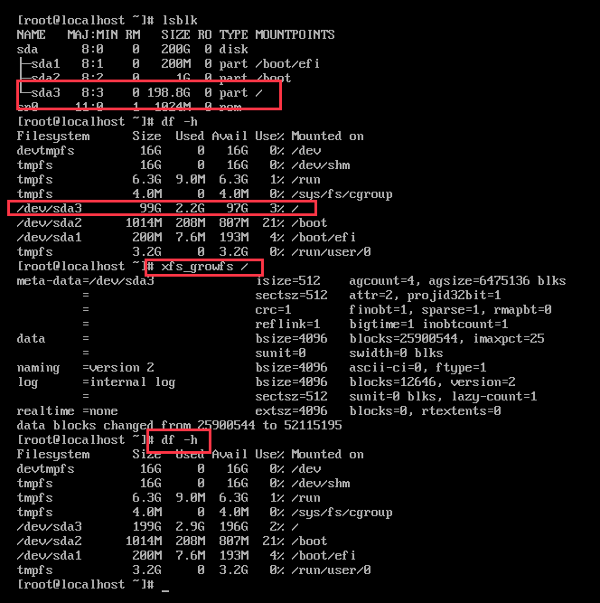

# TOC

<!--ts-->
   * [TOC](#toc)
   * [Kernel](#kernel)
      * [进程调度](#进程调度)
      * [进程间通信](#进程间通信)
         * [ipcs和ipcrm工具](#ipcs和ipcrm工具)
      * [IO调度器](#io调度器)
      * [系统缓存](#系统缓存)
         * [swap交换分区](#swap交换分区)
            * [常见操作](#常见操作)
            * [使用文件file创建swap分区](#使用文件file创建swap分区)
            * [运行过程中增加节点swap分区](#运行过程中增加节点swap分区)
         * [pagecache页缓存](#pagecache页缓存)
         * [drop_caches清理缓存](#drop_caches清理缓存)
         * [更加积极的脏页缓存刷新](#更加积极的脏页缓存刷新)
      * [大页内存hugepages](#大页内存hugepages)
         * [预分配大页内存](#预分配大页内存)
            * [系统启动时分配大页内存](#系统启动时分配大页内存)
            * [系统运行时分配大页内存](#系统运行时分配大页内存)
            * [Kubernetes中Pod使用大页内存](#kubernetes中pod使用大页内存)
         * [透明大页THP](#透明大页thp)
      * [NUMA](#numa)
      * [内核模块Module](#内核模块module)
      * [inotify](#inotify)
         * [inotify打开句柄数耗尽问题解决办法](#inotify打开句柄数耗尽问题解决办法)
         * [inotify文件监控句柄数耗尽的解决办法](#inotify文件监控句柄数耗尽的解决办法)
         * [找到谁在使用inotify instance资源](#找到谁在使用inotify-instance资源)
         * [找到谁在使用inotify watch资源](#找到谁在使用inotify-watch资源)
         * [inotify-tools](#inotify-tools)
      * [sysctl和系统配置](#sysctl和系统配置)
         * [典型操作](#典型操作)
            * [cpu下线和上线](#cpu下线和上线)
            * [其它](#其它)
         * [内核参数调优](#内核参数调优)
      * [D-Bus](#d-bus)
      * [PCI设备](#pci设备)
         * [获取PCI设备信息](#获取pci设备信息)
         * [重新扫描PCI设备](#重新扫描pci设备)
      * [周边知识](#周边知识)
         * [vDSO机制](#vdso机制)
   * [Systemd](#systemd)
   * [Networks](#networks)
      * [常用操作](#常用操作)
      * [虚拟网络中的Linux接口](#虚拟网络中的linux接口)
      * [OpenvSwitch](#openvswitch)
      * [OVN](#ovn)
         * [常用操作](#常用操作-1)
      * [bridge网桥](#bridge网桥)
      * [veth-pair](#veth-pair)
         * [veth接口速率speed](#veth接口速率speed)
         * [veth接口的hairpin模式](#veth接口的hairpin模式)
         * [如何找到容器对应的veth接口](#如何找到容器对应的veth接口)
      * [容器网络](#容器网络)
      * [iptables](#iptables)
         * [预置的chains](#预置的chains)
         * [table类型](#table类型)
         * [常用操作](#常用操作-2)
         * [实例](#实例)
         * [绕过kube-proxy的nodePort直接做DNAT](#绕过kube-proxy的nodeport直接做dnat)
         * [iptables-extensions](#iptables-extensions)
      * [conntrack](#conntrack)
         * [常用操作](#常用操作-3)
      * [ipvs](#ipvs)
         * [常用命令](#常用命令)
      * [配置网卡聚合NIC bonding](#配置网卡聚合nic-bonding)
      * [组播](#组播)
      * [防火墙](#防火墙)
      * [固定网卡名称](#固定网卡名称)
         * [背景知识](#背景知识)
         * [操作方法](#操作方法)
      * [InfiniBand](#infiniband)
      * [RDMA](#rdma)
      * [DPDK](#dpdk)
      * [SPDK](#spdk)
      * [SR-IOV](#sr-iov)
   * [Storage](#storage)
      * [Disk操作](#disk操作)
         * [使用storcli查看存储信息](#使用storcli查看存储信息)
         * [使用lshw查看磁盘硬件信息](#使用lshw查看磁盘硬件信息)
         * [使用fdisk操作MBR](#使用fdisk操作mbr)
         * [使用fdisk为分区扩容](#使用fdisk为分区扩容)
         * [使用sgdisk操作GPT](#使用sgdisk操作gpt)
      * [lvm和devicemapper](#lvm和devicemapper)
         * [常用命令](#常用命令-1)
         * [LVM XFS的扩容和缩容](#lvmxfs的扩容和缩容)
         * [LVM EXT4的扩容和缩容](#lvmext4的扩容和缩容)
         * [Docker使用devicemapper的操作步骤](#docker使用devicemapper的操作步骤)
      * [ISCSI存储](#iscsi存储)
         * [使用iscsiadm客户端](#使用iscsiadm客户端)
         * [iscsi存储典型操作流程](#iscsi存储典型操作流程)
         * [targetcli设置iscsi本地调试环境](#targetcli设置iscsi本地调试环境)
      * [FC存储](#fc存储)
      * [存储多路径](#存储多路径)
   * [File system](#file-system)
      * [内存文件系统](#内存文件系统)
      * [xfs文件系统](#xfs文件系统)
         * [配额管理](#配额管理)
         * [常用操作](#常用操作-4)
      * [samba](#samba)
         * [通过客户端访问samba服务器](#通过客户端访问samba服务器)
      * [NFS](#nfs)
         * [搭建NFS测试环境](#搭建nfs测试环境)
         * [nfs问题定位手段](#nfs问题定位手段)
      * [webdav](#webdav)
   * [Operation &amp; Management](#operation--management)
      * [loop设备](#loop设备)
      * [用户管理](#用户管理)
      * [audit系统审计](#audit系统审计)
      * [HTPasswd认证](#htpasswd认证)
      * [系统资源限制](#系统资源限制)
         * [limits.conf资源限制](#limitsconf资源限制)
         * [systemd资源限制](#systemd资源限制)
      * [openssl和证书](#openssl和证书)
         * [生成根证书](#生成根证书)
         * [签发自签名证书](#签发自签名证书)
         * [极简命令操作](#极简命令操作)
         * [自动化操作](#自动化操作)
         * [根证书缺失导致TLS通信失败](#根证书缺失导致tls通信失败)
      * [远程安全终端openssh](#远程安全终端openssh)
         * [服务端sshd](#服务端sshd)
         * [使用ssh-keygen生成秘钥](#使用ssh-keygen生成秘钥)
         * [客户端ssh](#客户端ssh)
         * [ssh免密登录](#ssh免密登录)
         * [ssh隧道](#ssh隧道)
      * [使用gost配置隧道](#使用gost配置隧道)
      * [Alpine](#alpine)
         * [使用镜像源](#使用镜像源)
         * [下载软件包及其依赖到本地](#下载软件包及其依赖到本地)
         * [安装本地软件包](#安装本地软件包)
      * [Debian](#debian)
         * [添加仓库](#添加仓库)
      * [CentOS](#centos)
         * [常用操作](#常用操作-5)
         * [NetworkManager网络管理](#networkmanager网络管理)
            * [配置全局域名解析服务器](#配置全局域名解析服务器)
            * [不去override更新resolv.conf文件](#不去override更新resolvconf文件)
         * [获取RPM包的源码](#获取rpm包的源码)
         * [构建自定义的CentOS内核](#构建自定义的centos内核)
         * [关闭coredump](#关闭coredump)
      * [性能调优和问题定位](#性能调优和问题定位)
         * [CPU性能](#cpu性能)
            * [设置或提升CPU运行频率](#设置或提升cpu运行频率)
            * [解决pcc和acpi的bug导致的CPU降频问题](#解决pcc和acpi的bug导致的cpu降频问题)
            * [长期测试CPU性能](#长期测试cpu性能)
         * [网络性能](#网络性能)
         * [IO性能](#io性能)
            * [iostat判断io瓶颈](#iostat判断io瓶颈)
            * [ionice修改io优先级](#ionice修改io优先级)
            * [fio性能测试](#fio性能测试)
            * [iozone](#iozone)
            * [判断SSD还是HDD](#判断ssd还是hdd)
         * [使用stress进行压力测试](#使用stress进行压力测试)
         * [messages日志统计](#messages日志统计)
            * [既有日志统计](#既有日志统计)
      * [如何Debug程序和进程](#如何debug程序和进程)
         * [softlockup告警](#softlockup告警)
         * [pmap分析内存使用](#pmap分析内存使用)
         * [strace查看进程调用链](#strace查看进程调用链)
         * [ftrace查看系统调用耗时](#ftrace查看系统调用耗时)
         * [perf查看系统调用性能](#perf查看系统调用性能)
            * [收集perf](#收集perf)
         * [pstack分析CPU异常高时堆栈信息](#pstack分析cpu异常高时堆栈信息)
         * [abrtd自动报告bug](#abrtd自动报告bug)
         * [scanelf获取运行时依赖（动态链接库）](#scanelf获取运行时依赖动态链接库)
         * [time查看执行时间](#time查看执行时间)
         * [coredump分析](#coredump分析)
         * [/proc//目录下文件说明](#proc目录下文件说明)
         * [D状态进程的分析](#d状态进程的分析)
         * [defunct进程](#defunct进程)
         * [objdump分析库和可执行文件](#objdump分析库和可执行文件)
      * [主机资源监控](#主机资源监控)
         * [vmstat（内存）](#vmstat内存)
         * [mpstat（CPU）](#mpstatcpu)
         * [pidstat（进程）](#pidstat进程)
         * [iftop（网络）](#iftop网络)
         * [sar（历史记录）](#sar历史记录)
            * [使能和配置sar](#使能和配置sar)
            * [操作实例](#操作实例)
         * [打开文件数](#打开文件数)
         * [lsof（文件和设备）](#lsof文件和设备)
         * [fuser（文件和设备）](#fuser文件和设备)
         * [netstat（网络）](#netstat网络)
         * [ss（网络）](#ss网络)
         * [常用命令](#常用命令-2)
      * [内存信息解读](#内存信息解读)
         * [内存用量TopN](#内存用量topn)
         * [top内存信息解读](#top内存信息解读)
         * [free信息解读](#free信息解读)
         * [smaps信息解读](#smaps信息解读)
         * [meminfo信息解读](#meminfo信息解读)
      * [中断信息解读](#中断信息解读)
      * [文件系统修复](#文件系统修复)
      * [软件包管理](#软件包管理)
         * [rpm](#rpm)
         * [yum](#yum)
      * [域名解析](#域名解析)
         * [nslookup](#nslookup)
      * [时钟同步](#时钟同步)
         * [ntp](#ntp)
            * [优化NTP](#优化ntp)
            * [手动执行集群内时间同步的操作](#手动执行集群内时间同步的操作)
            * [ntp服务自我保护](#ntp服务自我保护)
            * [常用命令和工具](#常用命令和工具)
         * [chronyd](#chronyd)
      * [动态链接库管理](#动态链接库管理)
      * [文本、字节流编辑](#文本字节流编辑)
      * [L2TP without IPsec配置](#l2tp-without-ipsec配置)
      * [日志](#日志)
         * [systemd-journald日志](#systemd-journald日志)
            * [开启systemd-journald日志](#开启systemd-journald日志)
            * [日志限制](#日志限制)
            * [使用journalctl查看日志](#使用journalctl查看日志)
         * [rsyslogd日志](#rsyslogd日志)
            * [日志限制](#日志限制-1)
            * [同systemd-journald的关系](#同systemd-journald的关系)
         * [shell脚本使用logger输出日志](#shell脚本使用logger输出日志)
      * [其它技巧](#其它技巧)

<!-- Added by: admin, at: 2022年12月 6日 21:42:21 -->

<!--te-->


# Kernel


## 进程调度

### migration
migration是Linux内核进程，用于在core间分摊处理压力：

```bash
[zy@m1 ~]$ ps -ef | grep migration
root         7     2  0 Feb02 ?        00:00:14 [migration/0]
root        12     2  0 Feb02 ?        00:00:14 [migration/1]
```

### 绑核和预留CPU

#### 操作
```bash
# 查看进程可以运行的cpu
taskset -pc <pid>

# grub参数配置isolcpus，预留CPU，避免除中断外的进程调度到预留的CPU上
# cat /proc/cmdline
... isolcpus=1,2,3,4 ...

# 配置CPU隔离，重启节点生效
grubby --update-kernel=ALL --args="isolcpus=3,4"
# 此后查看是否生效

# 能看到1号进程不会运行到3和4核上
taskset -cp 1

# 使用numactl将进程绑定到隔离的核上

```

## 进程间通信

### ipcs和ipcrm工具

```bash
# 文件/etc/sysctl.conf中配置信号量相关参数
	kernel.msgmni
	kernel.sem

# 用来查看系统间通信队列列表
ipcs -q

# 用来创建系统间通信队列
ipcmk -Q

cat /proc/sys/kernel/sem
echo 250 32000 100 128 > /proc/sys/kernel/sem
ipcs -ls
sysctl -w kernel.sem="250 32000 100 128"
echo "kernel.sem=250 32000 100 128" >> /etc/sysctl.conf
```


## IO调度器

参见:

* [Archlinux Improving Performance](https://wiki.archlinux.org/index.php/Improving_performance#Input/output_schedulers)
* [Linux-I-O-Schedulers](http://www.admin-magazine.com/HPC/Articles/Linux-I-O-Schedulers)
* [Ubuntu IOSchedulers](https://wiki.ubuntu.com/Kernel/Reference/IOSchedulers)

修改/查看设备当前调度器

```bash
echo 'deadline' > /sys/block/sda/queue/scheduler
cat /sys/block/sda/queue/scheduler
```

引导时修改默认调度器

1. 在`/etc/default/grub`中，为`GRUB_CMDLINE_LINUX`增加配置`elevator=deadline`
2. 重新生成配置文件:

  - BIOS节点上，执行`grub2-mkconfig -o /boot/grub2/grub.cfg`
  - UEFI节点上，执行`grub2-mkconfig -o /boot/efi/EFI/centos/grub.cfg`


## 系统缓存

### swap交换分区

#### 常见操作

制作swap分区并使用新的swap分区

```bash
mkswap /dev/hdb1
swapon /dev/hdb1
```
启机时需要自动挂载swap分区，修改/etc/fstab文件，增加swap分区的配置:

```bash
/dev/hdb1    none    swap   sw   0   0
```
查看交换分区类型

```bash
swapon -s
```
关闭Swap交换分区

```bash
# 先强制释放系统缓存
echo 3 > /proc/sys/vm/drop_caches
echo 0 > /proc/sys/vm/drop_caches
# 再关闭Swap交换分区
swapoff /dev/mapper/centos-swap
```
另一种关闭Swap交换分区的方法
```bash
# 执行该命令后，系统会逐渐回收swap分区的空间，通过free命令看到swap分区的在变小
swapoff -a
```
打开所有的交换分区（将/etc/fstab中的swap空间都挂载上）

```bash
swapon -a
```
查看进程的Swap分区使用情况

```bash
cat /proc/pid/smaps
cat /proc/pid/status | grep -i vm
top ->f->选择显示Swap    ->f->s  选择排序的项
top -b -n1 -o SWAP | head -n27 | sed '1,7d'    # TOP 20交换分区使用
```
设置Swap分区使用偏好

```bash
echo 30 > /proc/sys/vm/swappiness
```
#### 使用文件file创建swap分区
创建一个16GB的swap文件
```bash
dd if=/dev/zero of=/swapfile bs=1G count=16
```
初始化swap文件
```bash
mkswap /swapfile
chmod 0600 /swapfile
```
挂载并使用swap文件
```bash
swapon /swapfile
```
需要启机自动挂载swap文件时，在/etc/fstab中增加如下配置：
```bash
/swapfile    none    swap   sw   0   0
```

#### 运行过程中增加节点swap分区
参考资料[https://www.linux.com/news/all-about-linux-swap-space](https://www.linux.com/news/all-about-linux-swap-space)
**警告**，操作有风险，请确认每条指令带来的后果。

设置Swap分区使用偏好（可选操作）
```bash
# echo 'vm.swappiness = 1' >> /etc/sysctl.conf
# sysctl -p
```

制作swapfile（以新增16GB的swap空间为例，注意先确保/swapfile这个文件不存在，否则将被覆盖）
```bash
# dd if=/dev/zero of=/swapfile bs=1G count=16
# mkswap /swapfile
# chmod 0600 /swapfile
```

挂载并使用swap文件
```bash
# swapon /swapfile
```

固化配置，保证节点重启后仍然生效
```bash
# echo '/swapfile none swap sw 0 0' >> /etc/fstab
```

**注意**：
* 操作过程中确保命令和参数不要输错，特别是dd和mkswap，否则带来不可挽回的损失。
* swap文件路径可根据需要进行调整，上述例子中是/swapfile。
* 集群环境，需要在每个节点上进行操作。
* 增大swap分区仅为规避问题，正确做法是找到内存、swap分区使用过多的服务，然后优化配置或升级。


### pagecache页缓存


### drop_caches清理缓存

通过`/proc/sys/vm/drop_caches`(since Linux 2.6.16)清理系统缓存

>Writing to this file causes the kernel to drop clean caches, dentries and inodes from memory, causing that memory to become free.
>
>To free pagecache, use `echo 1 > /proc/sys/vm/drop_caches`
>
>To free dentries and inodes, use `echo 2 > /proc/sys/vm/drop_caches`
>
>To free pagecache, dentries and inodes, use `echo 3 > /proc/sys/vm/drop_caches`
>
>Because this is a nondestructive operation and dirty objects are not freeable, the user should run sync(8) first.


### 更加积极的脏页缓存刷新

```bash
### 默认值
[root@zy-m224 scripts]# sysctl -a 2>/dev/null | grep vm.dirty
vm.dirty_background_bytes = 0
# 允许“脏数据”占内存比例，超过该比例后“脏数据”会被后台进程（例如kdmflush）清理并写入磁盘。默认值10。
vm.dirty_background_ratio = 10
vm.dirty_bytes = 0
# “脏数据”在内存中过期时间，过期后“脏数据”会被写入磁盘，防止其在内存中待得过久。默认值3000，即30秒。
vm.dirty_expire_centisecs = 3000
# “脏数据”的绝对限制，内存里的“脏数据”不能超过该值，否则新的IO请求将被阻塞，直到“脏数据”被写入磁盘。IO卡顿时应关注是否由于“脏数据”达到该阈值所致。默认值30。
vm.dirty_ratio = 30
# 负责将“脏数据”写入磁盘的后台进程（例如kdmflush）的执行周期，默认值500，即5秒
vm.dirty_writeback_centisecs = 500
vm.dirtytime_expire_seconds = 43200

### 优化值
vm.dirty_background_ratio = 1
vm.dirty_ratio = 1
vm.dirty_expire_centisecs = 10
vm.dirty_writeback_centisecs = 10
```


## 大页内存hugepages

### 预分配大页内存
参见资料[CONFIGURING HUGETLB HUGE PAGES](https://access.redhat.com/documentation/en-us/red_hat_enterprise_linux/7/html/performance_tuning_guide/sect-red_hat_enterprise_linux-performance_tuning_guide-memory-configuring-huge-pages)

#### 系统启动时分配大页内存
TODO

#### 系统运行时分配大页内存
通过 `/sys/devices/system/node/<node_id>/hugepages/hugepages-<size>/<nr_hugepages>` 指定NUMA节点`node_id`上分配页大小`hugepages-<size>`的大页内存`<nr_hugepages>`个。
```bash
# numastat -cm | egrep 'Node|Huge'
                 Node 0 Node 1 Node 2 Node 3  Total add
AnonHugePages         0      2      0      8     10
HugePages_Total       0      0      0      0      0
HugePages_Free        0      0      0      0      0
HugePages_Surp        0      0      0      0      0
# echo 20 > /sys/devices/system/node/node2/hugepages/hugepages-2048kB/nr_hugepages
# numastat -cm | egrep 'Node|Huge'
                 Node 0 Node 1 Node 2 Node 3  Total
AnonHugePages         0      2      0      8     10
HugePages_Total       0      0     40      0     40
HugePages_Free        0      0     40      0     40
HugePages_Surp        0      0      0      0      0
```

#### Kubernetes中Pod使用大页内存
参见[资料](https://kubernetes.io/docs/tasks/manage-hugepages/scheduling-hugepages/)


### 透明大页THP

参见[文档](https://help.aliyun.com/document_detail/161963.html) 。

```bash
# 关闭透明大页，执行如下命令，然后重启系统生效
grubby --update-kernel=/boot/vmlinuz-`uname -r` --args="transparent_hugepage=never kpti=off"

# 检查配置是否成功
grubby --info=/boot/vmlinuz-`uname -r`

# 系统启动后查看是否开启了透明大页内存
cat /sys/kernel/mm/transparent_hugepage/enabled

# 系统启动后关闭透明大页内存
echo never > /sys/kernel/mm/transparent_hugepage/enabled

# 系统启动后开启透明大页内存
echo always > /sys/kernel/mm/transparent_hugepage/enabled

# 回退上述修改，重新开启透明大页
grubby --update-kernel=/boot/vmlinuz-`uname -r` --remove-args="transparent_hugepage=never kpti=off"
```

查看某个进程使用的大页内存：
```bash
cat /proc/<pid>/smaps | grep AnonHugePages
```

碎片整理：
```bash
cat /sys/kernel/mm/transparent_hugepage/defrag

cat /sys/kernel/mm/transparent_hugepage/khugepaged/defrag
```

每次遍历扫描的page数：
```bash
cat /sys/kernel/mm/transparent_hugepage/khugepaged/pages_to_scan
```

## NUMA

常见操作：

```bash
numactl -H

# 指定NUMA节点运行程序
numactl -N 0 -m 0 ./test

numastat
```


## 内核模块Module

启机时自动加载内核驱动的方法可参见`man modules-load.d`。

检查模块已被静态编译到内核中：

```bash
grep -e ipvs -e nf_conntrack_ipv4 /lib/modules/$(uname -r)/modules.builtin
```


## inotify

### inotify打开句柄数耗尽问题解决办法
```bash
# 日志中报错“unable to create inotify: too many open files”
# 解决办法为调大 fs.inotify.max_user_instances
fs.inotify.max_user_instances = 8192
```

### inotify文件监控句柄数耗尽的解决办法

```bash
fs.inotify.max_user_watches = 1000000
```

### 找到谁在使用inotify instance资源

instance（一个打开的文件句柄）由调用`inotify_init()`创建。

```bash
# 查看inotify打开文件数
lsof 2>/dev/null | grep inotify -c

# 通过tail判断当前inotify是否耗尽，因为tail -f也会去创建fsnotify
tail -f

# 有效
find /proc/*/fd -lname anon_inode:inotify 2>/dev/null | cut -d/ -f3 | xargs -I '{}' -- ps --no-headers -o '%p %U %c' -p '{}' | uniq -c | sort -nr

# 查看哪些进程在消耗inotify
ps -p $(find /proc/*/fd/* -type l -lname 'anon_inode:inotify' -print 2> /dev/null | sed -e 's/^\/proc\/\([0-9]*\)\/.*/\1/')

# 执行太慢了
for foo in /proc/*/fd/*; do readlink -f $foo; done | grep inotify | sort | uniq -c | sort -nr
find /proc/*/fd/* -type l -lname 'anon_inode:inotify' -print
find /proc/*/fd/* -type l -lname 'anon_inode:inotify' -exec sh -c 'cat $(dirname {})/../cmdline; echo ""' \; 2>/dev/null
```

### 找到谁在使用inotify watch资源

watches由调用`inotify_add_watch()`创建。

从代码看，watches的使用数量是统计到每个用户user（uid）的，因此无法找到是那个进程（线程）耗尽了inotify watch资源？？？
详见Linux内核代码 `fs/notify/inotify/inotify_user.c`:

```c
inotify_new_watch()
  atomic_inc(&group->inotify_data.user->inotify_watches);
```

检查 `user.max_inotify_watches` ，默认65536。使用如下脚本，能够统计到各进程打开的watch资源数：
```bash
#!/usr/bin/env bash
#
# Copyright 2019 (c) roc
#
# This script shows processes holding the inotify fd, alone with HOW MANY directories each inotify fd watches(0 will be ignored).
total=0
result="EXE PID FD-INFO INOTIFY-WATCHES\n"
while read pid fd; do \
  exe="$(readlink -f /proc/$pid/exe || echo n/a)"; \
  fdinfo="/proc/$pid/fdinfo/$fd" ; \
  count="$(grep -c inotify "$fdinfo" || true)"; \
  if [ $((count)) != 0 ]; then
    total=$((total+count)); \
    result+="$exe $pid $fdinfo $count\n"; \
  fi
done <<< "$(lsof +c 0 -n -P -u root|awk '/inotify$/ { gsub(/[urw]$/,"",$4); print $2" "$4 }')" && echo "total $total inotify watches" && result="$(echo -e $result|column -t)\n" && echo -e "$result" | head -1 && echo -e "$result" | sed "1d" | sort -k 4rn;

```
关键信息来自`/proc/$pid/fdinfo/$fd`。


### inotify-tools

```bash
inotifywait
inotifywatch
```


## sysctl和系统配置

### 典型操作

#### cpu下线和上线
```bash
# offline
echo 0 > /sys/devices/system/cpu/cpu2/online
# online
echo 1 > /sys/devices/system/cpu/cpu2/online
```

#### 其它

设置浮动IP时，需要让haproxy监听非本地IP地址（即VIP地址），在
```bash
/etc/sysctl.conf
```
中增加配置
```bash
net.ipv4.ip_nonlocal_bind=1
```
然后使用如下命令使其生效
```bash
sysctl -p
```
获取系统支持的最大线程数：
```bash
sysctl kernel.pid_max
```
修改系统支持的最大线程数：
```bash
sysctl -w kernel.pid_max=327680
```

防止well-known端口被当做local port占用

```bash
net.ipv4.ip_local_reserved_ports = 35357,12345
```

系统层面的，能够打开的文件总数

```bash
/proc/sys/fs/file-max
```

### 内核参数调优

| 类型 | 参数 | 默认值 | 优化 | 说明 |
| --- | ---  |  ---- | ---- | ---- |
| sysctl | net.ipv4.tcp_syncookies  |  ---- | ---- | 开启SYN Cookies，当出现SYN等待队列溢出时，启用cookies来处理 |
| sysctl | net.ipv4.tcp_retries2  |  15 | 8 | TCP报文重传次数，当发送报文后没有收到ACK，就会触发重传。注意其采用指数回退，每次重试间隔都是上次的两倍。参见[文章](https://pracucci.com/linux-tcp-rto-min-max-and-tcp-retries2.html) |
| sysctl | net.ipv4.tcp_tw_reuse  |  ---- | ---- | 开启重用，允许将TIME-WAIT sockets重新用于新的TCP连接 |
| sysctl | net.ipv4.tcp_tw_recycle<br>net.ipv4.tcp_timestamps  |  ---- | ---- | 开启TCP连接中TIME-WAIT sockets的快速回收，已被net.ipv4.tcp_tw_reuse取代 |
| sysctl | net.ipv4.tcp_fin_timeout  |  ---- | ---- | xxx超时时间 |
| sysctl | net.ipv4.tcp_keepalive_time  |  30 | 30 | 优化keepalive 起用的时候，TCP 发送keepalive 消息的频度 |
| sysctl | net.ipv4.tcp_keepalive_intvl  |  30 | 30 | 优化keepalive 起用的时候，探测时发探测包的时间间隔值 |
| sysctl | net.ipv4.tcp_keepalive_probes  |  9 | 5 | 优化keepalive 起用的时候，探测重试的次数值. 全部超时则认定连接失效 |
| sysctl | net.ipv4.tcp_max_tw_buckets  |  ---- | ---- | 优化系统同时保持TIME_WAIT的最大数量 |
| sysctl | net.ipv4.tcp_max_syn_backlog  |  ---- | ---- | 增大socket监听backlog上限 |
| sysctl | net.ipv4.tcp_synack_retries  |  ---- | ---- | ---- |
| sysctl | net.ipv4.neigh.default.gc_stale_time  |  ---- | ---- | ---- |
| sysctl | net.ipv4.neigh.default.gc_thresh1  |  ---- | ---- | ARP缓存 |
| sysctl | net.ipv4.neigh.default.gc_thresh2  |  ---- | ---- | ---- |
| sysctl | net.ipv4.neigh.default.gc_thresh3  |  ---- | ---- | ---- |
| sysctl | net.ipv4.route.gc_thresh  |  ---- | ---- | ---- |
| sysctl | net.ipv4.xfrm4_gc_thresh  |  ---- | ---- | ---- |
| sysctl | net.ipv6.neigh.default.gc_thresh1  |  ---- | ---- | ---- |
| sysctl | net.ipv6.neigh.default.gc_thresh2  |  ---- | ---- | ---- |
| sysctl | net.ipv6.neigh.default.gc_thresh3  |  ---- | ---- | ---- |
| sysctl | net.ipv6.route.gc_thresh  |  ---- | ---- | ---- |
| sysctl | net.ipv6.xfrm6_gc_thresh  |  ---- | ---- | ---- |
| sysctl | net.ipv4.conf.all.rp_filter  |  ---- | ---- | ---- |
| sysctl | net.ipv4.conf.all.arp_announce  |  ---- | ---- | ---- |
| sysctl | net.core.netdev_max_backlog  |  ---- | ---- | 每个网络接口接收数据包的速率比内核处理这些包的速率快时，允许送到队列的数据包的最大数目 |
| sysctl | net.core.optmem_max<br>net.core.rmem_default<br>net.core.rmem_max<br>net.core.wmem_default<br>net.core.wmem_max  |  ---- | ---- | socket读写buffer值 |
| sysctl | net.ipv4.tcp_mem<br>net.ipv4.tcp_rmem<br>net.ipv4.tcp_wmem  |  ---- | ---- | tcp读写buffer值 |
| sysctl | net.netfilter.nf_conntrack_max  |  ---- | ---- | ---- |
| sysctl | net.nf_conntrack_max  |  ---- | ---- | ---- |
| sysctl | kernel.sysrq  |  ---- | ---- | ---- |
| sysctl | kernel.core_uses_pid  |  ---- | ---- | ---- |
| sysctl | net.bridge.bridge-nf-call-ip6tables<br>net.bridge.bridge-nf-call-iptables<br>net.bridge.bridge-nf-call-arptables  |  ---- | ---- | ---- |
| sysctl | kernel.msgmnb<br>kernel.msgmax  |  ---- | ---- | ---- |
| sysctl | kernel.shmmax<br>kernel.shmall  |  ---- | ---- | ---- |
| sysctl | net.ipv4.ip_local_port_range<br>net.ipv4.ip_local_reserved_ports  |  ---- | ---- | ---- |
| sysctl | fs.aio-max-nr  |  ---- | ---- | ---- |
| sysctl | fs.file-max  |  ---- | ---- | ---- |
| sysctl | fs.inotify.max_user_instances  |  ---- | ---- | ---- |
| sysctl | vm.min_free_kbytes  |  67584 | 2097152 | 系统最小预留内存，频繁使用内存、cache内存占用量大的环境，建议增大系统预留内存 |
| sysctl | vm.overcommit_memory  |  ---- | ---- | ---- |
| sysctl | vm.swappiness  |  ---- | ---- | ---- |
| sysctl | net.core.somaxconn  |  ---- | ---- | ---- |
| sysctl | net.netfilter.nf_conntrack_tcp_be_liberal  |  0 | 1 | https://kubernetes.io/blog/2019/03/29/kube-proxy-subtleties-debugging-an-intermittent-connection-reset/ |
| limits | nofile  |  ---- | ---- | ---- |


## D-Bus

```bash
busctl
```


## PCI设备
### 获取PCI设备信息
从如下位置获取pci设备（id）信息
```
/sys/bus/pci/devices/<device>/class
/sys/bus/pci/devices/<device>/vendor
```
参见[node-feature-discovery如何获取PCI设备信息](https://github.com/kubernetes-sigs/node-feature-discovery/blob/master/source/pci/pci.go)


### 重新扫描PCI设备
```bash
echo 1 > /sys/bus/pci/rescan
```

## 周边知识
### vDSO机制
`virtual dynamic share object`。

[安全：人见人爱的vDSO机制，如今也靠不住了](https://cloud.tencent.com/developer/article/1073909)

# Systemd

常用操作

```bash
# 查看依赖的服务
systemctl list-dependencies crio
# 查看被谁依赖
systemctl list-dependencies --reverse crio

# 查看服务启动耗时
systemd-analyze blame

# 不要过多的输出
systemctl status etcd2.service
systemctl status gocronitor --lines=0
systemctl start docker
systemctl stop docker
systemctl restart docker
# Service会在设备上自动启用
systemctl enable docker
systemctl disable docker
# 显示详细配置和属性
systemctl show docker -p xxx
systemctl show --property Environment docker
systemctl is-active kube-kubelet.service
# 查看“etcd2”依赖谁
systemctl list-dependencies etcd2
# 查看谁依赖“etcd2”
systemctl list-dependencies etcd2 --reverse
```

service文件中：

```bash
"--etcd-certfile=\${ETCD_CLIENT_PEM}"   # 使用反斜杠'\'对'$'转义
```


# Networks

## 常用操作

```bash
ip route add 0.0.0.0/0 via 172.25.0.1
ip -4 route get 8.8.8.8 # 获取生效的默认路由及其出接口IP地址
cat /proc/net/route && cat /proc/net/ipv6_route   # 当没有ip和route命令时查看路由信息
ip address add 172.25.50.32/20 dev eth0 # 设置（secondary）地址
arp -s 172.25.50.31 fa:16:3e:b7:2a:8e # 添加静态ARP表项
arp -d 172.25.50.31     # 删除ARP表项
cat /sys/class/net/<interface>/speed    # 查看接口速率
```


## 虚拟网络中的Linux接口
https://developers.redhat.com/blog/2018/10/22/introduction-to-linux-interfaces-for-virtual-networking/
https://developers.redhat.com/blog/2019/05/17/an-introduction-to-linux-virtual-interfaces-tunnels/
https://www.kernel.org/doc/Documentation/networking/vxlan.txt
https://vincent.bernat.ch/en/blog/2017-vxlan-linux

## OpenvSwitch

常用命令：

```bash
## 数据库相关命令
# 查看数据库列表
ovsdb-client list-dbs
# 查看schema
ovsdb-client get-schema  | jq
# 查看表
ovsdb-client list-tables
    Table
    -------------------------
    Controller
    Bridge
    Queue
    IPFIX
    NetFlow
    Open_vSwitch
    QoS
    Port
    sFlow
    SSL
    Flow_Sample_Collector_Set
    Mirror
    Flow_Table
    Interface
    AutoAttach
    Manager
# 查看表结构信息
ovsdb-client list-columns
# 输出所有信息
ovsdb-client dump


## Switch相关命令
# 查询Bridge信息，来自 ovsdb-client list-tables 获取的Bridge表
ovs-vsctl list Bridge
# 删除ovs网桥
ovs-vsctl del-br br-ex
# 查询ovs信息
ovs-vsctl list Open_vSwitch
# 查看端口名和端口ID关系
ovs-vsctl -- --columns=name,ofport list Interface
# 查看端口ID信息
ovs-vsctl -- --columns=name,ofport,external_ids list Interface
# 查看端口的vlan tag信息
ovs-vsctl -- --columns=name,tag list Port
# 查看某个端口的vlan tag
ovs-vsctl get port dpdk1 tag
# 查看bridge信息
ovs-vsctl list-br
ovs-vsctl br-to-vlan <br>
ovs-vsctl br-to-parent <br>
# 查看端口信息
ovs-vsctl list-ports <br>
# 查看接口信息
ovs-vsctl list-ifaces <br>
ovs-vsctl get-controller <br>
ovs-vsctl get-manager
ovs-vsctl get-ssl
ovs-vsctl get-aa-mapping <br>


## OpenFlow流表信息
# 查看流表
ovs-ofctl -O OpenFlow13 dump-flows br0
# 支持查看所有流表，包括隐藏的流表
ovs-appctl bridge/dump-flows br0

ovs-ofctl -O OpenFlow13 show <br>
ovs-ofctl -O OpenFlow13 dump-desc <br>
ovs-ofctl -O OpenFlow13 dump-tables <br>
ovs-ofctl -O OpenFlow13 dump-table-features <br>
ovs-ofctl -O OpenFlow13 dump-table-desc <br>
ovs-ofctl -O OpenFlow13 get-frags <br>
ovs-ofctl -O OpenFlow13 dump-ports <br> [port]
ovs-ofctl -O OpenFlow13 dump-ports-desc <br> [port]
ovs-ofctl -O OpenFlow13 dump-flows <br> [flow]
ovs-ofctl -O OpenFlow13 queue-stats <br> [port [queue]]


# 其它命令
ovs_dbg_listports
```


## OVN
### 常用操作
```bash
# LB列表
ovn-nbctl lb-list
```

## bridge网桥

常用操作：

```bash
bridge fdb show dev flannel.1           # 查看FDB表中与flannel.1相关的表项。
brctl                                   # 属于bridge-utils包
```


## veth-pair
源码`https://github.com/torvalds/linux/blob/master/drivers/net/veth.c`。
以module方式安装：
```bash
[root@aaa-d5dc9 ~]# lsmod | grep veth
veth                   16384  0
[root@aaa-d5dc9 ~]# modinfo veth
filename:       /lib/modules/4.14.0-115.7.1.el7a.x86_64/kernel/drivers/net/veth.ko.xz
alias:          rtnl-link-veth
license:        GPL v2
description:    Virtual Ethernet Tunnel
rhelversion:    7.6
srcversion:     699C066ED915679A9525580
depends:
intree:         Y
name:           veth
vermagic:       4.14.0-115.7.1.el7a.x86_64 SMP mod_unload modversions
```

### veth接口速率speed
- https://mailman.stanford.edu/pipermail/mininet-discuss/2015-January/005633.html

目前看kernel中veth的speed是hard-coded为10G。


### veth接口的hairpin模式
查看veth的`hairpin`模式
```bash
cat /sys/devices/virtual/net/veth*/brport/hairpin_mode
```
在[该issue](https://github.com/kubernetes/kubernetes/issues/45790)中，由于容器的veth接口`hairpin`模式未使能，导致该容器内无法通过其Service访问自己。


### 如何找到容器对应的veth接口
veth pair中两个veth接口互相记录着彼此的ifindex，根据这一特性进入关心的容器：
```bash
[root@m2 ~]# docker exec -it 72c3c4000e1e bash
bash-4.4# cat /sys/devices/virtual/net/eth0/iflink
205
bash-4.4# exit
```
找到容器中eth0接口连接的对端接口ifindex为205，在宿主机上执行如下操作
```bash
[root@m2 ~]# grep -l 205 /sys/devices/virtual/net/veth*/ifindex
/sys/devices/virtual/net/veth88a3f539/ifindex
```
找到对应的接口为veth88a3f539。


## 容器网络
- https://unix.stackexchange.com/questions/283854/what-is-the-network-connection-speed-between-two-containers-communicating-via-a


## iptables

### 预置的chains

~~~
PREROUTING   FORWARD   POSTROUTING
INPUT                  OUTPUT
~~~

### table类型

* filter
* nat
* mangle
* raw
* security

### 常用操作

```bash
iptables-save           # dump所有的规则，这些规则可直接使用
iptables -S -t nat      # 显示nat规则
iptables -S -t <filter | nat | mangle | raw | security> # 显示各个table的规则
iptables -t nat -D POSTROUTING -s 10.101.94.0/24 ! -o docker0 -j MASQUERADE  #删除Docker添加的源地址伪装规则
iptables -t nat -nL | less      #查看nat表在所有chain的规则
iptables -t nat -nL --line-numbers | less
iptables -t nat -D POSTROUTING 1
iptables -t nat -R KUBE-MARK-MASQ 1 -j MARK --set-xmark 0x2000/0x2000
iptables -A INPUT -s 172.25.19.177 -p tcp --dport 8888 -j ACCEPT    # 添加规则
iptables -nL --line-numbers     # 显示INPUT、FORWARD、OUTPUT等chain上的规则，带规则号rulenum
iptables -D INPUT 8             # 删除INPUT chain上的第8号规则
iptables -A IN_public_allow -p tcp -m tcp --dport 8080 -m conntrack --ctstate NEW -j ACCEPT   # CentOS自定义filter chain上增加accept规则
# 限制节点间网络通信
iptables -I INPUT 1 -s <存储服务器IP地址> -p tcp -j DROP
iptables -D INPUT -s <存储服务器IP地址> -p tcp -j DROP
```

注意，配置`POSTROUTING chain`时，需要指定具体的`table`。

### 实例

对于应用直接在节点上启动占用的端口，为了整洁起见，专门建立链：

```bash
iptables -N DEMOINPUT
# 将所有允许通过的原地址通过这种方式加入
iptables -A DEMOINPUT -s 172.25.18.24 -p tcp -m tcp --dport 8888 -j RETURN
iptables -A DEMOINPUT -s 172.25.18.41 -p tcp -m tcp --dport 8888 -j RETURN
iptables -A DEMOINPUT -s 172.25.18.89 -p tcp -m tcp --dport 8888 -j RETURN
iptables -A DEMOINPUT -s 127.0.0.1 -p tcp -m tcp --dport 8888 -j RETURN
# 将其它访问此端口的报文丢弃
iptables -A DEMOINPUT -p tcp -m tcp --dport 8888 -j DROP
iptables -I INPUT 1 -j DEMOINPUT
```

对于使用 docker、K8s的nodeport运行起来占用的端口，为了整洁起见，专门建立链：

```bash
iptables -N DEMOFORWARD
# 将所有允许通过的原地址通过这种方式加入
iptables -A DEMOFORWARD -s 172.25.18.24/32 -p tcp -m tcp --dport 3306 -j RETURN
iptables -A DEMOFORWARD -s 172.25.18.41/32 -p tcp -m tcp --dport 3306 -j RETURN
iptables -A DEMOFORWARD -s 172.25.18.89/32 -p tcp -m tcp --dport 3306 -j RETURN
iptables -A DEMOFORWARD -s 127.0.0.1/32 -p tcp -m tcp --dport 3306 -j RETURN
# 将其它访问此端口的报文丢弃
iptables -A DEMOFORWARD -p tcp -m tcp --dport 3306 -j DROP
iptables -I FORWARD 1 -j DEMOFORWARD
```

恢复：

```bash
# 将我们自建的链条内容清空
iptables -F DEMOINPUT
# 将我们的链条从主链上删除
iptables -D INPUT -j DEMOINPUT
# 删除我们的chain
iptables -X DEMOINPUT
```


### 绕过kube-proxy的nodePort直接做DNAT
有一个容器的IP地址192.168.7.4，服务端口8080。现在需要在其宿主机上暴露服务，监听IP地址192.0.2.1，监听端口80。
配置如下：
```bash
iptables -t nat -N expose-ports
iptables -t nat -A OUTPUT -j expose-ports
iptables -t nat -A PREROUTING -j expose-ports

iptables -t nat -A expose-ports -p tcp --destination 192.0.2.1 --dport 80 -j DNAT --to 192.168.7.4:8080
```
参见[How can I enable NAT for incoming traffic to containers with private IP addresses?](https://docs.projectcalico.org/reference/faq#how-can-i-enable-nat-for-incoming-traffic-to-containers-with-private-ip-addresses)


### iptables-extensions

扩展的iptables：

```bash
# 通过扩展的iptables规则，去屏蔽掉所有源地址不是172.17.8.1的、原始访问端口12380的请求
iptables -I DOCKER -m conntrack --ctstate DNAT ! --ctorigsrc 172.17.8.1/32 --ctorigdstport 12380 -j REJECT

# 数据库黑名单功能
iptables -N MYSQL3306
iptables -A MYSQL3306 -m conntrack --ctstate DNAT --ctorigsrc 10.125.30.150/32 --ctorigdstport 3306 -j REJECT
iptables -I FORWARD 1 -j MYSQL3306
```


## conntrack

### 常用操作

```bash
# 查看SYN状态的连接
watch -n 0.5 -d 'cat /proc/net/nf_conntrack | grep -v "udp" | grep 35357 | grep SYN'
# 抓取SYN包
tcpdump -i ens160 "host 172.25.18.91 and port 35357" -nnl | grep "\[S"
# 查看连接信息
conntrack -L
```

## ipvs
### 常用命令
```bash
ipvsadm -Ln --stats
ipvsadm -Ln -c
ipvsadm -L --timeout
ipvsadm -Ln --rate
ipvsadm -Ln --thresholds

# 配置 real server 的权重
ipvsadm -e -t 192.168.1.201:23456 -r 10.0.224.11:23456 -m -w 1

```

## 配置网卡聚合NIC bonding
**注意**，本示例在CentOS7上操作。
参考[configure-nic-bonding-in-centos-7-rhel-7](https://www.linuxtechi.com/configure-nic-bonding-in-centos-7-rhel-7/)。

加载`bonding`内核模块
```bash
[root@node ~]# modprobe bonding
[root@node ~]# modinfo bonding
...
name:           bonding
...
parm:           miimon:Link check interval in milliseconds (int)
parm:           mode:Mode of operation; 0 for balance-rr, 1 for active-backup, 2 for balance-xor, 3 for broadcast, 4 for 802.3ad, 5 for balance-tlb, 6 for balance-alb (charp)
...
```

创建bond网卡配置文件，在/etc/sysconfig/network-scripts/目录下创建bond网卡配置文件
```bash
[root@node network-scripts]# realpath ifcfg-bond0
/etc/sysconfig/network-scripts/ifcfg-bond0
[root@node network-scripts]# cat ifcfg-bond0
DEVICE=bond0
TYPE=Bond
NAME=bond0
BONDING_MASTER=yes
BOOTPROTO=none
ONBOOT=yes
IPADDR=172.25.18.233
PREFIX=22
GATEWAY=172.25.16.1
BONDING_OPTS="mode=1 miimon=100"
```
注意其中`mode`和`miimon`参数配置。

修改物理网卡配置文件，参与bond的物理网卡都需要修改配置，内容大同小异
```bash
[root@node network-scripts]# cat ifcfg-eth0
TYPE=Ethernet
BOOTPROTO=none
DEVICE=eth0
ONBOOT=yes
UUID=3e0da80f-351b-4d81-b3c6-4a5190bc1cc7
MASTER=bond0
SLAVE=yes
[root@node network-scripts]# cat ifcfg-eth1
TYPE=Ethernet
BOOTPROTO=none
DEVICE=eth1
ONBOOT=yes
HWADDR="0c:da:41:1d:a5:xx"
MASTER=bond0
SLAVE=yes
```

重启网络服务使配置生效
```bash
[root@node network-scripts]# systemctl restart network
```

验证配置生效
```bash
[root@node network-scripts]# ifconfig eth0
eth0: flags=6211<UP,BROADCAST,RUNNING,SLAVE,MULTICAST>  mtu 1500
        ether 0c:da:41:1d:81:9b  txqueuelen 1000  (Ethernet)
        RX packets 15830932  bytes 11949420784 (11.1 GiB)
        RX errors 0  dropped 0  overruns 0  frame 0
        TX packets 7868537  bytes 5853249586 (5.4 GiB)
        TX errors 0  dropped 0 overruns 0  carrier 0  collisions 0
[root@node network-scripts]# ifconfig eth1
eth1: flags=6211<UP,BROADCAST,RUNNING,SLAVE,MULTICAST>  mtu 1500
        ether 0c:da:41:1d:81:9b  txqueuelen 1000  (Ethernet)
        RX packets 8117986  bytes 586911004 (559.7 MiB)
        RX errors 0  dropped 0  overruns 0  frame 0
        TX packets 369  bytes 33883 (33.0 KiB)
        TX errors 0  dropped 0 overruns 0  carrier 0  collisions 0
[root@node network-scripts]# ifconfig bond0
bond0: flags=5187<UP,BROADCAST,RUNNING,MASTER,MULTICAST>  mtu 1500
        inet 172.25.18.233  netmask 255.255.252.0  broadcast 172.25.19.255
        ether 0c:da:41:1d:81:9b  txqueuelen 1000  (Ethernet)
        RX packets 21599684  bytes 12365916057 (11.5 GiB)
        RX errors 0  dropped 0  overruns 0  frame 0
        TX packets 7859419  bytes 5853028905 (5.4 GiB)
        TX errors 0  dropped 0 overruns 0  carrier 0  collisions 0
[root@node network-scripts]# cat /proc/net/bonding/bond0
Ethernet Channel Bonding Driver: v3.7.1 (April 27, 2011)
Bonding Mode: fault-tolerance (active-backup)
Primary Slave: None
Currently Active Slave: eth0
MII Status: up
MII Polling Interval (ms): 100
Up Delay (ms): 0
Down Delay (ms): 0
Slave Interface: eth0
MII Status: up
Speed: Unknown
Duplex: Unknown
Link Failure Count: 0
Permanent HW addr: 0c:da:41:1d:81:9b
Slave queue ID: 0
Slave Interface: eth1
MII Status: up
Speed: Unknown
Duplex: Unknown
Link Failure Count: 0
Permanent HW addr: 0c:da:41:1d:a5:f9
Slave queue ID: 0
```


## 组播

```bash
ipmaddr show dev ens192   				# 查看接口上的组播地址
ipmaddr add 33:33:00:00:00:02 dev eth0  # 添加静态组播地址
ipmaddr del 33:33:00:00:00:02 dev eth0  # 删除静态组播地址
```


## 防火墙

命令`firewall-cmd`


## 固定网卡名称

### 背景知识

CentOS7在网卡的命名上使用了新的动态命名规则，已保证网卡名称是固定且可预测的，具体如下：

1. 依据Firmware或BIOS提供的设备索引号为网卡命名，如eno1。如不符合，则使用规则2。
2. 依据Firmware或BIOS提供的PCI-E 热插拔槽（slot）索引号为网卡命名，如ens1。如不符合，则使用规则3。
3. 使用硬件连接器或物理位置命名，如enp2s0。如不符合，则使用规则5。
4. 使用MAC地址命名，如en00abddedddee。默认不使用该规则
5. 使用默认的不可预期的kernel命名方式，如eth0。

### 操作方法

修改 `/lib/udev/rules.d/60-net.rules` ，在原规则之前插入如下规则：
```bash
ACTION=="add", SUBSYSTEM=="net", DRIVERS=="?*", ATTR{address}=="0c:da:41:1d:e3:41", NAME="eth0"
```
其中`ATTR{address}==`后跟该网卡的MAC地址，`NAME=`为欲固定的网卡名称。


## InfiniBand
[参考资料](https://access.redhat.com/documentation/en-us/red_hat_enterprise_linux/7/html/networking_guide/ch-configure_infiniband_and_rdma_networks)


## RDMA


## DPDK
[参考资料](https://doc.dpdk.org/guides-18.08/nics/intel_vf.html)


## SPDK
- [参考资料](https://tonydeng.github.io/sdn-handbook/dpdk/spdk.html)
- [容器里运行](https://github.com/spdk/spdk/tree/master/docker)

## SR-IOV


# Storage

## Disk操作
### 使用storcli查看存储信息
```bash
/opt/bin/storcli64 /c0 show
```

### 使用lshw查看磁盘硬件信息
```bash
lshw -C disk
```

### 使用fdisk操作MBR

### 使用fdisk为分区扩容
参考[文档](https://access.redhat.com/articles/1190213) 。
* **注意**，仅支持**最后一个分区**的扩容。
* **注意**，操作有风险，必要时请备份关键数据。
* **注意**，操作删除**最后一个分区**前，请记录其`First sector`和`Last sector`信息。

具体操作如下：
```bash
# 选取需要操作的disk
fdisk /dev/sdx

# 敲d和回车，删除最后一个分区，注意，这里仅删除分区信息，后面会恢复并实现扩容
d

# 敲n和回车，重建最后一个分区
n
# 敲回车，直接使用默认的分区号，即之前被删除的最后一个分区的id
# 敲回车，使用默认的起始sector，【注意】若此前最后一个分区的起始sector同这里默认的不同，请确保输入相同的sector
# 敲回车，使用默认的终止sector即可

# 【注意】若提示是否删除文件系统的指纹信息（例如xfs signature），一定选择No，敲No和回车
No

# 敲w和回车，保存上述修改
w
```

操作实例（xfs文件系统）：
* fdisk为分区扩容<br>
  
* xfs_growfs为文件系统扩容（fdisk仅完成分区的扩容，文件系统还需操作扩容）<br>
  

### 使用sgdisk操作GPT
```bash
# 查看GPT分区信息
sgdisk --print /dev/<sdxxx>

# 【危险操作】清除GPT分区信息
# sgdisk -z /dev/<sdxxx>
```


## lvm和devicemapper

### 常用命令
```bash
dmsetup info
dmsetup table
dmsetup table centos-data (设备id 253:3)
  0 975495168 linear 252:4 701351936
  |- 起始Sector号    |- 块设备id
    |- 结束Sector号        |- 块设备上起始Sector索引号
              |- 直接映射块设备
dmsetup table docker-253:0-13763296-pool (设备id 253:4)
  0 975495168 thin-pool 253:2 253:3 128 32768 1 skip_block_zeroing
  |- 起始Sector号       |- meta文件的设备id     |- 附件参数，表示略过用0填充的block
    |- 结束Sector号           |- data文件的设备id
              |- 创建的pool         |- 最小可分配的Sector数
                                        |- 最少可用Sector数的water mark，也就是threshold
                                              |- 代表有附加选项
dmsetup table docker-253:0-13763296-b89d0dbfcd280497532976e070e53a135cc56d0a2782dcc6f193bf28449c4919 (设备id 253:5)
  0 20971520 thin 253:4 8
  |- 起始Sector号       |- thin-provision设备标识符（24bits的数字）
    |- 结束Sector号
             |- 创建的thin
                  |- 用的pool的设备id
dmsetup ls
dmsetup status
dmsetup remove <device_name>
pvdisplay -m
vgdisplay
lvm
lvdisplay
vgreduce
vgreduce --removemissing
vgscan
pvchange -x n /dev/sdb1
pvchange -x y /dev/sdb1
lvchange -an centos/data
lvchange -an centos/metadata
lvscan
vgscan
lvchange -ay centos/metadata
lvchange -ay centos/data
vgs --noheadings --nosuffix --units s -o vg_size centos
pvcreate /dev/vdxx      # 新建pv
vgextend <vgname> <pvdevice>    # 将pv加入vg

# Docker使用devicemapper的最简操作
vgname='centos'
lvcreate -L 5120M -n metadata ${vgname}
sleep 2
lvcreate -l +100%FREE -n data ${vgname}
sleep 2

# 删除lv
lvremove centos/metadata
lvremove centos/data
```

### LVM+XFS的扩容和缩容

操作步骤如下：

1. 备份数据，备份`/home`目录下所有数据。
2. 卸载挂载点`umount /home/`
3. 调整（缩小）lv大小，重建文件系统并重新挂载
```bash
[root@zy-super-load /]# lvreduce --size 50G centos/home
  WARNING: Reducing active logical volume to 50.00 GiB.
  THIS MAY DESTROY YOUR DATA (filesystem etc.)
Do you really want to reduce centos/home? [y/n]: y
  Size of logical volume centos/home changed from 433.24 GiB (110910 extents) to 50.00 GiB (12800 extents).
  Logical volume centos/home successfully resized.
[root@zy-super-load /]# lvs
  LV   VG     Attr       LSize  Pool Origin Data%  Meta%  Move Log Cpy%Sync Convert
  home centos -wi-a----- 50.00g
  root centos -wi-ao---- 50.00g
  swap centos -wi-ao---- 15.75g
[root@zy-super-load /]# mkfs.xfs /dev/mapper/centos-home -f
meta-data=/dev/mapper/centos-home isize=512    agcount=4, agsize=3276800 blks
         =                       sectsz=512   attr=2, projid32bit=1
         =                       crc=1        finobt=0, sparse=0
data     =                       bsize=4096   blocks=13107200, imaxpct=25
         =                       sunit=0      swidth=0 blks
naming   =version 2              bsize=4096   ascii-ci=0 ftype=1
log      =internal log           bsize=4096   blocks=6400, version=2
         =                       sectsz=512   sunit=0 blks, lazy-count=1
realtime =none                   extsz=4096   blocks=0, rtextents=0
[root@zy-super-load /]# mount /dev/mapper/centos-home /home/
```
4. 新建lv用于/root目录
```bash
[root@zy-super-load home]# lvcreate -l +60%FREE -n rootdir centos
  Logical volume "rootdir" created.
[root@zy-super-load home]# lvs
  LV      VG     Attr       LSize    Pool Origin Data%  Meta%  Move Log Cpy%Sync Convert
  home    centos -wi-ao----   50.00g
  root    centos -wi-ao----   50.00g
  rootdir centos -wi-a----- <229.95g
  swap    centos -wi-ao----   15.75g
```
5. 初始化文件系统并挂载/root目录
```bash
[root@zy-super-load /]# mkfs.xfs /dev/mapper/centos-rootdir
meta-data=/dev/mapper/centos-rootdir isize=512    agcount=4, agsize=15069696 blks
         =                       sectsz=512   attr=2, projid32bit=1
         =                       crc=1        finobt=0, sparse=0
data     =                       bsize=4096   blocks=60278784, imaxpct=25
         =                       sunit=0      swidth=0 blks
naming   =version 2              bsize=4096   ascii-ci=0 ftype=1
log      =internal log           bsize=4096   blocks=29433, version=2
         =                       sectsz=512   sunit=0 blks, lazy-count=1
realtime =none                   extsz=4096   blocks=0, rtextents=0
[root@zy-super-load /]# mount /dev/mapper/centos-rootdir /root
```
注意向`/etc/fstab`追加表项：`/dev/mapper/centos-rootdir /root xfs defaults 0 0`
6. 剩余150GB用于扩展根文件系统
```bash
[root@zy-super-load home]# vgdisplay
  --- Volume group ---
  VG Name               centos
  System ID
  Format                lvm2
  Metadata Areas        1
  Metadata Sequence No  6
  VG Access             read/write
  VG Status             resizable
  MAX LV                0
  Cur LV                4
  Open LV               3
  Max PV                0
  Cur PV                1
  Act PV                1
  VG Size               <499.00 GiB
  PE Size               4.00 MiB
  Total PE              127743
  Alloc PE / Size       88498 / <345.70 GiB
  Free  PE / Size       39245 / 153.30 GiB
  VG UUID               6xdmlp-9Tj7-RX9E-cXGA-ahti-1Kum-kvcMD1
```
7. 扩展根文件系统
```bash
[root@zy-super-load ~]# lvs
  LV      VG     Attr       LSize    Pool Origin Data%  Meta%  Move Log Cpy%Sync Convert
  home    centos -wi-ao----   50.00g
  root    centos -wi-ao----   50.00g
  rootdir centos -wi-ao---- <229.95g
  swap    centos -wi-ao----   15.75g
[root@zy-super-load ~]# lvextend -l +100%FREE centos/root
  Size of logical volume centos/root changed from 50.00 GiB (12800 extents) to 203.30 GiB (52045 extents).
  Logical volume centos/root successfully resized.
[root@zy-super-load ~]# lvs
  LV      VG     Attr       LSize    Pool Origin Data%  Meta%  Move Log Cpy%Sync Convert
  home    centos -wi-ao----   50.00g
  root    centos -wi-ao----  203.30g
  rootdir centos -wi-ao---- <229.95g
  swap    centos -wi-ao----   15.75g
[root@zy-super-load ~]# xfs_growfs /
meta-data=/dev/mapper/centos-root isize=512    agcount=4, agsize=3276800 blks
         =                       sectsz=512   attr=2, projid32bit=1
         =                       crc=1        finobt=0 spinodes=0
data     =                       bsize=4096   blocks=13107200, imaxpct=25
         =                       sunit=0      swidth=0 blks
naming   =version 2              bsize=4096   ascii-ci=0 ftype=1
log      =internal               bsize=4096   blocks=6400, version=2
         =                       sectsz=512   sunit=0 blks, lazy-count=1
realtime =none                   extsz=4096   blocks=0, rtextents=0
data blocks changed from 13107200 to 53294080
[root@zy-super-load ~]# df -h
Filesystem                  Size  Used Avail Use% Mounted on
/dev/mapper/centos-root     204G  897M  203G   1% /
devtmpfs                     16G     0   16G   0% /dev
tmpfs                        16G     0   16G   0% /dev/shm
tmpfs                        16G  8.4M   16G   1% /run
tmpfs                        16G     0   16G   0% /sys/fs/cgroup
/dev/vda1                  1014M  143M  872M  15% /boot
tmpfs                       3.2G     0  3.2G   0% /run/user/0
/dev/mapper/centos-home      50G   33M   50G   1% /home
/dev/mapper/centos-rootdir  230G   33M  230G   1% /root
```

### LVM+EXT4的扩容和缩容

操作步骤如下：

1. 扩展根文件系统lv大小
```bash
[root@zy-op-m Packages]# lvs
  LV          VG     Attr       LSize    Pool Origin Data%  Meta%  Move Log Cpy%Sync Convert
  docker-pool centos twi-aot---  <72.51g             6.50   0.41                            
  log         centos -wi-ao----  <19.34g                                                    
  mysql       centos -wi-ao----   96.71g                                                    
  root        centos -wi-ao---- <183.76g                
[root@zy-op-m Packages]# lvextend -L +8G centos/root
  Size of logical volume centos/root changed from <183.76 GiB (47042 extents) to <191.76 GiB (49090 extents).
  Logical volume centos/root successfully resized.
[root@zy-op-m Packages]# lvs
  LV          VG     Attr       LSize    Pool Origin Data%  Meta%  Move Log Cpy%Sync Convert
  docker-pool centos twi-aot---  <72.51g             6.50   0.41                            
  log         centos -wi-ao----  <19.34g                                                    
  mysql       centos -wi-ao----   96.71g                                                    
  root        centos -wi-ao---- <191.76g         
```
2. 扩展根文件系统
```bash
[root@zy-op-m Packages]# df -h
Filesystem                Size  Used Avail Use% Mounted on
...
/dev/mapper/centos-root   181G  9.7G  162G   6% /
...
[root@zy-op-m Packages]# resize2fs /dev/mapper/centos-root
resize2fs 1.42.9 (28-Dec-2013)
Filesystem at /dev/mapper/centos-root is mounted on /; on-line resizing required
old_desc_blocks = 23, new_desc_blocks = 24
The filesystem on /dev/mapper/centos-root is now 50268160 blocks long.
[root@zy-op-m Packages]# df -h
Filesystem                Size  Used Avail Use% Mounted on
...
/dev/mapper/centos-root   189G   11G  170G   6% /
...
```

### Docker使用devicemapper的操作步骤

操作步骤如下：

1. 创建块设备：例如`/dev/sdb`
2. 创建PV：`pvcreate /dev/sdb`
3. 创建VG：`vgcreate docker /dev/sdb`
4. 查看VG：`vgdisplay docker #其中，VG名称为docker`
5. 创建pool：
```bash
# 数据LV占用VG的95%空间
lvcreate --wipesignatures y -n thinpool docker -l 95%VG
# 元数据LV占用VG的1%空间，剩余4%空间自动扩展
lvcreate --wipesignatures y -n thinpoolmeta docker -l 1%VG
```
6. 转换为thinpool：
```bash
lvconvert -y --zero n -c 512K --thinpool docker/thinpool --poolmetadata docker/thinpoolmeta
```
7. 配置thinpool池自动扩展：
```bash
cat <<EOF >/etc/lvm/profile/docker-thinpool.profile
activation {
  thin_pool_autoextend_threshold=80
  thin_pool_autoextend_percent=20
}
EOF
```
8. 应用配置到docker/thinpool
```
lvchange --metadataprofile docker-thinpool docker/thinpool
```
9. 状态检查
```bash
lvs -o+seg_monitor
```
10. dockerd配置
```bash
--storage-driver=devicemapper --storage-opt dm.datadev=/dev/centos/data --storage-opt dm.metadatadev=/dev/centos/metadata
--storage-driver=devicemapper --storage-opt=dm.thinpooldev=/dev/mapper/docker-thinpool --storage-opt dm.use_deferred_removal=true
```
11. 清除之前的数据`rm -rf /var/lib/docker/*`
12. 重启docker服务


## ISCSI存储


术语：

- **iSCSI Initiator**: iSCSI initiators are clients that authenticate to an iSCSI target and get the authorization of block level storage access. Clients can have multiple iSCSI devices access the initiator.
- **iSCSI Target**: An iSCSI target is a server that provides storage to an iSCSI Initiator. You can create a LUN in a target and provide block storage to the iSCSI initiator.
- **LUN (Logical Unit Number)**: A LUN is a SCSI concept that allows us to divide a large number of the storage into a sizable chunk. A LUN is a logical representation of a physical disk. Storage which has been assigned to the iSCSI initiator will be the LUN.
- **IQN (iSCSI qualified name)**: An IQN is a unique name that is assigned to the iSCSI target and iSCSI initiator to identify each other.
- **Portal**: The iSCSI portal is a network portal within the iSCSI network where the iSCSI network initiates. iSCSI works over TCP/IP, so the portal can be identified by IP address. There can be one or more Portal.
- **ACL**: An access control list will allow the iSCSI initiator to connect to an iSCSI target. The ACL will restrict access for the iSCSI target so unauthorized initiators cannot connect

获取iscsi targets的NAA

```bash
[root@xxx]# /lib/udev/scsi_id --whitelisted --page=0x83 ip-10.125.31.41\:3260-iscsi-iqn.2000-05.com.3pardata\:20210002ac012e3b-lun-0
360002ac0000000000000046200012e3b
[root@nw-merge-150 by-path]# /lib/udev/scsi_id --whitelisted --page=0x83 ip-10.125.31.41\:3260-iscsi-iqn.2000-05.com.3pardata\:20210002ac012e3b-lun-1
360002ac0000000000000046100012e3b

360002ac0000000000000046100012e3b
|->                                 indicates a NAA identifier (3)
 |->                                indicates the IEEE Registered extended format (6)
  |____|->                          24-bit vendor ID (00:02:ac)
        |_______|->                 9 digits are the vendor specific id (000000000)
                 |______________|-> remaining 16 digits are the specific NAA id (0000 0461 0001 2e3b)
```


### 使用iscsiadm客户端

关键概念：
- node record
- target portal
- target
- session
- lun

常用操作：

```bash
# manual示例：发现targets
iscsiadm --mode discoverydb --type sendtargets --portal 192.168.1.10 --discover
# manual示例：登录target
iscsiadm --mode node --targetname iqn.2001-05.com.doe:test --portal 192.168.1.1:3260 --login
# manual示例：登出target
iscsiadm --mode node --targetname iqn.2001-05.com.doe:test --portal 192.168.1.1:3260 --logout
# manual示例：列出node records
iscsiadm --mode node
# 删除node record
iscsiadm --mode node --op delete --portal 10.125.30.178
# manual示例：列出node record详细信息
iscsiadm --mode node --targetname iqn.2001-05.com.doe:test --portal 192.168.1.1:3260

# 查看当前会话
iscsiadm --mode session
# 重新扫描id为N的会话
iscsiadm --mode session --sid=N --rescan
# 查看会话详细信息
iscsiadm --mode session --sid=N --print 3

# 发现存储
iscsiadm --mode discovery --type sendtargets --portal x.x.x.x
# 登录和attach存储
iscsiadm --mode node --login
# 重新扫描
iscsiadm --mode session --rescan

iscsiadm -m iface -o show
iscsiadm -m iface -I default -o show
```

Kubernetes里iscsi存储插件代码中使用方法：

```bash
# AttachDisk
# build discoverydb and discover iscsi target
iscsiadm -m discoverydb -t sendtargets -p targetPortal -I iface -o new
# discover
iscsiadm -m discoverydb -t sendtargets -p targetPortal -I iface --discover
    # 当 discover 失败后 delete discoverydb record
    iscsiadm -m discoverydb -t sendtargets -p targetPortal -I iface -o delete
    # 例子
    iscsiadm -m discoverydb -p 10.125.30.178 -o delete
# login to iscsi target
iscsiadm -m node -p targetPortal -T iqn -I iface --login
    # 当 login to iscsi target 失败后 delete the node record from database
    iscsiadm -m node -p targetPortal -T iqn -I iface -o delete
    # 例子
    iscsiadm -m node -p 10.125.30.178 -o delete
# 当 node 错误或重启, 显示的设置 manual login so it doesn't hang on boot
iscsiadm -m node -p targetPortal -T iqn -o update -n node.startup -v manual
```


### iscsi存储典型操作流程

1. 在存储服务器上新建存储卷
存储服务器配置顺序为：创建pool -> 创建块设备 -> 创建iSCSI的Target -> 设置IQN认证（紧接后面的第2步）

2. 将集群中各服务器加入该新建的存储卷中
注意，服务器的“发起程序节点名称”在`/etc/iscsi/initiatorname.iscsi`中获取

3. 在集群的各节点中执行存储卷发现和添加操作
```bash
iscsiadm -m discovery -t sendtargets -p 172.25.20.20    # 发现操作，-p后为存储portal地址
iscsiadm -m node -l   # 添加操作
```

4. 格式化存储卷
在`/dev/disk/by-path`中查看添加的网络存储卷
使用`mkfs.ext4`将上述存储卷格式化


### targetcli设置iscsi本地调试环境

targetcli，administration shell for storage targets，可用于设置ISCSI的本地调试环境，进入`targetcli`后，执行如下命令：

```bash
cd /backstores/fileio
create storage1 /var/lib/iscsi_disks/storage1.img 1G
cd /iscsi
create iqn.2019-07.com.abc.ctt:storage1
cd /iscsi/iqn.2019-07.com.abc.ctt:storage1/tpg1/luns
create /backstores/fileio/storage1
cd /iscsi/iqn.2019-07.com.abc.ctt:storage1/tpg1/acls
create iqn.1994-05.com.redhat:df33382e31
create iqn.1994-05.com.redhat:eab9a033b8e6
create iqn.1994-05.com.redhat:fa6cc387d391
```


## FC存储

添加（再次添加）共享存储

```bash
echo "1" > /sys/class/fc_host/host1/issue_lip
```


## 存储多路径

常见操作

```bash
multipath -l
multipath -F
multipathd
```


# File system


## 内存文件系统

ETCD IO性能不足的银弹。

几个概念的对比：

* ramdisk是一个块设备，需要`mkfs`后才能使用。
* ramfs是 TODO
* tmpfs是一个文件系统，可直接挂载使用。

tmpfs有如下特点：
- 临时性，数据存在内存中，掉电后丢失。
- 读写性能卓越，远胜于磁盘和SSD（即使使用了swap）。
- 动态收缩，系统自动调整tmpfs下文件数据占用的内存。

如何使用tmpfs：
1. 创建目录 `mkdir /NODE1.etcd.tmpfs`
2. 将目录加载到内存设备中 `mount -ttmpfs -o size=5G,mode=0755 tmpfs /NODE1.etcd.tmpfs`
3. 【可选】动态调整文件系统大小 `mount -o remount,size=100M /NODE1.etcd.tmpfs`
4. 【警告】销毁内存文件系统 `umount /NODE1.etcd.tmpfs`
5. 系统启动时自动初始化tmpfs，在 `/etc/fstab` 中追加 `tmpfs /NODE1.etcd.tmpfs tmpfs size=100M,mode=0755 0 0`
6. 给ETCD的配置追加 ` --data-dir=/${ETCD_NAME}.etcd.tmpfs`

## xfs文件系统

### 配额管理
通过`xfs`文件系统的`pquota`属性，可以实现文件夹级别的存储配额限制。

### 常用操作
命令 `xfs_info`。

## samba

典型配置：
```bash
[root@workstation ~]# cat /etc/samba/smb.conf
[root]
   comment = root public dir
   path = /root
   browseable = yes
   read only =no
   guest ok =yes
```
还需要使用smbpasswd添加用户，才能登录。
```bash
smbpasswd -a root
```

在CentOS，若samba无法正常访问，需开启iptables规则，在 `/etc/sysconfig/iptables` 尾部、COMMIT前追加：
```bash
-A OS_FIREWALL_ALLOW -p tcp -m state --state NEW -m tcp --dport 445 -j ACCEPT
-A OS_FIREWALL_ALLOW -p udp -m state --state NEW -m udp --dport 445 -j ACCEPT
-A OS_FIREWALL_ALLOW -p udp -m state --state NEW -m udp --dport 137 -j ACCEPT
-A OS_FIREWALL_ALLOW -p udp -m state --state NEW -m udp --dport 138 -j ACCEPT
-A OS_FIREWALL_ALLOW -p tcp -m state --state NEW -m tcp --dport 139 -j ACCEPT
-A OS_FIREWALL_ALLOW -p udp -m state --state NEW -m udp --dport 3260 -j ACCEPT
-A OS_FIREWALL_ALLOW -p tcp -m state --state NEW -m tcp --dport 3260 -j ACCEPT
```
并重启iptables服务：
```bash
systemctl restart iptables
```

如果还是有问题，可尝试关闭`firewalld`服务。
```bash
systemctl stop firewalld
systemctl disable firewalld
```

### 通过客户端访问samba服务器
```bash
smbclient -c "get remote/path/to/file local/path/to/file" '//samba.foo.bar/workdir/' -U 'user%password'
```


## NFS

### 搭建NFS测试环境

~~~bash
mkdir -p /exports/pv0001
yum install nfs-utils rpcbind -y
chown nfsnobody:nfsnobody /exports/ -R
ls -lZ /exports/pv0001/ -d
id nfsnobody
echo "/exports/pv0001 *(rw,sync,all_squash)" >> /etc/exports
systemctl start rpcbind
exportfs -r                 # 加载共享目录配置
exportfs -a                 # 加载共享目录配置
showmount -e                # 查看当前可用的共享目录
systemctl start nfs-server
sestatus
setenforce 0
sestatus
mount 10.125.30.252:/exports/pv0001 /mnt
touch /mnt/test
ls /mnt/
cd ~
umount /mnt
ls /exports/pv0001/
~~~

如果其它节点需要访问nfs服务，还需开放nfs访问端口
~~~
iptables -A IN_public_allow -p tcp --dport 2049 -j ACCEPT
iptables -A IN_public_allow -p tcp --dport 111 -j ACCEPT
iptables -A IN_public_allow -p tcp --dport 20048 -j ACCEPT
~~~


### NFS客户端的sport源端口
https://unix.stackexchange.com/questions/398152/why-is-nfs-client-using-low-numbered-ports
```bash
/sys/module/sunrpc/parameters/min_resvport
/sys/module/sunrpc/parameters/max_resvport
```

或者*mount*增加参数`noresvport` 。

### nfs问题定位手段

```bash
TODO
```


## webdav

对HTTP/1.1的扩展，支持`COPY`、`LOCK`、`MKCOL`、`MOVE`、`PROPFIND`、`PROPPATCH`和`UNLOCK`。

# Operation & Management

## loop设备
```bash
dd if=/dev/zero of=loopfile-1G.img bs=1G count=1
mkfs.ext4 loopfile-1G.img
file loopfile-1G.img
mkdir /mnt/loopdevmnt
mount loopfile-1G.img /mnt/loopdevmnt/
```

## 用户管理

```bash
groupadd                # 创建新的组
useradd -U zy           # 创建新的用户
passwd zy               # 创建（修改）用户密码
usermod -aG wheel zy    # 将新建的用户加入wheel组，成为sudoer
su - zy                 # 切换用户，推荐带上'--login'（缩写'-'），以确保像是一次真正的login
su [-] nova
usermod -s /bin/bash nova
```


## audit系统审计
```bash
ausearch
auditctl -a exit,always -F arch=b64 -F exe!=/usr/bin/nice&&/usr/bin/du -S execve
```

TODO: [参见资料](https://www.cyberciti.biz/tips/linux-audit-files-to-see-who-made-changes-to-a-file.html)

## HTPasswd认证
在RHEL/CentOS上，htpasswd来自httpd-tools包。
```bash
# 创建flat文件，并新增一个用户user1
htpasswd -c -B -b /path/to/users.htpasswd user1 MyPassword!

# 新增一个用户user2
htpasswd -B -b /path/to/users.htpasswd user2 MyPassword@
```


## 系统资源限制

通过`/proc/<pid>/limits`查看进程（线程）的资源限制。

### limits.conf资源限制

路径为`/etc/security/limits.conf`，详见`man limits.conf`。
增大open file限制

```bash
*          soft    nofile     204800
*          hard    nofile     204800
```
增大进程（线程）数限制
```bash
*          soft    nproc      59742
*          hard    nproc      59742
```
注意，`/etc/security/limits.d/20-nproc.conf`会覆盖 `/etc/security/limits.conf`中相同配置项的值，启机时读取顺序是先limits.conf再是`limits.d/*`下文件。

### systemd资源限制

详见 `man systemd-system.conf`
涉及文件 `/etc/systemd/system.conf` 和 `/etc/systemd/user.conf`

```bash
DefaultLimitCORE=infinity
DefaultLimitNOFILE=102400
DefaultLimitNPROC=102400
```


## openssl和证书

常用命令

~~~bash
# tls建连，获取server端证书信息
openssl s_client -host 10.0.0.100 -port 2379 -msg -state -showcerts -tls1_2
openssl s_client -showcerts -timeout -connect 1.2.3.4:8443 2>/dev/null | grep -i notafter

# 读取x509证书的信息
openssl x509 -in xxx.crt -text -noout
openssl x509 -dates  -noout  -in kube-apiserver-localhost-server.crt
# 证书有效期起始时间
openssl x509 -in ${cert} -noout -dates | grep notBefore | awk -F"=" '{print $2}'
openssl x509 -enddate -noout -in file.pem
# 证书有效期截止时间
openssl x509 -in ${cert} -noout -dates | grep notAfter | awk -F"=" '{print $2}'
# certificate signing request (csr)
openssl req -new -out server.csr -config server.conf

# 检查证书链是否正确，其中ca.pem是启动server（例如这里rancher.yourdomain.com）指定的CA
openssl s_client -CAfile ca.pem -connect rancher.yourdomain.com:443

# print csr
openssl req -in server.csr -noout -text

# sign a certificate
openssl x509 \
        -req \
        -days 3650 \
        -in server.csr \
        -CA ca.crt \
        -CAkey ca.key \
        -CAcreateserial \
        -out server.crt \
        -extensions harbor_extensions \
        -extfile ext.cnf

# print singed certificate
openssl x509 -in server.crt -noout -text

# 检查认证链（certificate chain）是否有效，设置SSL_CERT_DIR为dummy以防止使用系统安装的默认证书
SSL_CERT_DIR=/dummy SSL_CERT_FILE=/dummy openssl verify -CAfile ca.crt server.crt
SSL_CERT_DIR=/dummy SSL_CERT_FILE=/dummy openssl verify -CAfile ca.crt -untrusted server.crt


# 创建K8s用户的key和csr文件
openssl req -newkey rsa:4096 \
           -keyout user.key \
           -nodes \
           -out user.csr \
           -subj "/CN=user/O=hehe-company"
# 使用K8s的CA去签发证书
openssl x509 -req -in user.csr \
                  -CA /etc/kubernetes/pki/ca.crt \
                  -CAkey /etc/kubernetes/pki/ca.key \
                  -CAcreateserial \
                  -out user.crt \
                  -days 365
~~~

### 生成根证书

```bash
openssl genrsa -des3 -out cacerts.key 2048
openssl req -x509 -new -nodes -key cacerts.key -sha256 -days 3650 -out cacerts.pem
```

### 签发自签名证书

使用上述生成的根证书，签发自签名证书：

```bash
# 生成私有密钥
openssl genrsa -out key.pem 2048
# 生成csr
openssl req -new -key key.pem -out csr.epm
# 生成csr的另外一个例子，其对应的kubernetes客户端名称为jbeda，所属Group为app1和app2
openssl req -new -key jbeda.pem -out jbeda-csr.pem -subj "/CN=jbeda/O=app1/O=app2"
# TODO
```

### 极简命令操作

```bash
# Generate the CA cert and private key
openssl req -nodes -new -x509 -keyout ca.key -out ca.crt -subj "/CN=Admission Controller Webhook Demo CA" -days 3650
# Generate the private key for the webhook server
openssl genrsa -out webhook-server-tls.key 2048
# Generate a Certificate Signing Request (CSR) for the private key, and sign it with the private key of the CA.
openssl req -new -key webhook-server-tls.key -subj "/CN=webhook-server.webhook-demo.svc" \
    | openssl x509 -req -CA ca.crt -CAkey ca.key -CAcreateserial -out webhook-server-tls.crt -days 3650
```


### 自动化操作

```bash
# Country Name
CN="\r"
# State or Province Name
STATE="\r"
# cality Name
LN="\r"
# Organization Name
ON="\r"
# Organizational Unit Name
OUN="\r"
# Email Address
EA="\r"
# default null
DEFAULTNULL="\r"
# An optional company name
COMPANY="\r"
#
HOSTNAME='server.domain'
PASSWD='123456'

# 生成私有CA的证书ca.crt和秘钥ca.key
expect<<-EOF
set timeout 20
spawn openssl req -newkey rsa:4096 -nodes -sha256 -keyout ca.key -x509 -days 3650 -out ca.crt
expect "Country Name"
send ${CN}
expect "State or Province Name"
send ${STATE}
expect "Locality Name"
send ${LN}
expect "Organization Name"
send ${ON}
expect "Organizational Unit Name"
send ${OUN}
expect "Common Name"
send "${DEFAULTNULL}\r"
expect "Email Address"
send ${EA}
expect eof
EOF

# 生成key和csr，以用于签发证书
expect<<-EOF
set timeout 20
spawn openssl req -newkey rsa:4096 -nodes -sha256 -keyout server.key -out server.csr
expect "Country Name"
send ${CN}
expect "State or Province Name"
send ${STATE}
expect "Locality Name"
send ${LN}
expect "Organization Name"
send ${ON}
expect "Organizational Unit Name"
send ${OUN}
expect "Common Name"
send "${HOSTNAME}\r"
expect "Email Address"
send ${EA}
expect "A challenge password"
send "${PASSWD}\r"
expect "An optional company name"
send "${COMPANY}\r"
expect "eof"
EOF

cat > ext.cnf << EOF
[ extensions ]
basicConstraints=CA:FALSE
subjectAltName=@subject_alt_names
subjectKeyIdentifier=hash
keyUsage=nonRepudiation,digitalSignature,keyEncipherment

[ subject_alt_names ]
DNS.1 = ${HOSTNAME}
IP.1 = 1.2.3.4
EOF

openssl x509 -req -days 3650 -in server.csr -CA ca.crt -CAkey ca.key -CAcreateserial  -extfile ext.cnf  -out server.crt

```


### 根证书缺失导致TLS通信失败

以docker服务访问为例，当遇到如下问题时，可考虑由缺乏签发Server证书的根证书（CA Cert）导致：

```
Error response from daemon: Get https://registry-1.docker.io/v2/: x509: certificate signed by unknown authority
```

要解决上述问题，需添加CA根证书：

```bash
# 将知名的CA根证书拷贝到 /etc/pki/ca-trust/source/anchors 路径下，执行如下更新命令
update-ca-trust extract
# 重启docker服务
systemctl restart docker
```

同时，还存在如下**临时方案**：

```bash
openssl s_client -connect docker-registry:443 -showcerts </dev/null 2>/dev/null | openssl x509 -outform PEM | tee /etc/pki/ca-trust/source/anchors/docker-registry.crt
update-ca-trust
```


## 远程安全终端openssh

### 服务端sshd

必须带全路径才能启动sshd，例如`/usr/bin/sshd`。

若启动时提示
* /etc/ssh/ssh_host_dsa_key
* /etc/ssh/ssh_host_ecdsa_key
* /etc/ssh/ssh_host_ed25519_key
* /etc/ssh/ssh_host_rsa_key

找不到，则需要使用`ssh-keygen`命令，生成上述key文件

```bash
ssh-keygen -t dsa -f /etc/ssh/ssh_host_dsa_key
```

常用命令：

```bash
sshd -T | grep kex    # 获取sshd服务端支持的加密算法
```

### 使用ssh-keygen生成秘钥
```bash
# 增加comment
ssh-keygen -C dev@ytinirt.cn
```

### 客户端ssh

常用命令：

```bash
ssh root@172.25.19.117 ps -ef | grep kube-controller | grep -v grep     # 远程到某节点执行命令，然后直接在本地返回执行结果
ssh -o StrictHostKeyChecking=no op-s1 ls        # 初次连接，跳过恼人的主机host fingerprint检查
ssh -Q kex    # 获取ssh客户端支持的加密算法
ssh $node -C "/bin/bash" < local-scripts.sh     # 远程到节点上执行本地的脚本
```


### ssh免密登录

服务端（被连接者）中`~/.ssh/authorized_keys`加入客户端（连接发起者）的公钥。
注意，客户端的`~/.ssh/`中需要有与该公钥对应的私钥。

如何定位免密登录问题：

```bash
ssh -v master           # 查看客户端操作详细信息
journalctl -u sshd      # 查看服务端日志，必要情况下可增加'-d'选项查看更详细的debug信息
```


### ssh隧道
ssh隧道或称ssh端口转发，常用于解决跳板访问。

有实例，在`10.254.7.2`节点上执行如下命令，把`10.254.7.2`的`48080`端口转发到`10.0.46.10`节点`8080`端口：
```bash
ssh -L 10.254.7.2:48080:10.0.46.10:8080 root@10.0.46.10
```


## 使用gost配置隧道

项目地址`https://github.com/ginuerzh/gost`

```bash
# Windows跳板机上创建proxy.bat批处理文件，其执行如下内容
gost -D -L=http://:8080/ -F=http://<代理服务器地址>:<代理服务器端口>/
```


## Alpine

### 使用镜像源

```bash
echo "http://mirrors.aliyun.com/alpine/v3.6/main/" > /etc/apk/repositories && \
echo "http://mirrors.aliyun.com/alpine/v3.6/community" >> /etc/apk/repositories
```

### 下载软件包及其依赖到本地

```bash
apk fetch -R python
```

### 安装本地软件包

```bash
apk add --allow-untrusted /gdbm-1.12-r0.apk
```


## Debian

```bash
# 设置仓库
update-command-not-found
deb http://1.2.3.4/debian/ jessie main contrib non-free
apt-get update

# 安装单个deb包
dpkg -i path_to_deb_package.deb

# 修理安装deb包引起的依赖问题
apt-get -f install

# apt下载的deb包的缓存
/var/cache/apt/archive
```

### 添加仓库

依赖包： software-properties-common 和 python-software-properties

```bash
add-apt-repository ppa:nhandler/ppa
```

## CentOS

### 常用操作
CentOS7使用阿里的yum源：
```bash
wget -O /etc/yum.repos.d/CentOS-Base.repo https://mirrors.aliyun.com/repo/Centos-7.repo
```

使用ISO作为yum源：
```
[appstream]
name=local-yum
baseurl=file:///mnt/AppStream/
enabled=1
gpgcheck=0

[base]
name=local-yum-base
baseurl=file:///mnt/BaseOS/
enabled=1
gpgcheck=0

```


获取yum repo中的变量值
```bash
# CentOS 8
/usr/libexec/platform-python -c 'import dnf, json; db = dnf.dnf.Base(); print(json.dumps(db.conf.substitutions, indent=2))'
```


解决CentOS 8安装软件时，源报错的问题：
```bash
# 将 mirror.centos.org 改为 vault.centos.org
sed -i 's|baseurl=http://mirror.centos.org|baseurl=http://vault.centos.org|g' /etc/yum.repos.d/*
# 同时，不再使用mirrorlist
```


CentOS 8安装EPEL仓库
```
dnf install epel-release -y
```


删除老的、不用的内核Kernel

```bash
rpm -q kernel # 查询有哪些kernel
package-cleanup --oldkernels --count=2   # 删除老的不用的kernel，并保留最近2个kernel
```

查看系统可用内核的索引值

```bash
awk -F\' '$1=="menuentry " {print i++ " : " $2}' /etc/grub2.cfg
```

修改默认引导的内核

```bash
grub2-editenv list
grub2-set-default 1
grub2-editenv list
```

升级内核前若替换了reboot和shutdown命令，升级内核后节点将无法reboot或shutdown

```
升级内核会重新生成initramfs.img，该镜像负责最后重启关机工作。
升级前若替换了reboot和shutdown命令，则替换后的命令会被打进新的initramfs.img，最终影响重启关机操作。
解决办法是升级内核前将reboot和shutdown命令替换回系统初始状态，待升级后再恢复。
```

新增内核模块

```bash
# 降低新编译内核模块的大小
strip --strip-debug drbd.ko
# 复制新增内核模块到指定位置
cp drbd.ko /lib/modules/${uname -r}/extra/
# 更新内核模块依赖信息
depmod -a
```

查看CentOS版本信息

```bash
hostnamectl
rpm --query centos-release
cat /etc/*-release
```

安装和运行GNOME桌面

```bash
yum -y groups install "GNOME Desktop"
startx
```

默认启动图形化界面

```bash
systemctl set-default graphical.target
```

使用GNOME Shell

```bash
echo "exec gnome-session" >> ~/.xinitrc
startx
```

### NetworkManager网络管理
**注意**，要使用`NetworkManager`管理`OVS`，需安装`NetworkManager-ovs`包。

命令行工具
```bash
# 查看连接信息
nmcli connection show
nmcli connection show br-ex
nmcli --get-values ipv4.dhcp-client-id conn show 0ae83f63-5be5-3002-a6b0-1295ec3b55c4
nmcli --get-values ipv6.dhcp-duid conn show 0ae83f63-5be5-3002-a6b0-1295ec3b55c4
nmcli --get-values ipv6.addr-gen-mode conn show 0ae83f63-5be5-3002-a6b0-1295ec3b55c4
nmcli --get-values connection.type conn show 0ae83f63-5be5-3002-a6b0-1295ec3b55c4

# 新建连接
nmcli c add type ovs-bridge con-name br-ex conn.interface br-ex 802-3-ethernet.mtu 1500 ipv4.route-metric 49 ipv6.route-metric 49 ipv6.addr-gen-mode eui64
# 使能连接
nmcli conn up br-ex
```

#### 配置全局域名解析服务器
```bash
cat <<EOF > /etc/NetworkManager/conf.d/dns-servers.conf
[global-dns-domain-*]
servers=10.253.15.120,223.5.5.5
EOF
```

#### 不去override更新resolv.conf文件
修改`NetworkManager`配置，在`[main]`段增加`dns=none`，具体：
```bash
if [ $(cat /etc/NetworkManager/NetworkManager.conf | grep -c "^dns=none") -eq 0 ]; then
    sed -i "/^\[main\]/a\dns=none" /etc/NetworkManager/NetworkManager.conf
    systemctl reload NetworkManager
fi
```

### 获取RPM包的源码
以yum源上docker为例，docker属于CentOS-extras仓库，获取其相关信息：
```bash
# To search everything 'docker' related
yum search docker
# Once found interresting package..
yum infos docker
```
其中能获知docker在`extras`仓库，然后下载源码：
```bash
# Disable all repos, enable the one we have eyes on, set 'source only' and download
yumdownloader --disablerepo=\* --enablerepo=extras --source docker
```

详见[where-can-i-find-the-souce-code-of-docker-rpm-in-centos](https://stackoverflow.com/questions/57144507/where-can-i-find-the-souce-code-of-docker-rpm-in-centos)

### 构建自定义的CentOS内核
参考[https://wiki.centos.org/HowTos/Custom_Kernel](https://wiki.centos.org/HowTos/Custom_Kernel)

安装构建依赖包
```bash
[root@workstation ~]# yum groupinstall "Development Tools"
[root@workstation ~]# yum install rpm-build redhat-rpm-config asciidoc hmaccalc perl-ExtUtils-Embed pesign xmlto -y
[root@workstation ~]# yum install audit-libs-devel binutils-devel elfutils-devel elfutils-libelf-devel java-devel ncurses-devel -y
[root@workstation ~]# yum install newt-devel numactl-devel pciutils-devel python-devel zlib-devel openssl-devel bc -y
```

获取内核源码
**警告**，必须以非root用户执行
```bash
[zy@workstation ~]$ mkdir -p ~/rpmbuild/{BUILD,BUILDROOT,RPMS,SOURCES,SPECS,SRPMS}
[zy@workstation ~]$ echo '%_topdir %(echo $HOME)/rpmbuild' > ~/.rpmmacros
[zy@workstation ~]$ rpm -i http://vault.centos.org/7.5.1804/updates/Source/SPackages/kernel-3.10.0-862.9.1.el7.src.rpm 2>&1 | grep -v exist
[zy@workstation SPECS]$ cd ~/rpmbuild/SPECS
[zy@workstation SPECS]$ rpmbuild -bp --target=$(uname -m) kernel.spec
```
操作完成后，内核源码在`~/rpmbuild/BUILD/kernel*/linux*/`路径下。
需要说明的是第3行中`http://vault.centos.org/7.5.1804/updates/Source/SPackages/kernel-3.10.0-862.9.1.el7.src.rpm`是内核源码包的网络地址，当无法直接访问互联网时可准备好内核源码包后指定本地文件路径，例如：
```bash
[zy@workstation ~]$ ...
[zy@workstation ~]$ ...
[zy@workstation ~]$ rpm -i ~/download/kernel-3.10.0-693.21.1.el7.src.rpm 2>&1 | grep -v exist
```
同时，也请根据需要选择内核源码包版本，建议与当前系统的内核版本保持一致。

配置内核
**警告**，必须以非root用户执行
```bash
[zy@workstation ~]$ cd ~/rpmbuild/BUILD/kernel*/linux*/
[zy@workstation linux-3.10.0-862.9.1.el7.ctt.x86_64]$ cp /boot/config-$(uname -r) .config
[zy@workstation linux-3.10.0-862.9.1.el7.ctt.x86_64]$ make oldconfig
[zy@workstation linux-3.10.0-862.9.1.el7.ctt.x86_64]$ make menuconfig
[zy@workstation linux-3.10.0-862.9.1.el7.ctt.x86_64]$ vim .config # 将'# x86_64'添加到.config头部
[zy@workstation linux-3.10.0-862.9.1.el7.ctt.x86_64]$ cp .config configs/kernel-3.10.0-$(uname -m).config
[zy@workstation linux-3.10.0-862.9.1.el7.ctt.x86_64]$ cp configs/* ~/rpmbuild/SOURCES
```
需要说明的：
* 第2和第3行操作，将系统当前运行内核的配置拷贝到内核源码路径下，保证新构建出来的内核同当前运行内核配置一致。
* 第4行操作进行内核配置，完成后记得Save保存配置。
* 第5行操作，在.config头部添加注释行表明系统架构，系统架构信息为$(uname -m)。

Kernel ABI一致性检查
在后面的rpmbuild构建内核包时，增加`--without kabichk`能避免ABI一致性检查，绕过ABI兼容性错误。详细信息请见文末参考文档。
目前看，取消`kernel memory accounting`配置后，必须关闭ABI一致性检查，才能编译内核。

修改内核SPEC文件
**警告**，必须以非root用户(non-root)执行
```bash
[zy@workstation ~]$ cd ~/rpmbuild/SPECS/
[zy@workstation SPECS]$ cp kernel.spec kernel.spec.distro
[zy@workstation SPECS]$ vim kernel.spec
```
第3行编辑kernel.spec文件时，需自定义内核buildid，做到新构建的内核不能与已安装的同名。
具体做法是去掉buildid定义前的'#'，并设置自己的id，注意%与define间不能有空格。

有任何patch补丁文件，请放到`~/rpmbuild/SOURCES/`目录下。
需要打补丁时：
1. 找到kernel.spec的'# empty final patch to facilitate testing of kernel patches'位置，在其下以40000开头声明patch
2. 找到kernel.spec的'ApplyOptionalPatch linux-kernel-test.patch'，在其前面加入patch

附打patch的方法
```bash
# TODO: diff -Nurp a/drivers/block/nbd.c b/drivers/block/nbd.c
[zy@workstation ~]$ diff -Naur orig_src_root_dir my_src_root_dir > my-custom-kernel.patch
```

构建新内核
**警告**，必须以非root用户(non-root)执行。
终于，我们来到了编译和打包内核的阶段。常用的命令如下
```bash
[zy@workstation SPECS]$ rpmbuild -bb --target=$(uname -m) kernel.spec 2> build-err.log | tee build-out.log
```
一切顺利的话，构建好的内核在~/rpmbuild/RPMS/$(uname -m)/目录下。
需要说明的是：上述命令构建的内核包含debug信息、size很大；另一方面，由于修改内核配置，很可能遇到KABI检查失败的情况。因此推荐使用如下命令构建：
```bash
[zy@workstation SPECS]$ rpmbuild -bb --with baseonly --without debug --without debuginfo --without kabichk --target=$(uname -m) kernel.spec 2> build-err.log | tee build-out.log
```

安装新内核
将构建好的内核rpm包，全部拷贝到待更新内核的节点上，进入内核rpm包目录，执行
```bash
[root@workstation x86_64]# yum localinstall kernel-*.rpm
```
或者
```bash
[root@workstation x86_64]# rpm -ivh kernel-*.rpm   # 当涉及降级时，增加--oldpackage选项
```
注意，构建新内核时可能会产出其它不以'kernel-'开头的包（例如perf-3.10.0-327.22.2.el7.ctt.x86_64.rpm），上述安装步骤将会略过这些包，得根据自己需要判断是否安装这些rpm包。

附通过内核符号，判断对内核的修改生效
```bash
# 读取 /proc/kallsyms 文件，查看是否有修改/新增的内核符号
[root@zy-super-load proc]# less /proc/kallsyms
```

### 关闭coredump

**普通进程**

参考[文档](https://linux-audit.com/understand-and-configure-core-dumps-work-on-linux/)

1. 配置文件`/etc/security/limits.conf`中增加：
~~~
* hard core 0
~~~
2. 配置文件`/etc/sysctl.conf`中增加：
~~~
fs.suid_dumpable = 0
~~~
并执行`sysctl -p`是配置立即生效。
3. 配置文件`/etc/profile`中增加：
~~~
ulimit -S -c 0 > /dev/null 2>&1
~~~

上述操作，在用户重新登录后生效。

**systemd服务**

*验证无效，即使重启节点。*

修改配置文件`/etc/systemd/coredump.conf`：
~~~
[Coredump]

Storage=none
ProcessSizeMax=0
~~~


## 性能调优和问题定位

### CPU性能

#### 设置或提升CPU运行频率
```bash
# 查询CPU额定主频
cat /proc/cpuinfo
# 最后参数是额定主频
cpupower frequency-set -f 2.5GHz
# 卸载pcc_cpufreq内核模块
modprobe -r pcc_cpufreq
```
#### 解决pcc和acpi的bug导致的CPU降频问题

```bash
modprobe -r pcc_cpufreq
modprobe -r acpi_cpufreq
echo "blacklist pcc-cpufreq" >> /etc/modprobe.d/cpufreq.conf
echo "blacklist acpi-cpufreq" >> /etc/modprobe.d/cpufreq.conf
```

#### 长期测试CPU性能
```bash
for i in $(seq 0 99); do
    echo -en [$(printf "%02d" $i)] $(date +"%Y-%m-%d %T") "\t"
    echo -n $({ time python3 -c "2**1000000000"; } 2>&1 | grep -v ^$ | awk '{print $2}')
    echo
done
```

或者：
```bash
for i in $(seq 0 99); do     echo -en [$(printf "%02d" $i)] $(date +"%Y-%m-%d %T") "\t";     echo -n $({ time python3 -c "2**1000000000"; } 2>&1 | grep -v ^$ | awk '{print $2}');     echo; done | tee -a ./cpu-perf-test-$(hostname).log
```


### 网络性能

使用`iperf`测试网络性能：

```bash
# 服务端执行
iperf -s
# 客户端执行
iperf -c <serverIP>
# 测试示例
iperf3 -c <serverIP>  -t 30   -b 100M  -P 4
```


### IO性能

#### iostat判断io瓶颈
间隔两秒看cpu util，如果到70%左右性能就会有明显影响：
```bash
# 查看cpu和硬盘io信息，关注await和iowait的CPU占比
iostat -xz 2
```

#### ionice修改io优先级

使用`ionice`提升/限制磁盘IO性能：

```bash
# 提升etcd3的磁盘IO操作优先级
ionice -c2 -n0 -p $(pgrep -w etcd3)
```

在脚本开头增加
```bash
ionice -c3 -p$$
```
此后该脚本所有操作的io优先级，均被修改为idle class。


#### fio性能测试

用于测试硬盘性能，准备2GB文件`/tmp/test`。

```bash
# 顺序读性能
fio --filename=/tmp/test -iodepth=64 -ioengine=libaio --direct=1 --rw=read --bs=1m --size=2g --numjobs=4 --runtime=10 --group_reporting --name=test-read-linear

# 顺序写性能
fio --filename=/tmp/test -iodepth=64 -ioengine=libaio --direct=1 --rw=write --bs=1m --size=2g --numjobs=4 --runtime=20 --group_reporting --name=test-write-linear

# 随机读性能
fio --filename=/tmp/test -iodepth=64 -ioengine=libaio --direct=1 --rw=randread --bs=4k --size=2g --numjobs=64 --runtime=20 --group_reporting --name=test-rand-read

# 随机写性能
fio --filename=/tmp/test -iodepth=64 -ioengine=libaio --direct=1 --rw=randwrite --bs=4k --size=2g --numjobs=64 --runtime=20 --group_reporting --name=test-rand-write

# 针对device的压力测试
# 注意，其中-filename指定的设备会被随机读写，请确保上面没有关键数据
fio -filename=/dev/sda1 -direct=1 -iodepth 1 -thread -rw=randrw -rwmixread=70 -ioengine=psync -bsrange=512-10240 -numjobs=1 --rate 1M -runtime=6000 -time_based -group_reporting -name=randrw_70read_4k_local

# 另一个测试命令实例
fio --filename=/tmp/1G -iodepth=64 -ioengine=libaio --direct=1 --rw=randwrite --bs=4k --size=1g --numjobs=64 --runtime=10 --group_reporting --name=test
```


参见[文章](https://www.ibm.com/cloud/blog/using-fio-to-tell-whether-your-storage-is-fast-enough-for-etcd)，测试方法如下：
```bash
fio --rw=write --ioengine=sync --fdatasync=1 --directory=test-data --size=22m --bs=2300 --name=mytest
```
TODO


#### iozone

TODO


#### 判断SSD还是HDD
最准确的办法是查看服务器控制台中硬件信息。当不便于查看服务器控制台时，可考虑如下方法：
```bash
# 1 for hard disks
# 0 for SSD
cat /sys/block/sda/queue/rotational

# 或者如下方法，依然0表示ssd，1表示hdd
lsblk -d -o name,rota
```
注意，存在RAID控制器或者VM上，判断可能不准。
参见[how-to-know-if-a-disk-is-an-ssd-or-an-hdd](https://unix.stackexchange.com/questions/65595/how-to-know-if-a-disk-is-an-ssd-or-an-hdd)。


### 使用stress进行压力测试
TODO
```bash
docker run -d -m 100M --rm polinux/stress stress  --vm 1 --vm-bytes 128M --vm-keep --timeout 3600s
```


### messages日志统计
#### 既有日志统计
```bash
cat messages | cut -c1-12 | uniq -c
```

## 如何Debug程序和进程

### softlockup告警
打开`softlockup panic`，当遇到`softlockup`时直接打印堆栈并异常：
```
echo 1 > /proc/sys/kernel/softlockup_panic
```
配合上`kdump`服务，在panic时生成`vmcore`文件，用于定位。

通过`virsh dump`也可直接获取虚机的`core dump`文件。

### pmap分析内存使用

```bash
pmap -x pid     # 查看详细信息
pmap -XX pid    # 查看kernel提供的所有信息
```

### strace查看进程调用链

```bash
strace -f -e trace=access curl 'https://10.100.0.1/'
strace -fc -e trace=access curl -s 'https://10.100.0.1/' > /dev/null

# 找配置文件的奇技淫巧
strace -eopen pip 2>&1|grep pip.conf

# 获取etcd每次写操作字节数，借此评估fio测试块大小  TODO
strace -p $(pidof etcd) 2>&1 | grep -e  "\(write\|fdatasync\)\((12\|(18\)"

# 查看系统调用和耗时的汇总信息，特别有助于分析性能问题
strace -c -f -p <pid of process/thread>
```

### ftrace查看系统调用耗时
安装`trace-cmd`

### perf查看系统调用性能
安装`perf`

```bash
perf record cat /sys/fs/cgroup/memory/memory.stat
perf report
perf top
```

#### 收集perf
```bash
while true; do
    date
    start=$(date +%s)
    perf record -o perf-file.$start time python3 -c "2**1000000000"
    end=$(date +%s)
    elapse=$[${end} - ${start}]

    if [[ ${elapse} -gt 19 ]]; then
        echo elapse ${elapse} greater than 19s, perf file: perf-file.$start
        break
    fi
    echo
done
```

### pstack分析CPU异常高时堆栈信息

```bash
top                 #找到CPU占用率高的进程ID
top -c -H -p <pid>  #找到CPU占用率最高的线程ID
pstack <tid>        #查看该线程的调用栈
pstack是gstack的链接，gstack是脚本，属于gdb这个package。
```

### abrtd自动报告bug

abrtd是Redhat的Automatic bug reporting tool，相关的工具和命令包括：`abrt-auto-reporting`和`abrt-cli`。

### scanelf获取运行时依赖（动态链接库）
```bash
scanelf --needed --nobanner --recursive /usr/local \
      | awk '{ gsub(/,/, "\nso:", $2); print "so:" $2 }' \
      | sort -u \
      | xargs -r apk info --installed \
      | sort -u
```


### time查看执行时间

```bash
[zy@m1 ~]$ time sleep 1s

real    0m1.001s
user    0m0.001s
sys     0m0.000s
```

获取更详细的信息
```bash
# 安装
yum install time -y

# wrap time，输出更详细信息
cat <<EOF >/tmp/xtime
#!/bin/sh
/usr/bin/time -f '%Uu %Ss %er %MkB %C' "\$@"
EOF
chmod a+x /tmp/xtime

/tmp/xtime sleep 1s
```


### coredump分析

查看Core Dump文件保存路径

```bash
cat /proc/sys/kernel/core_pattern
```

### /proc/<pid>/目录下文件说明
TODO

| 文件名称 | 说明 |
| ------- | ---- |
| cmdline | 命令行字符串 |
| exe | |
| stack | 进程堆栈信息 |
| root | |
| syscall | |

### D状态进程的分析
查看进程堆栈信息：
```bash
cat /proc/<pid>/stack
```

### defunct进程
在Linux中`defunct`和`zombie`进程是一回事儿，从`man ps`可知：
> Processes marked `<defunct>` are dead processes (so-called "zombies") that remain because their parent has not destroyed them properly. These processes will be destroyed by init(8) if the parent process exits.

```bash
PROCESS STATE CODES
    Here are the different values that the s, stat and state output specifiers (header "STAT" or "S") will display to describe the state of a process:
    D    uninterruptible sleep (usually IO)
    R    running or runnable (on run queue)
    S    interruptible sleep (waiting for an event to complete)
    T    stopped by job control signal
    t    stopped by debugger during the tracing
    W    paging (not valid since the 2.6.xx kernel)
    X    dead (should never be seen)
    Z    defunct ("zombie") process, terminated but not reaped by its parent
```
`defunct`进程已异常退出，但其`parent`进程未能正常处理/确认其退出。当这类进程的`parent`进程退出后，`init(8)`进程会彻底销毁它们。因此，只要`kill`掉`defunct`进程的`parent`即可。

另一方面，当遇到`defunct`进程的父进程为`init(8)`时，目前唯一简便且可行的是重启节点。导致出现这类进程的原因多是IO或者系统调用（syscall）异常，可通过`lsof -p <pid of the zombie>`获取debug信息。


### objdump分析库和可执行文件
```bash
# 查看导出的符号表
objdump -T vdso.so

# 查看section列表
objdump -h binary
```


## 主机资源监控

### vmstat（内存）

```bash
vmstat 3 100        #查看swap in/out
vmstat -m           #查看slab信息   vm.min_slab_ratio 检查slab与vm的比例
vmstat -s           #显示事件计数器和内存状态
cat /proc/vmstat | grep 'pgpg\|pswp'     #查看page交换in/out的统计值
```

### mpstat（CPU）
```bash
mpstat              # 查看资源使用率的【利器】，说明详见man mpstat
mpstat.steal        # 检查vm的cpu资源是否被hypervisor挪用
mpstat -P ALL 1     # 每个CPU核的使用率
```

### pidstat（进程）
查看进程的状态详情
```bash
# 进程上下文切换
pidstat -w 3 10
# 查看页错误（page fault）和内存使用率
pidstat -p <pid> -r 1 10
```

### iftop（网络）
监控网络接口

### sar（历史记录）

#### 使能和配置sar
```bash
# 安装并使能sysstat服务，开启sar
dnf install sysstat
systemctl enable sysstat.service
systemctl start sysstat.service

# 将sar相关采集程序的执行频率由10分钟修改为2分钟
PROCESS_FILE=/usr/lib/systemd/system/sysstat-collect.timer; grep '^OnCalendar=\*:00/10$' $PROCESS_FILE; if [ $? -ne 0 ]; then echo 'Modified, do nothing'; else echo 'Default, change 10 min to 1 min'; sed -i 's|^OnCalendar=\*:00/10$|OnCalendar=\*:00/1|' $PROCESS_FILE; fi
systemctl daemon-reload
systemctl restart sysstat-collect.timer
systemctl status sysstat-collect.timer
```

#### 操作实例
```bash
#查看内存使用情况（不包括swap）来自package: pcp-import-sar2pcp
sar -r 3
#查看CPU消耗情况
sar -u 3
#查看CPU load，可以查看到历史CPU/系统负载
sar -q 3
#查看网络统计信息
sar -n ALL
#关键字包括：DEV 网络设备信息；NFS 客户端统计信息；NFSD 服务端统计信息；SOCK 套接字信息；IP ipv4流量信息；ICMP；TCP；UDP...
sar -n keyword [,...]
```

### 打开文件数
```bash
# 操作系统层面，最大打开文件/fd数
cat /proc/sys/fs/file-max
# 操作系统层面，当前打开文件连接数
cat /proc/sys/fs/file-nr
# 进程层面，最大打开文件/fd数，因此应该小于上述/proc/sys/fs/file-max的值
ulimit -n
```


### lsof（文件和设备）

```bash
# 统计打开文件数
lsof -n | awk '{print $2}' | grep -v PID | sort | uniq -c | sort -n

lsof /etc/passwd            #哪个进程打开了/etc/passwd文件
lsof `which httpd`          #哪个进程在使用Apache可执行文件
lsof -i:2375
lsof -p pid                 #显示进程pid打开的文件，这种方式不会重复统计进程中线程的fd数量
for i in $(ps -ef | grep shim | grep -v grep | grep -v "\-\-shim" | awk '{print $2}'); do echo $i $(lsof -p $i | wc -l); done

# 统计、查看未关闭文件句柄的进程
lsof 2>/dev/null | grep -i deleted | awk '{print $2}' | sort -n | uniq -c | sort -nr

# 查看什么command打开的文件最多
lsof 2>/dev/null | awk '{print $1}' | sort | uniq -c | sort -r -n | head

# 查看nginx命令打开的文件数，输出打开文件TOP10的进程pid
lsof 2>/dev/null | grep ^nginx | awk '{print $2}' | sort -n | uniq -c | sort -rn | head
```


### fuser（文件和设备）

当挂载点无法umount、提示“device is busy”时，能够使用fuser查找到谁在使用这个资源。

```bash
# 查找哪些用户和进程在使用该设备
fuser -vam /dev/sdf
```

同时也能查看谁在占用端口：

```bash
# 查找哪些用户和程序使用tcp的80端口
fuser -v -n tcp 80
```


### netstat（网络）

常用操作：

```bash
#查看所有连接及其pid
netstat -anp
netstat -aonp

netstat -ptn | grep 10257
```


### ss（网络）

常用操作：

```bash
# 连接和端口打开信息
ss -Htanop \( sport = 10257 \)

#查看TCP已连接数
ss state ESTABLISHED
ss -s
# 查看套接字 socket 连接信息，基本等同于 netstat -ptn
ss -aonp
ss -tpn dst :8080
```


### 常用命令

```bash
# 排查load-average过高的可疑线程
# milk-cdn服务产生很多Dl状态(不可中断线程)的线程，导致load-average很高，重启服务后恢复正常。目前在持续观察这种情况如何产生。
ps -eTo stat,pid,tid,ppid,comm --no-header | sed -e 's/^ \*//' | perl -nE 'chomp;say if (m!^S*[RD]+\S*!)'
# 查看进程状态
ps -e -o pid,stat,comm,lstart,wchan=WIDE-WCHAN-COLUMN
ps -p 1,222,3,14 -o pid,ppid,lstart,args
top                 #监控进程/线程状态    ->f->选择关注项
ps                  #查看进程/线程
ps -o ppid= 19312   #查找19312的父进程，注意 ppid= 和 19312 间的空格
pstree -l -a -A pid #查看进程树
top -H -p pid
top -b -n 1             # batch模式，输出1次
slabtop             #监控内存SLAB使用情况
cat /proc/meminfo
    MemTotal:       98707036 kB
    MemFree:        60587804 kB
    MemAvailable:   76521792 kB
    Buffers:          199108 kB
    Cached:         18710356 kB
    SwapCached:       813128 kB
    Active:         20548488 kB
    Inactive:       14160184 kB
    Active(anon):   15412388 kB
    Inactive(anon):  3855104 kB
    Active(file):    5136100 kB
    Inactive(file): 10305080 kB
    Unevictable:        8624 kB
    Mlocked:            8624 kB
    SwapTotal:       4194300 kB
    SwapFree:        2831864 kB
    Dirty:               232 kB
    Writeback:             0 kB
    AnonPages:      15291684 kB
    Mapped:           430144 kB
    Shmem:           3464324 kB
    Slab:            1893012 kB
    SReclaimable:     999628 kB
    SUnreclaim:       893384 kB
    KernelStack:      104736 kB
    PageTables:        68900 kB
    NFS_Unstable:          0 kB
    Bounce:                0 kB
    WritebackTmp:          0 kB
    CommitLimit:    53547816 kB
    Committed_AS:   45280032 kB
    VmallocTotal:   34359738367 kB
    VmallocUsed:      707420 kB
    VmallocChunk:   34291471360 kB
    HardwareCorrupted:     0 kB
    AnonHugePages:  11507712 kB
    HugePages_Total:       0
    HugePages_Free:        0
    HugePages_Rsvd:        0
    HugePages_Surp:        0
    Hugepagesize:       2048 kB
    DirectMap4k:      170240 kB
    DirectMap2M:     5994496 kB
    DirectMap1G:    96468992 kB
ifstat
time python -c "2**1000000000"  # CPU性能
iotop               #监控磁盘IO操作
ps -eo min_flt,maj_flt,cmd,pid    #查看 page faults 统计信息，有Minor、Major、Invalid三种 page faults类型
slabtop -s c        #查看slabinfo信息
pmstat              #查看系统全局性能  high-level system performance overview
watch -d more /proc/net/dev    #定位丢包情况
cat /proc/net/snmp  #查看和分析240秒内网络包量、流量、错包、丢包，重传率时RetransSegs/OutSegs
dig @127.0.0.1 -4 masternode  #查看域名解析地址，其中指定server为127.0.0.1，且仅查询A记录（ipv4）
# 正向解析
dig @<nameserver_ip> api.ocp4.ytinirt.cn
# 反向解析
dig @<nameserver_ip> -x 1.2.3.4
dstat               # 查看CPU、MEM、硬盘io信息
dstat --aio --io --disk --tcp --top-io-adv --top-bio-adv
dstat -m --top-mem  # 查看内存占用最多者
top -b -n1 -o RES | head -n27 | sed '1,7d'    # TOP 20内存使用
dmesg -H            # 查看kernel信息
perf
virt-what           # 判断是否虚拟机（Guest、VM）运行
lsblk
ethtool				# 查看以太接口信息
du -d 1 -h
du -sh --exclude='lib/*' # 统计时排出lib目录下所有内容
```


## 内存信息解读
Linux中内存信息错综复杂，统计值相互可能对不上，其原因在于统计标准和目的不同。
借助参考资料，这里较详细的解读各内存统计信息，希望有助于系统内存使用分析。
参考资料：
- [http://linuxperf.com/](http://linuxperf.com/)：强烈推荐，本内容绝大部分引用参考自该blog
- [https://linux-mm.org/LinuxMM](https://linux-mm.org/LinuxMM)
- [https://www.kernel.org/doc/Documentation/vm/overcommit-accounting](https://www.kernel.org/doc/Documentation/vm/overcommit-accounting)
- [https://www.kernel.org/doc/Documentation/sysctl/vm.txt](https://www.kernel.org/doc/Documentation/sysctl/vm.txt)
- [http://www.win.tue.nl/~aeb/linux/lk/lk-9.html](http://www.win.tue.nl/~aeb/linux/lk/lk-9.html)

### 内存用量TopN
```bash
ps -aux | sort -k4nr | head -n 10
```

### top内存信息解读
top典型携带的内存信息如下：
```bash
top - 17:33:31 up 16 days, 22:03, 32 users,  load average: 8.00, 8.82, 8.66
Tasks: 1178 total,   3 running, 806 sleeping,  54 stopped,   6 zombie
%Cpu(s): 15.3 us, 10.4 sy,  0.0 ni, 72.3 id,  0.0 wa,  0.0 hi,  1.8 si,  0.1 st
KiB Mem : 13174008+total, 57517092 free, 39725944 used, 34497052 buff/cache
KiB Swap:        0 total,        0 free,        0 used. 90331216 avail Mem

   PID USER        VIRT    RES    SHR %MEM COMMAND SWAP   CODE    DATA nMaj nMin nDRT   USED
 85849 100      2168724 855196   5540  0.6 app001     0   3824 1111484    0 323m    0 855196
 98319 root     4516952 794164 157236  0.6 app002     0  36076 1413992    3 1.0m    0 794164
 87364 698      1339200  74436   8920  0.1 app003     0     44  242728   11  16m    0  74436
119788 1000180+ 5657132   1.5g  83648  1.2 app004     0  20312 2043068   12  14m    0   1.5g
 88738 700        24.7g   5.8g  19340  4.6 app005     0  23420   13.5g    0 1.7m    0   5.8g
```

|字段|含义|
|----|----|
|VIRT	|虚拟内存，包括进程使用的物理内存、swap内存、映射到内存空间的文件等，可理解为进程的内存地址空间（address space）用量，并非实际消耗使用的物理内存。<br>进程总是直接申请、访问和释放虚拟内存，而虚拟内存到物理内存的映射（通过page fault触发）由操作系统完成。<br>The total amount of virtual memory used by the task.  It includes all code, data and shared libraries plus pages that have been swapped out and pages that have been mapped but not used. |
|RES	|物理内存，即进程当前消耗的RAM存储量。 |
|SHR	|共享内存<br>Indicates how much of the VIRT size is actually sharable (memory or libraries). In the case of libraries, it does not necessarily mean that the entire library is resident. For example, if a program only uses a few functions in a library, the whole library is mapped and will be counted in VIRT and SHR, but only the parts of the library file containing the functions being used will actually be loaded in and be counted under RES. |
|%MEM	|进程消耗的物理内存（RES）占系统内存百分比 |
|SWAP	|交换分区（swap）内存用量 |
|CODE	|进程可执行文件消耗的内存。<br>The amount of physical memory devoted to executable code, also known as the Text Resident Set size or TRS. |
|DATA	|进程数据段和堆栈段内存。<br>The amount of physical memory devoted to other than executable code, also known as the Data Resident Set size or DRS. DATA is the amount of virtual memory used that isn't shared and that isn't code-text. I.e., it is the virtual stack and heap of the process. |
|nMaj	|Major Page Fault Count.<br>A page fault occurs when a process attempts to read from or write to a virtual page that is not currently present in its address space.  A **major** page fault is when *auxiliary storage* access is involved in making that page available. |
|nMin	|Minor Page Fault Count.<br>A **minor** page fault does not involve auxiliary storage access in making that page available. |
|nDRT	|脏页数量。<br>Dirty Pages Count.The number of pages that have been modified since they were last written to auxiliary storage.  Dirty pages must be written to auxiliary storage before the corresponding physical memory location can be used for some other virtual page. |
|USED	|等于RES+SWAP |
参考资料：
- [what-does-virtual-memory-size-in-top-mean](https://serverfault.com/questions/138427/what-does-virtual-memory-size-in-top-mean)
- [man top](https://linux.die.net/man/1/top)
- [res-code-data-in-the-output-information-of-the-top-command-why](https://stackoverflow.com/questions/7594548/res-code-data-in-the-output-information-of-the-top-command-why)


### free信息解读
```bash
[root@dbtest-r2-m0 ~]# free -k
              total        used        free      shared  buff/cache   available
Mem:       98822688    17584108    62921084     4338580    18317496    75918884
Swap:      16777212       30036    16747176
```

|字段|含义|
|----|----|
|total	|系统可支配使用的所有内存 |
|used	|系统当前已使用的内存，主要由所有进程的【Pss】构成，还包括kernel动态分配的内存等 |
|free	|尚未被系统涉足（不等同于使用）的内存 |
|shared	|包括tmpfs占用的pagecache |
|buff/cache	|由meminfo中【Buffers】+【Cached】得来 |
|available	|同meminfo中MemAvailable，表示当前系统可用内存数量的统计值 |

### smaps信息解读
```bash
[root@dbtest-r2-m0 ~]# cat /proc/76737/smaps
00400000-01a6a000 r-xp 00000000 fd:21 10487597                           /usr/sbin/mysqld
Size:              22952 kB
Rss:                8820 kB
Pss:                8820 kB
Shared_Clean:          0 kB
Shared_Dirty:          0 kB
Private_Clean:      8820 kB
Private_Dirty:         0 kB
Referenced:         8820 kB
Anonymous:             0 kB
AnonHugePages:         0 kB
Swap:                  0 kB
KernelPageSize:        4 kB
MMUPageSize:           4 kB
Locked:                0 kB
VmFlags: rd ex mr mw me dw sd
...
```

|字段|含义|
|----|----|
| Rss	| 当前进程使用的常驻内存大小（resident set size），其中也包含当前进程使用的共享内存，例如.so库。<br>通过累加"ps -ef"中所有进程的RSS来统计系统物理内存（常驻内存）使用情况是不准确的，这种方法重复累加计算了共享内存，因此得到的结果偏大。|
| Pss	| Proportional Set Size，同Rss类似，但其将共享内存的Rss进行平均分摊，例如100MB的内存被10个进程共享使用，那么每个进程就分摊10MB。因此，通过累加所有进程的Pss，就能得到系统物理内存使用的正确值。<br>命令为 $ grep Pss /proc/[1-9]*/smaps \| awk '{total+=$2};END{print total}' |
| Shared_Clean<br>Shared_Dirty<br>Private_Clean<br>Private_Dirty | clean pages指mapped但未被修改过的内存，主要包括代码段text sections。<br>shared pages指被其它进程共享的内存。<br>dirty pages指mapped但已被修改过的内存。<br>private pages指只有当前进程使用的内存。<br>综上，Shared_Clean主要指动态链接库上的代码段。<br>注意，当动态链接库mapped到内存，且仅被一个进程使用时，其计入该进程的Private_XXX中。一旦有其它进程也共享这些mapped的内存，这些内存将计入Shared_XXX中。 |
| AnonHugePages | 当前进程使用的AnonHugePages，详细描述见meminfo中AnonHugePages。 |

### meminfo信息解读
```bash
[root@dbtest-r2-m0 ~]# cat /proc/meminfo
MemTotal:       98822688 kB
MemFree:        62931212 kB
MemAvailable:   75954120 kB
Buffers:          279104 kB
Cached:         17102704 kB
SwapCached:        20128 kB
Active:         25256640 kB
Inactive:        8508220 kB
Active(anon):   18231312 kB
Inactive(anon):  2494152 kB
Active(file):    7025328 kB
Inactive(file):  6014068 kB
Unevictable:       13780 kB
Mlocked:           13780 kB
SwapTotal:      16777212 kB
SwapFree:       16747176 kB
Dirty:               456 kB
Writeback:             0 kB
AnonPages:      16389068 kB
Mapped:           582396 kB
Shmem:           4338576 kB
Slab:             961284 kB
SReclaimable:     644916 kB
SUnreclaim:       316368 kB
KernelStack:       78848 kB
PageTables:        84464 kB
NFS_Unstable:          0 kB
Bounce:                0 kB
WritebackTmp:          0 kB
CommitLimit:    66188556 kB
Committed_AS:   56842952 kB
VmallocTotal:   34359738367 kB
VmallocUsed:      466620 kB
VmallocChunk:   34359085056 kB
HardwareCorrupted:     0 kB
AnonHugePages:  12058624 kB
HugePages_Total:       0
HugePages_Free:        0
HugePages_Rsvd:        0
HugePages_Surp:        0
Hugepagesize:       2048 kB
DirectMap4k:      395132 kB
DirectMap2M:    100268032 kB
```

|字段|含义|
|----|----|
|MemTotal	|系统可支配使用的所有内存，不包括用以记录page frame管理信息的mem_map的内存。|
|MemFree	|尚未被系统涉足（不等同于使用）的内存。|
|MemAvailable	|记录当前系统可用内存数量的统计值，buff/cache和slab中潜藏着很多可以回收的内存，使用MemFree显然不妥。|
|Buffers	|表示块设备（block device）所占用的缓存页，包括：直接读写块设备、文件系统metadata（SuperBlock等）所使用的缓存页。注意与Cached区别。<br>Buffers占用的内存也计入LRU链，被统计在Active(file)和Inactive(file)中。|
| Cached | pagecache内存大小，用于缓存文件里的数据、提升性能，通过echo 1 > /proc/sys/vm/drop_caches回收。<br>Cached是Mapped的超集，不仅包含mapped，也包含unmapped页面。当一个文件不再与进程关联后，其pagecache页面不会立即回收，仍然保留在LRU中，但Mapped统计值会减少。<br>POSIX/SysV shared memory和shared anonymous mmap基于tmpfs实现（等同于file-backed pages），都计入Cached。<br>Cached和SwapCached没有重叠，所以shared memory、shared anonymous mmap和tmpfs在不发生swap out时属于Cached，而在swap out/in过程中会被加入SwapCached、不再属于Cached。 |
| SwapCached | anonymous pages要用到交换分区。shared memory、shared anonymous mmap和tmpfs虽然未计入AnonPages，但它们不是file-backed pages，所以也要用到交换分区。<br>交换分区可以包括一个或多个设备，每个交换分区设备对应有自己的swap cache，可以把swap cache理解为交换分区设备的“pagecache”：pagecache对应一个个文件，在打开文件时对应关系就确定了；swapcache对应一个个交换分区设备，一个匿名页只有即将被swap out时，对应关系才能被确定。<br>匿名页只有在如下两种情形时才存在于swapcache中： <br>a. 匿名页即将被swap out时先放进swap cache，直到swap out操作完成后就从swap cache中删除，该过程持续时间很短暂。<br>b. 曾经被swap out，再被swap in的匿名页会位于swap cache中，直到页面中内容发生变化或者原来的交换分区被回收为止。<br>综上，SwapCached记录：系统中曾经被swap out，现在又被swap in并且之后页面内容一直没发生变化的。 |
| Active | 等于【Active(anon)】+【Active(file)】|
| Inactive | 等于【Inactive(anon)】+【Inactive(file)】|
| Active(anon) | 即LRU_ACTIVE_ANON<br>LRU是内核的页面回收（Page Frame Reclaiming）算法使用的数据结构，pagecache和所有用户进程的内存（kernel stack和huge pages除外）都挂在LRU链上。LRU包含Cached和AnonPages，不包含HugePages_*。<br>Inactive链上是长时间未被访问的内存页，Active链上是最近被访问过的内存页。LRU算法利用Inactive和Active链判断哪些内存页被优先回收。<br>用户进程的内存分两种：file表示与文件对应的页file-backed pages；anon表示匿名页anonymous pages。<br>file页包括进程代码、映射文件等。anon页包括进程的堆、栈等未与文件对应的。<br>内存不足时，file页直接写回disk中对应文件（称为page out）而无需用到swap分区，anon页只能写到disk上swap分区里（称为swap out）。<br>Unevictable链上是不能page out和swap out的内存页，包括VM_LOCKED内存页、SHM_LOCK共享内存页（又被计入"Mlocked"）和ramfs。 |
| Inactive(anon) | 即LRU_INACTIVE_ANON |
| Active(file) | 即LRU_ACTIVE_FILE |
| Inactive(file) | 即LRU_INACTIVE_FILE |
| Unevictable | 即LRU_UNEVICTABLE |
| Mlocked | 统计被mlock()锁定的内存，这些内存不能page/swap out，会从Active/Inactive LRU链移动到UnevictableLRU链。Mlocked的统计和Unevictable、AnonPages、Shmem和Mapped有重叠。 |
| SwapTotal | Swap分区大小 |
| SwapFree | Swap分区空闲值 |
| Dirty | 其值并未包括系统中所有脏页dirty pages，还需另外加上NFS_Unstable和Writeback。<br>即系统中所有脏页dirty pages = 【Dirty】+【NFS_Unstable】+【Writeback】。 <br>anonymous pages不属于dirty pages。  |
| Writeback | 统计正准备回写硬盘的缓存页。 |
| AnonPages | 统计用户进程的匿名页anonymous pages。<br>所有pagecache页（Cached）都是文件对应的页file-backed pages，不是匿名页anonymous pages，"Cached"和"AnonPages"间没有重叠。<br>shared memory基于tmpfs（文件系统），计入"Cached"。<br>private anonymous mmap计入"AnonPages"，而shared anonymous mmap计入"Cached"。<br>AnonHugePages计入AnonPages。<br>anonymous pages与用户进程共存，一旦用户进程退出，anonymous pages被释放。<br>pagecache与用户进程不强相关，即使文件与进程不关联了，pagecache仍可能保留。 |
| Mapped | Mapped是Cached的子集，仅统计正被用户进程关联使用的文件，例如shared libraries、可执行文件、mmap文件等。因为shared memory和tmpfs被计入pagecache（Cached），所以attached shared memory和tmpfs上被map的文件计入Mapped。<br>用户进程的内存分两种：file表示与文件对应的页file-backed pages；anon表示匿名页anonymous pages。<br>因此，【所有进程PSS之和】=【Mapped】+【AnonPages】。 |
| Shmem | 包含shared memory（shmget、shm_open、shared anonymous mmap）和tmpfs。<br>内核中shared memory都是基于tmpfs实现的，详见Documentation/filesystems/tmpfs.txt。<br>既然基于文件系统（fs），就不算anon页，所以未计入AnonPages，而被计入Cached（例如pagecache）和Mapped（当shmem被attached时）。<br>但tmpfs背后并不存在对应的disk文件，一旦内存不足时只能swap out，所以在LRU中其被计入anon链，注意与AnonPages处理的区别。<br>当shmget、shm_open和mmap创建共享内存时，只有真正访问时才分配物理内存，Shmem统计的是已分配大小。 |
| Slab | 内核通过slab分配管理的内存总数。 |
| SReclaimable | 内核通过slab分配的可回收的内存（例如dentry），通过echo 2 > /proc/sys/vm/drop_caches回收。 |
| SUnreclaim | 内核通过slab分配的不可回收的内存。 |
| KernelStack | 所有线程的内核栈（kernel stack）消耗总和，即等于（线程数 x Page大小）。 |
| PageTables | 其统计Page Table所用内存大小（注：page table将内存的虚拟地址翻译成物理地址）。 |
| NFS_Unstable | 其统计发给NFS server但尚未写入硬盘的缓存页，这些内存由Slab管理，因此也计入Slab。 |
| Bounce | 内核在低地址（16MB以下）位置分配的临时buffer，用于对高地址（16MB以上）进行I/O操作的适配。 |
| WritebackTmp | Memory used by FUSE for temporary writeback buffers。 |
| CommitLimit | 基于vm.overcommit_ratio，表示系统当前可以分配的内存总数。<br>由【(vm.overcommit_ratio * 物理内存) + Swap】计算得来。 |
| Committed_AS | 系统当前已分配的内存总数，即所有processes分配的（即使未使用）内存总和。例如某进程malloc()了1GB内存，但只使用300MB，仍然计入1GB至Committed_AS中。<br>当采用strict overcommit时（vm.overcommit_memory为2），Committed_AS值不能大于CommitLimit，否则应用会申请内存失败。 |
| VmallocTotal | 可分配的虚拟内存总数。 |
| VmallocUsed | 内核通过vmalloc分配的内存总数，注意区分VM_IOREMAP/VM_MAP/VM_ALLOC，详见/proc/vmallocinfo。 |
| VmallocChunk | largest contiguous block of vmalloc area which is free。 |
| HardwareCorrupted | 遇到内存硬件故障的内存总数。 |
| AnonHugePages | 用以统计TransparentHugePages (THP)，与HugePages没有任何关系。其计入AnonPages和各进程RSS/PSS。<br>THP也可用于shared memory和tmpfs，但缺省是禁止的，详见Documentation/vm/transhuge.txt。<br>当THP未用于shared memory和tmpfs时，进程间不共享AnonHugePages，因此其统计值等于所有进程smaps中AnonHugePages值之和。 |
| HugePages_Total | 对应内核参数vm.nr_hugepages，HugePages在内存中独立管理，不计入RSS/PSS、LRU Active/Inactive等。<br>HugePages一旦配置，无论是否使用都不再属于空闲内存。|
| HugePages_Free | 空闲的HugePages |
| HugePages_Rsvd | 用户申请HugePages后，HugePages_Rsvd立刻增加但HugePages_Free不会减少，直到用户读写后HugePages才被真正消耗，相应的HugePages_Rsvd减少、HugePages_Free也会检查。 |
| HugePages_Surp | 统计surplus huge pages，即超过系统设定的常驻HugePages的内存数。 |
| Hugepagesize | HugePage每页大小。 |
| DirectMap4k<br>DirectMap2M<br>DirectMap1G | DirectMap不用于统计内存使用，而是反映TLB效率和负载（Load）的指标，它统计映射为4K、2M和1G页的内存大小。x86架构下，TLB管理更大的“page”，能够提升TLB的性能。 |


## 中断信息解读
`/proc/interrupts`

`/proc/irq`

## 文件系统修复

常用操作：

```bash
blkid                                   # 获取所有分区的uuid信息，包括文件系统类型
fsck -n /dev/dm-0

tune2fs -l /dev/dm-0                    # 查看文件系统健康相关信息
tune2fs -l /dev/dm-0 | grep Last\ c     # 查看最近一次文件系统检查时间
tune2fs -l /dev/dm-0 | grep Mount       # 查看文件系统挂载了多少次
tune2fs -l /dev/dm-0 | grep Max         # 强制检查的最大挂载次数，当为-1是表示强制检查被关闭了
tune2fs -c 1 /dev/dm-0                  # 设置强制检查的最大挂载次数为1，若fstab中第6列设置为1，则每次挂载都会检查dm-0上的文件系统

# 在待强制检查的文件系统根目录下，创建空文件forcefsck，触发强制检查，检查后会自动删除该文件
touch forcefsck

e2fsck -n /dev/sde # 先了解下
e2fsck -y /dev/sde # 然后修复
```


## 软件包管理

### rpm

rpm是一种包格式，也是其管理工具的名称，来自`package rpmdevtools`

```bash
rpminfo
rpmls
rpm -ivh package.rpm
rpm -q kernel
rpm -qa | grep kernel
# 查看安装脚本
rpm -qi --scripts kmod-nvidia-latest-dkms-440.95.01-1.el7.x86_64
# 查看文件属于哪个包
rpm -qf /usr/lib/systemd/system/kubelet.service
```


### yum

```bash
# 安装yum工具
yum install yum-utils
# 安装docker-ce.repo
yum-config-manager --add-repo https://download.docker.com/linux/centos/docker-ce.repo
# 修改repo不同的channel
yum-config-manager --enable docker-ce-nightly
yum-config-manager --enable docker-ce-test
# 关闭channel
yum-config-manager --disable docker-ce-nightly

yum localinstall *.rpm
yum updateinfo
# 下载package指定版本的rpm包至本地
yum reinstall --downloadonly --downloaddir=./ <PackageName>-<Version>.<Arch>
# 下载package及其依赖的rpm包至本地
yumdownloader --resolve systemd-219-57.el7_5.1.x86_64
# 属于yum-utils package
yumdownloader
# 下载该package的源码包，可以从中获取SPEC文件，再本地编译package。
yumdownloader --source <package-name>
# 查看操作历史
yum history
# 创建yum repo
createrepo /opt/repo/openshift
# 获取httpd-tools依赖的packages
yum deplist httpd-tools
# 获取谁依赖httpd-tools
yum resolvedep httpd-tools
# 当存在多个版本时，列出这些版本
yum list docker-ce --showduplicates

yum install yum-changelog
# 查看docker包的changelog，注意需要安装changelog插件
yum changelog docker

# 安装系统帮助文档manual
yum install man-pages
yum install man-db

# 修改、切换repo后建议重新缓存repo信息
yum clean all
yum makecache
```


## 域名解析

### nslookup

属于bind-utils包。

kube-dns的健康检查healthz容器使用如下命令对kube-dns进行检查

```bash
nslookup kubernetes.default.svc.local 127.0.0.1
```

曾遇到问题环境，由于节点在`etc/resolv.conf`中配置了IPv6的nameserver且其为第一个nameserver，healthz容器执行nslookup时，虽然指定server为127.0.0.1，但仍然优先选取这个IPv6的nameserver，导致解析kubernetes.default.svc.local失败。
作为对比，当节点中`/etc/resolv.conf`配置了IPv4的nameserver且其为第一个nameserver时，不会出现上述问题。

## 时钟同步

### ntp

实现集群各节点的时间同步。

#### 优化NTP
配置优化`/etc/ntp.conf`：

1. 从节点取消以自身为时钟源进行同步。从节点必须且只能与主节点同步，否则同步无意义。即便集群时间与RTC不一致，至少不影响集群整体正常工作。集群内部时钟同步为第一优先级。
2. 增加参数“maxpoll 6”。ntpd默认同步间隔最短64秒（minpoll 6），最长1024秒（maxpoll 10），最长同步时长改为64秒后强制每64秒同步一次，避免某些机器时钟源不稳定，在1024秒同步间隔内出现较大偏差。
3. 主节点配置有多个外部时钟源时，应使用prefer选项设置主时钟源。

服务优化`/usr/lib/systemd/system/ntpd.service`：
1. ntpd取消-g选项，即ntpd在发现时间相差超过1000秒时退出。
2. 重启策略改为always。
3. 增加ntpd服务启动前执行命令 ntpd –qg，即启动前强制与时钟源同步一次，即使时间差超过1000秒。

主节点`/etc/ntp.conf`示例：
~~~bash
driftfile /var/lib/ntp/drift
restrict default nomodify notrap nopeer noquery
restrict 127.0.0.1
restrict ::1

server external1 prefer maxpoll 6  #存在多个外部时钟源时使用prefer设定优先级，其他源为同级
server external2 maxpoll 6
server 127.127.1.0 iburst maxpoll 6
fudge 127.127.1.0 stratum 10

includefile /etc/ntp/crypto/pw
keys /etc/ntp/keys
disable monitor
~~~

从节点`/etc/ntp.conf`示例：
~~~bash
restrict default nomodify notrap nopeer noquery
restrict 127.0.0.1
restrict ::1

server 10.125.30.147 iburst maxpoll 6  # 注意：不含主节点外其他时钟源

includefile /etc/ntp/crypto/pw
keys /etc/ntp/keys
disable monitor
~~~

ntpd服务配置`/usr/lib/systemd/system/ntpd.service`示例：
~~~bash
[Unit]
Description=Network Time Service
After=syslog.target ntpdate.service sntp.service

[Service]
Type=forking
EnvironmentFile=-/etc/sysconfig/ntpd
ExecStartPre=/usr/sbin/ntpd -qg  #启动前强制同步
ExecStart=/usr/sbin/ntpd -u ntp:ntp  #取消-g选项
PrivateTmp=true
Restart=always  #总是重启
RestartSec=10

[Install]
WantedBy=multi-user.target
~~~

#### 手动执行集群内时间同步的操作

使用ntpdate命令强制同步时间：

~~~
systemctl stop ntpd
ntpdate <master-ip>
systemctl start ntpd
~~~

#### ntp服务自我保护
ntp默认有1000秒的保护时间限制，当节点间时间差超过1000秒，ntpd服务将不会同步时间。
在保护时间限制内，采用渐进的同步方式，即不是一步到位的fix时间差，而是逐渐弥合差异。

#### 常用命令和工具

ntpstat

```bash
ntpstat
```

timedatectl

```bash
[root@zy-op-m ~]# timedatectl
      Local time: Mon 2018-12-03 14:32:22 CST
  Universal time: Mon 2018-12-03 06:32:22 UTC
        RTC time: Mon 2018-12-03 06:32:22
       Time zone: Asia/Shanghai (CST, +0800)
     NTP enabled: yes
NTP synchronized: yes
 RTC in local TZ: no
      DST active: n/a
[root@zy-op-m ~]# timedatectl set-ntp true
```
ntpq

~~~bash
ntpq -p   # 查看当前从谁那里同步时间
~~~


### chronyd

对ntp的改良。


## 动态链接库管理

```bash
ldd         # 查看可执行文件依赖库
ldconfig    # TODO
```


## 文本、字节流编辑

```bash
sed '1d'   #跳过（删除）第一行
sed '$d'   #跳过（删除）最后一行
sed '1,17d' #删除第1到第17行
# 匹配和替换word
sed -i 's/\bhehe\b/xixi/g' /tmp/path/to/file
sed "s|{INITIAL_CLUSTER}|${INITIAL_CLUSTER}|g" os-param-rc.yaml    # 如果替换的字符串中有'/'，则sed的间隔附可替换为'|'
sed -i "/Listen 35357/a\ListenBacklog 4096" /etc/httpd/conf.d/wsgi-keystone.conf
sed -i "s/^Listen 80$/Listen 8080/g" /etc/httpd/conf/httpd.conf
sed -i "0,/#enabled = true/s//enabled = true/" /etc/keystone/keystone.conf
sed -i "1,/#transport_url=<None>/s/#transport_url=<None>/transport_url=rabbit:\/\/openstack:${RABBITMQ_PASS}@${RABBITMQSVC}/" /etc/neutron/neutron.conf
sed -i "s/#OPENSTACK_API_VERSIONS = {/\
OPENSTACK_API_VERSIONS = {\n\
    \"identity\": 3,\n\
    \"image\": 2,\n\
    \"volume\": 2,\n\
}\
/g" /etc/openstack-dashboard/local_settings
sed 's/[[:space:]]//g'  # 去掉字符串中的空格' '
sed -e 's/{[0-9]\+}/%s/g'  # 使用正则表达式
cat api_raw.txt | grep -v "PUT" | grep "GET /systemparameters?paramName=" | sed "s/.*paramName=//g" | awk '{print $1}' | sort -u
sort -u rancher-images.txt -o rancher-images.txt  # 将一个文件中的重复行去掉
find . -name "compcas*" | xargs sed "s/D1101/D1101-stub/g" -i
find /proc/*/fd -lname anon_inode:inotify | cut -d/ -f3 | xargs -I '{}' -- ps --no-headers -o '%p %U %c' -p '{}'
find /lib/systemd/system/sysinit.target.wants/ -name "systemd-tmpfiles-setup.service" -delete
cat 172.25.18.178-mongodbreq.log | sed "s/\./ /g" | awk '{print $1"."$2"."$3"."$4}' | sort -r | uniq -c >> 172.25.18.178-mongodbreq.digest
hehe=0101;hehe=$(echo $hehe | sed "s/^0*//g");echo $hehe
ps -e -o "pid,comm,rss" | grep docker | awk '{a+=$3}END{print a}'   # 统计docker相关的进程占用的内存总数
ps -e -o "pid,comm,rss" | grep -v PID | awk '{a+=$3}END{print a}'
ps -ef | awk '{print $NF, $(NF-1)}'
ip addr |grep $local_ip |awk '(NR == 1) {print $NF}'
grep -Eo "mysql-node[0-9]+" #仅返回匹配值
# 一个复杂的正则匹配
grep -rE "[_0-9a-zA-Z]*[rR][eE][dD] ?[hH][aA][tT][_0-9a-zA-Z]*" * -o | cut -d: -f2 | sort | uniq
cut -d/ -f3  #  以'/'进行分隔，获取第3区域的内容
+------------------+----------+--------------+---------------------------------------+-------------------+
| File             | Position | Binlog_Do_DB | Binlog_Ignore_DB                      | Executed_Gtid_Set |
+------------------+----------+--------------+---------------------------------------+-------------------+
| mysql-bin.000930 |     1930 |              | information_schema,performance_schema |                   |
+------------------+----------+--------------+---------------------------------------+-------------------+
mysql -u${CLUSTER_USER} -e "show master status" |cat |sed -n "2p"|awk '{print "file="$1";pos="$2}'
cut -d '|' -f 5  #  以'|'为间隔，截取第5个成员
echo 'server1            | mysql-node1     |  3306 |          27 | Slave, Running' | cut -d '|' -f 5
docker ps | grep -v POD | awk '{print $NF}' | cut -d_ -f2-4
docker images | grep :9999/ | tr -s ' ' | cut -d ' ' -f1,2     # 使用tr和cut命令，替代awk
echo 1.24GBi | tr -d '[A-Z][a-z]'
echo ${routes} | tr ' ' '\n' | grep -c eth0    # 统计一样中某个单词的出现数量

```


## L2TP without IPsec配置

网络配置

```bash
使能: /proc/sys/net/ipv4/ip_forward
如果需要通过VPS访问互联网，还需开启源地址伪装: iptables -t nat -A POSTROUTING -j MASQUERADE
如果开启了防火墙，还必须开启 udp 1701 端口
```
安装xl2tpd

```bash
yum install xl2tpd
```
L2TP客户端配置

```bash
#cat /etc/xl2tpd/xl2tpd.conf
[global]
access control = no
debug avp = no
debug network = no
debug packet = no
debug state = no
debug tunnel = no

[lac tj-region]
lns = 1.2.3.4
name = user
require chap = yes
require pap = no
require authentication = yes
ppp debug = no
pppoptfile = /etc/ppp/options.xl2tpd
redial = yes
redial timeout = 5
autodial = yes

#cat /etc/ppp/options.xl2tpd
ipcp-accept-local
ipcp-accept-remote
refuse-eap
require-chap
noccp
noauth
mtu 1410
mru 1410
nodefaultroute
debug
connect-delay 5000
name user
password xxx
```

利用ppp的ip-up钩子脚本，自动配置接口路由。如果不存在则创建`/etc/ppp/ip-up`文件，并确保其具备可执行权限，ppp拨号成功并创建接口后会自动调用执行该脚本。/etc/ppp/ip-up中增加

```bash
# 其中$1是VPN接口，例如ppp0
/usr/sbin/route add -net 100.64.1.0 netmask 255.255.255.0 dev $1
```

最后，使能L2TP服务

    systemctl enable xl2tpd && systemctl start xl2tpd


## 日志

### systemd-journald日志

#### 开启systemd-journald日志
```bash
mkdir -p /var/log/journal

chgrp systemd-journal /var/log/journal
chmod g+s /var/log/journal
# 检查有写权限
systemd-tmpfiles --create --prefix /var/log/journal

systemctl restart systemd-journald
# 或者
killall -USR1 systemd-journald
```

#### 日志限制
- `/var/log/journal`下日志限制默认4GB。
- 配置文件`/etc/systemd/journald.conf` 。
- 配置帮助`man journald.conf` 。
- 系统启动时，还会检查根文件系统大小，日志用量不能超过`10%` 。

相关配置：
```bash
/etc/systemd/journald.conf
SystemMaxUse=4G ### 默认最多消耗4GB空间
SystemMaxFiles=100 ### 默认最多保留100个文件
```

#### 使用journalctl查看日志

```bash
# 查看CentOS上服务的log，包括Kubernetes/docker/flannel/etcd等服务都能通过该命令查看log
journalctl
# 查看尾部的日志
journalctl -xe
journalctl --no-pager -u docker
# 仅查看内核日志
journalctl -k
journalctl --since="19:00:00" -u docker
journalctl --since="2018-02-21 19:00:00"

# 查看存储用量
journalctl --disk-usage

# 清理日志，仅保留近期2GB大小的日志
journalctl --vacuum-size=2G

# 清理日志，仅保留近期2GB大小且近期1周的日志
journalctl --vacuum-size=2G --vacuum-time=1week

# 自某次引导后的信息
journalctl -b -u docker
# 查看error级别及以上的系统错误日志
journalctl -b -p3
```

### rsyslogd日志
- 帮助文档`man rsyslogd`和`man rsyslog.conf` 。
- 管理`/var/log/messages`等"OG"日志。
- 其日志由`logrotate`轮转，而`logrotate`由*crond*驱动周期执行。
- `logrotate`配置见`/etc/logrotate.conf`和`/etc/logrotate.d` 。

#### 日志限制
目前采用默认策略，每周轮转一次，保留四个历史文件，相当于/var/log/messages会保留5周的日志：
```bash
[root@hehe ~]# cat /etc/logrotate.conf
...
# rotate log files weekly
weekly

# keep 4 weeks worth of backlogs
rotate 4

# uncomment this if you want your log files compressed
#compress

# packages drop log rotation information into this directory
include /etc/logrotate.d
...

[root@hehe ~]# cat /etc/logrotate.d/rsyslog
/var/log/cron
/var/log/maillog
/var/log/messages
/var/log/secure
/var/log/spooler
{
    missingok
    sharedscripts
    postrotate
        /usr/bin/systemctl kill -s HUP rsyslog.service >/dev/null 2>&1 || true
    endscript
}
```

#### 同systemd-journald的关系
同`systemd-journald`是并列的关系，实际上systemd-journald已记录日志，rsyslog（/var/log/messages）其实不用再记了，统一通过`journalctl`查看日志。

### shell脚本使用logger输出日志

shell脚本记录日志统一使用 `logger` 命令，格式：
~~~bash
# -p 可以使用 user.info user.warning user.error
# -t 是模块名 最好直接使用脚本名称
logger -p user.info -t modname message
~~~
输出的日志可通过`journalctl`查看。


## 其它技巧
tar解压时，保留owner的id：
```bash
tar -zxf data.tar.gz --numeric-owner
```


查看服务器 SN 串号：
```bash
dmidecode -t 1| grep "Serial Number"
```


使用`socat`建立四层代理：
```bash
# from
socat UDP4-LISTEN:4789,reuseaddr,fork UNIX-CONNECT:/tmp/unix-4789
# to
socat UNIX-LISTEN:/tmp/unix-4789,reuseaddr,fork UDP4:1.2.3.4:4789
```


使用`nmap`扫描端口：
```bash
nmap -sU -oG - -p 623 10.0.0.0/24
```


使用`nmap`扫描tls加密套件：
```bash
nmap --script ssl-enum-ciphers -p 6443 127.0.0.1
nmap -sV --script ssl-enum-ciphers -p 2379 ${IP}
```


使用`ipmitool`获取服务器信息：
```bash
# 获取FRU设备信息
ipmitool -I lanplus -H $ip -U $username -P $password fru

# 获取网卡信息
ipmitool -I lanplus -H $ip -U $username -P $password lan print

# 服务器硬件信息（例如硬件报错）
ipmitool sel list

# 获取BMC登录信息
ipmitool lan print
```


通过tput获取终端的宽度和高度：
```bash
tput cols
tput lines
```


通过文件锁，确保系统中只有一个脚本在执行：
```bash
flock -xn /tmp/file-xxx.lock -c "/opt/bin/shell-script.sh"
```

curl常用命令

```bash
# 向静态文件服务器上传静态资源文件
curl -u 'user:password' -X PUT "url_to_file" -T path_to_file -v

# 重试
GRACEFUL_CURL="curl --retry 30 --retry-delay 5 --retry-connrefused --max-time 3"
```

查看系统开机时间

```bash
who -b
```

查看系统运行时间

```bash
who -r
```

某些容器中curl由于版本问题，不支持https

解决办法是更新curl及其依赖库`yum update -y nss curl libcurl`

安装并查看Linux内核文档

```bash
yum install kernel-doc
```
在路径`/usr/share/doc/kernel-doc-x.y.z`下可找到Documentation文件夹。

nl打印时显示行号

```bash
lsof | nl
```

使用bc做数值计算

```bash
echo "${curr_freq_M} / ${full_freq_G} / 10" | bc
```

后台Daemon方式执行命令和脚本

```bash
setsid xxx.sh >/dev/null 2>&1 < /dev/null &
# or
nohup ./*.sh  >/dev/null 2>&1 &
```
很多时候，由于异步执行，可能未执行setsid后面的命令就退出了，这时只需要在最后加上sleep延迟下就好。

忽略命令执行时的输出

```bash
curl http://192.168.11.131/login.xhtml 1>/dev/null 2>&1
```

使用`readlink`获取文件链接信息：

```bash
# 获取链接文件指向的文件
readlink -f /var/log/kubernetes/kube-proxy.INFO
```

hydra暴力破解密码

```bash
hydra -l root -P /root/2.txt 100.64.1.30 ssh
hydra -l root -P /root/pass.txt 100.64.1.30 mysql
```

uuidgen生成uuid

timeout为程序设置执行超时

```bash
# 给命令的执行加上一个期限
timeout 1s maxadmin list servers
```

硬盘检查

```bash
systemctl start smartd
systemctl status smartd
smartctl -i /dev/sda
smartctl -s on /dev/sda
smartctl -a /dev/sda

# 坏道检查
badblocks
```

使用grubby修改内核启动参数

```bash
grubby --args="user_namespace.enable=1" --update-kernel="$(grubby --default-kernel)"
```

使用`rsync`同步文件夹

```bash
TODO
```

使用linux-ftools

使用fincore

使用fadvise

使用losetup

使用find查找文件

```bash
# 查找链接文件
find /var/log/kubernetes -type l
#  查找并删除15天以上未修改的文件
find ${log_path} -mtime +14 -type f -name "*" -exec rm -rf {} \
# 替换成unix风格
find . -type f -exec doc2unix {} \;
find . -type f ! -name "*.gz"
find ${volume_dir} -maxdepth 1 -mindepth 1 -type d
find ./ -type f -not -path "./.git/*" -exec sed -i 's/\bhehe\b/xixi/g' {} \;
```


配置ls的颜色

```bash
/etc/DIR_COLORS
```

为`history`带上时间戳:
```bash
echo 'export HISTTIMEFORMAT="%F %T "' >> ~/.bash_profile
```

修改`history`最大保存记录数，具体的在`.bashrc`中增加如下配置：
```bash
HISTSIZE=100000
HISTFILESIZE=200000
```
注意，上述两个参数为`bash`内置，不需要`export`。

使用mktemp创建临时文件。


CentOS上解压*.7z文件
```bash
yum install p7zip
7za e messages.7z
```


其它小点：

```bash
zip -r images images              # zip压缩
hexdump -C xxx.bin                # 二进制文件查看工具
realpath file                     # 获取file的绝对路径
stat -L /var/log/kubernetes/kube-proxy.INFO # 查看链接文件详细信息
echo $(($(cat /dev/urandom | od -A none -w2 | head -n 1) % 3500)) #  生成随机数
mount -o loop -t iso9660 /root/xxx.iso /root/isomount/
# ISO以光盘方式挂载，其设备路径为 /dev/sr0
mount -o loop -t iso9660 /dev/sr0 /mnt/
mtr # 比 traceroute 更好用的路由追踪工具
ps -ax --width 100000   # 通过ps查看进程的执行命令和参数时，若遇到被截断，可指定--width显示完整的命令和参数信息
# 打印进程间父子关系
ps -afx
date +"%Y-%m-%d %T"
date +"%F %T.%3N"
date --date='Mon Apr 2 00:21:03 2018' +'%s'    # date的格式化输入和格式化输出
date -d "10 day ago" +"%Y-%m-%d"               # 符合自然语言的输入和格式化输出
date -d @1651406848.038734
echo -e '\n1.2.3.4 hehe\n2.3.4.5 xixi\n' >> /etc/hosts
echo ${a%?}  # 无条件去掉最后一个字符
```
