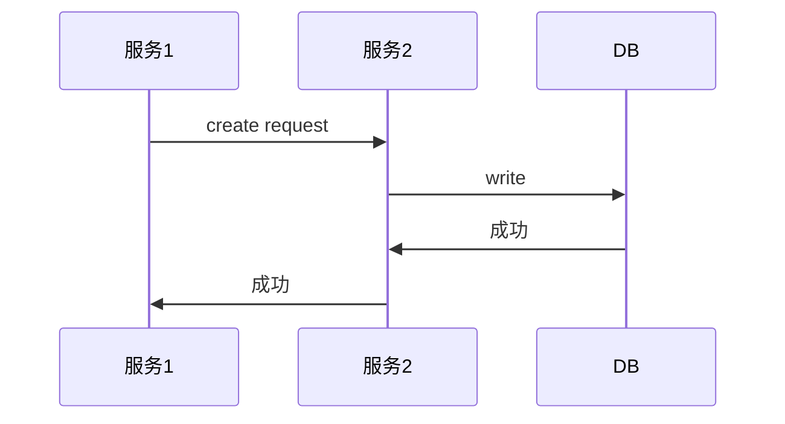

# TOC

<!--ts-->
   * [TOC](#toc)
   * [工具](#工具)
      * [Git](#git)
         * [git命令补全](#git命令补全)
         * [从一个仓库pull然后push到另一个仓库](#从一个仓库pull然后push到另一个仓库)
         * [常用操作](#常用操作)
      * [VI/VIM](#vivim)
         * [常用操作](#常用操作-1)
      * [Makefile](#makefile)
         * [Makefile文件](#makefile文件)
         * [cmake](#cmake)
      * [文本处理](#文本处理)
         * [grep](#grep)
         * [sed](#sed)
         * [sort](#sort)
         * [uniq](#uniq)
      * [Regex](#regex)
         * [实例](#实例)
      * [tcpdump](#tcpdump)
         * [tcpdump和libpcap常用规则](#tcpdump和libpcap常用规则)
      * [Shell和Bash](#shell和bash)
         * [Bash实例](#bash实例)
            * [循环](#循环)
            * [一次创建多个文件](#一次创建多个文件)
            * [获取入参名称及值](#获取入参名称及值)
            * [字符串转array和array切片](#字符串转array和array切片)
            * [trap](#trap)
            * [字符串切片](#字符串切片)
            * [截取字符串子串](#截取字符串子串)
            * [字符串比较](#字符串比较)
            * [计算数组中元素个数](#计算数组中元素个数)
            * [当没有stress时如何对CPU施压](#当没有stress时如何对cpu施压)
            * [并发执行多任务](#并发执行多任务)
            * [替换变量](#替换变量)
            * [日志输出](#日志输出)
            * [检查文件是否存在](#检查文件是否存在)
            * [IFS指定分隔符](#ifs指定分隔符)
            * [遍历处理被IFS分隔过的数组](#遍历处理被ifs分隔过的数组)
            * [从文件中读取信息](#从文件中读取信息)
            * [比较两个变量是否相同](#比较两个变量是否相同)
            * [高级test语句: 正则表达式，判断是否为纯数字](#高级test语句-正则表达式判断是否为纯数字)
            * [判断一个文件夹是否为空](#判断一个文件夹是否为空)
            * [使用cat生成文件](#使用cat生成文件)
            * [运算](#运算)
         * [其它记录](#其它记录)
      * [YAML](#yaml)
      * [JSON](#json)
         * [JSON Patch](#json-patch)
            * [简单示例](#简单示例)
            * [实用例子](#实用例子)
            * [操作说明](#操作说明)
         * [jq工具](#jq工具)
            * [过滤带有特殊注解的k8s资源](#过滤带有特殊注解的k8s资源)
            * [查询k8s的events](#查询k8s的events)
            * [数字转string](#数字转string)
            * [排序](#排序)
         * [常用操作](#常用操作-2)
      * [base64](#base64)
      * [butane](#butane)
      * [Helm](#helm)
         * [背后的思路](#背后的思路)
         * [常用命令](#常用命令)
      * [Swagger](#swagger)
         * [使用swagger-ui](#使用swagger-ui)
   * [容器网络](#容器网络)
      * [Calico](#calico)
         * [使用Calico实现容器网络流量限制](#使用calico实现容器网络流量限制)
         * [Calico容器网络中固定Pod IP地址](#calico容器网络中固定pod-ip地址)
      * [kube-ovn](#kube-ovn)
         * [常用操作](#常用操作-3)
      * [CoreDNS](#coredns)
         * [CoreDNS原理简介](#coredns原理简介)
         * [通过rewrite plugin修改待解析的域名](#通过rewrite-plugin修改待解析的域名)
         * [通过NodeLocalDns指定外部域名解析服务器](#通过nodelocaldns指定外部域名解析服务器)
         * [通过hosts方式手动增加A记录](#通过hosts方式手动增加a记录)
   * [基础组件和服务](#基础组件和服务)
      * [Etcd](#etcd)
         * [常见操作](#常见操作)
         * [如何判断Disk性能满足Etcd运行要求](#如何判断disk性能满足etcd运行要求)
         * [如何判断Network性能满足Etcd运行要求](#如何判断network性能满足etcd运行要求)
         * [kube-apiserver的etcd-quorum-read调查](#kube-apiserver的etcd-quorum-read调查)
         * [v3常见操作](#v3常见操作)
         * [v2 API](#v2-api)
         * [修复故障节点](#修复故障节点)
         * [快照备份（v3 支持）](#快照备份v3支持)
         * [v2全量备份](#v2全量备份)
         * [调优](#调优)
         * [错误类型说明](#错误类型说明)
      * [Prometheus](#prometheus)
         * [指标](#指标)
            * [内存](#内存)
               * [内存指标说明](#内存指标说明)
         * [promtool工具](#promtool工具)
         * [PromQL](#promql)
            * [Pod内存使用百分比](#pod内存使用百分比)
            * [Pod内各容器使用百分比](#pod内各容器使用百分比)
            * [CPU用量](#cpu用量)
            * [CPU使用率（同limit比较）](#cpu使用率同limit比较)
            * [其它](#其它)
         * [RESTful接口查询示例](#restful接口查询示例)
         * [Pushgateway](#pushgateway)
         * [Alertmanager](#alertmanager)
         * [prometheus-operator](#prometheus-operator)
      * [Harbor](#harbor)
         * [手动清理镜像](#手动清理镜像)
      * [minio](#minio)
      * [nginx](#nginx)
      * [haproxy](#haproxy)
         * [使用socat操作UNIX domain套接字](#使用socat操作unix-domain套接字)
      * [keepalived](#keepalived)
         * [keepalived背后的vrrp](#keepalived背后的vrrp)
      * [Redis](#redis)
         * [Redis常用操作](#redis常用操作)
   * [杂项](#杂项)
      * [AK/SK认证](#aksk认证)
         * [AK/SK原理](#aksk原理)
         * [AK/SK流程](#aksk流程)
      * [memcached](#memcached)
      * [mysql](#mysql)
         * [数据库操作](#数据库操作)
            * [常用操作](#常用操作-4)
            * [数据库master节点操作](#数据库master节点操作)
            * [数据库slave节点操作](#数据库slave节点操作)
            * [重置slave上master binlog的位置](#重置slave上master-binlog的位置)
            * [数据库读写分离主从同步延迟测试SQL语句](#数据库读写分离主从同步延迟测试sql语句)
            * [查看从数据库服务器信息](#查看从数据库服务器信息)
         * [DBA相关](#dba相关)
            * [获取 InnoDB_Buffer_Pool_Size 推荐值](#获取-innodb_buffer_pool_size-推荐值)
            * [获取 InnoDB Buffer Pool实际使用情况](#获取-innodb-buffer-pool实际使用情况)
            * [获取pool size 和 数据库内存使用参考值（mysql在800连接但不执行任何sql时需要的内存）](#获取pool-size-和-数据库内存使用参考值mysql在800连接但不执行任何sql时需要的内存)
            * [查询临时表的创建](#查询临时表的创建)
            * [临时表使用的内存大小](#临时表使用的内存大小)
            * [mysqld内存高使用量分析](#mysqld内存高使用量分析)
         * [SQL语句实例](#sql语句实例)
      * [maxscale](#maxscale)
      * [mha](#mha)
      * [PostgreSQL](#postgresql)
      * [SQLite](#sqlite)
      * [RabbitMQ](#rabbitmq)
         * [常用操作](#常用操作-5)
         * [rabbitmq节点重新加入集群](#rabbitmq节点重新加入集群)
      * [influxdb](#influxdb)
      * [Openstack](#openstack)
         * [常用操作](#常用操作-6)
         * [K8s中openstack-cloud-provider获取实例元数据](#k8s中openstack-cloud-provider获取实例元数据)
            * [通过ConfigDrive方式](#通过configdrive方式)
            * [通过MetadataService方式](#通过metadataservice方式)
         * [nova compute健康状态检查](#nova-compute健康状态检查)
         * [rally测试中TCP端口耗尽问题解决](#rally测试中tcp端口耗尽问题解决)
      * [Rancher](#rancher)
         * [通过API访问Rancher](#通过api访问rancher)
         * [在Air Gap环境中以HA方式部署Rancher](#在air-gap环境中以ha方式部署rancher)
      * [kubespray和kubeadm部署K8s集群](#kubespray和kubeadm部署k8s集群)
         * [为apiserver新增SAN](#为apiserver新增san)
            * [方法一，通过kubespray](#方法一通过kubespray)
            * [方法二，通过kubeadm](#方法二通过kubeadm)
      * [Weavescope](#weavescope)
      * [Ceph](#ceph)
         * [常用命令](#常用命令-1)
         * [ONEStor](#onestor)
      * [KVM](#kvm)
         * [检查是否支持虚拟化](#检查是否支持虚拟化)
         * [virsh操作](#virsh操作)
      * [drbd](#drbd)
         * [drbd常见命令](#drbd常见命令)
         * [修复处于Diskless状态的节点](#修复处于diskless状态的节点)
         * [修复脑裂/standalone状态的节点](#修复脑裂standalone状态的节点)
         * [修复Inconsistent/Inconsistent状态](#修复inconsistentinconsistent状态)
         * [肉搏操作drbd存储](#肉搏操作drbd存储)
         * [drbd周边知识](#drbd周边知识)
            * [块设备操作命令](#块设备操作命令)
            * [如何判断块设备是否在被使用中](#如何判断块设备是否在被使用中)
            * [debugfs](#debugfs)
      * [ansible](#ansible)
      * [Java](#java)
         * [Debug Java](#debug-java)
      * [Python](#python)
         * [使用pip](#使用pip)
         * [实例](#实例-1)
            * [字符串操作](#字符串操作)
      * [MarkDown](#markdown)
         * [时序图](#时序图)
         * [escaping转义](#escaping转义)
         * [图片配置大小](#图片配置大小)
      * [奇技淫巧](#奇技淫巧)
         * [atom超级好用的package](#atom超级好用的package)
         * [Azure镜像源](#azure镜像源)
         * [Office Word中打钩](#office-word中打钩)
         * [Chrome因证书问题打不开页面](#chrome因证书问题打不开页面)
            * [直接敲thisisunsafe](#直接敲thisisunsafe)
            * [管理HSTS](#管理hsts)

<!-- Added by: admin, at: 2022年12月 6日 21:42:35 -->

<!--te-->


# 工具

## Git

### git命令补全
在git安装完成后，一般会将补全配置文件自动安装到`/etc/bash_completion.d/git`或者
`/usr/share/bash-completion/completions/git`。

为此，只需要`source`上述配置文件即可，例如在`.bashrc`中：
```bash
[root@zy-super-load ~]# cat ~/.bashrc
# .bashrc
...
source /etc/bash_completion.d/git
```

### 从一个仓库pull然后push到另一个仓库
参见[链接](https://stackoverflow.com/questions/4523496/is-it-possible-to-pull-from-one-repo-and-push-to-other-one) .
```bash
# 从一个仓库pull下载
git pull
# 修改push的仓库路径
git remote set-url --push origin git@example.com:another-repo.git
# push到另一个仓库
git push
```

### 常用操作

```bash
# 撤销add的修改
git reset --mixed

## 将github上的项目搬运到gitlab
git remote rename origin old-origin
git remote add origin git@gitlab.x.y:path/to/project.git
# 将github上的分支track到本地
for remote in `git branch -r | grep -v master `; do git checkout --track $remote ; done
git push -u origin --all
git push -u origin --tags

git push -u origin maxscale-2.1.7       # push的同时，设置默认的远程仓库分支
git branch -vv
git clone -b maxscale-2.1.7 https://github.com/ytinirt/test.git
git tag -a v1.4 -m "my version 1.4"     # 创建Annotated Tag
git tag -a v1.2 deadbeef                # 根据历史commit，创建Tag
git tag v1.4-lw                         # 创建Lightweight Tag
git push origin v1.5                    # 将本地Tag push到remote server
git push origin --tags                  # 批量上传本地所有未push的Tag到remote server
git tag
git show v1.4
git log --pretty=oneline
# 直接checkout一个Tag时，会将repo置于“detached HEAD”状态，为此，可根据Tag创建Branch，在该Branch上修改bug再打Tag
git checkout -b version2 v2.0.0
git branch -d -r origin/feature/init    # 删除remote分支
git reset HEAD~                         # 撤销还未push的commit
git rm file                             # 删除文件
git clean -xdf .                        # 清理临时文件
git stash                               # 暂存修改
git stash pop                           # 重新实施暂存的修改
git config --global core.autocrlf=input # windows拉取代码时候换行符保持和仓库一样，提交代码时候换行符自动转换成 \n
git commit --signoff                    # 带上Signed-Off信息
git commit --signoff --amend            # 为上一个commit追加Signed-Off信息
git rev-parse --show-toplevel           # 获取repo根目录
git checkout -b systemd-mac-assignment bed5b7ef6c

# 为git设置代理
git config --global https.proxy 'http://a.b.c:8080'
git config --global http.proxy 'http://a.b.c:8080'
# 不需要代理的地址/域名，可配置环境变量
export no_proxy=.ytinirt.cn

# 当提示ssl、证书问题时，可尝试如下解决办法， TODO 深入分析
git config --global http.sslverify 'false'
```


## VI/VIM

### 常用操作

```bash
# 全局字符串替换
%s/xxx/yyy/g
# up half page
Ctrl + U
# up
Ctrl + B
# down half page
Ctrl + D
# down
Ctrl + F
```


## Makefile

### Makefile文件

在Makefile文件中使用shell函数

```bash
# 使用shell函数
tar -zcf os-nfs-v1-$$(date +"%y%m%d%H%M")-M1.tar.gz os-nfs
```


### cmake

```bash
# 查看配置项信息
cmake ../mysql-server-mysql-5.7.20/ -LH
```


## 文本处理
### grep
```bash
# 搜索时，跳过一些文件
grep -r --exclude-dir=".git;.svn" "string to search" <directory>
grep -r --exclude-dir="./*/.git" "string to search" <directory>
```

### sed

### sort

### uniq

## Regex

### 实例
```bash
# 匹配list pod和list node操作
'.*kubectl.* get (po|pods?).* (-A|--all-namespaces).*'
'.*kubectl.* get (no|nodes?).*'

# 匹配Word
'[_0-9a-zA-Z]*[rR][eE][dD] ?[hH][aA][tT][_0-9a-zA-Z]*'

# 匹配word的组合
'(RHEL|rhel|Rhel)_?[2-9]'

# 只能输入1~16位字母、数字、下划线，且只能以字母和数字开头
'^[A-Za-z0-9][A-Za-z0-9_]{0,15}$'

# 格式检查，pvc的value
'^([1-9][0-9]*Gi)?$'
```

## tcpdump

网络报文抓包工具。

常用命令：

```bash
# 各种复杂过滤规则示例
tcpdump -i lo 'tcp dst port 4194 and (((ip[2:2] - ((ip[0]&0xf)<<2)) - ((tcp[12]&0xf0)>>2)) != 0)' -A
tcpdump -i docker0 "dst 10.100.146.23 or dst 10.100.42.177 or dst 10.100.58.78" -nnq  | grep -v "length 0" | awk '{print $3}' | sed "s/\./ /g" | awk '{print $1"."$2"."$3"."$4}'
tcpdump -i eth0 '(tcp dst port 5005 or tcp dst port 19000) and (((ip[2:2] - ((ip[0]&0xf)<<2)) - ((tcp[12]&0xf0)>>2)) != 0)' -A
tcpdump -i eth0 'tcp and (ip src 10.101.13.21) and (((ip[2:2] - ((ip[0]&0xf)<<2)) - ((tcp[12]&0xf0)>>2)) != 0)' -A

# arp who-has过滤
tcpdump -i tun0 -nnl arp and host 10.241.127.9

# TCP报文是 GET 请求
tcpdump -i eth0 '(ip src 10.101.13.21) and (tcp[(tcp[12]>>2):4] = 0x47455420)'
# TCP报文是 POST 请求
tcpdump -i eth0 '(ip src 10.101.13.21) and (tcp[(tcp[12]>>2):4] = 0x504F5354)'
# TCP报文是 PUT 请求
tcpdump -i eth0 '(ip src 10.101.13.21) and (tcp[(tcp[12]>>2):4] = 0x50555420)'
# TCP报文是 DELETE 请求
tcpdump -i eth0 '(ip src 10.101.13.21) and (tcp[(tcp[12]>>2):4] = 0x44454C45)'
# TCP报文是 HTTP 应答
tcpdump -i eth0 '(ip dst 10.101.13.21) and (tcp[(tcp[12]>>2):4] = 0x48545450)'

# 谁在应答findCompute这个API
tcpdump -i docker0 '(tcp[(tcp[12]>>2):4] = 0x47455420)' -A  | grep "GET\|IP" | grep -B 1 "findCompute"

# 抓取报文并保存到本地
tcpdump -i eth0 port 8443 -w hehe.pcap -B 409600

# 常用的标识
# -N          不带详细的DNS域名
# -w file     输出抓包信息至文件
# -s0         抓取完整的数据包
# -q          显示尽量少的协议信息
# -t          不显示时间戳
```

### tcpdump和libpcap常用规则

```bash
dns.qry.name contains "devops"      # DNS请求过滤
```


## Shell和Bash

### Bash实例

#### 循环

```bash
for i in $(seq 1 431); do rm -f mysql-bin.$(printf "%06d" $i); done
for ((i=${hehe}; i<${hehe}+4; i++)); do printf "%03d\n" $i; done   #按照指定位数，左补零
for ((i=1; i<4; i++)); do echo $i; done
count=0;while true; do let 'count++'; echo ${count}; done
```

#### 一次创建多个文件
```bash
# 创建26个空文件
touch {a..z}.txt

# 创建152个文件
touch {{a..z},{A..Z},{0..99}}.txt
```

#### 获取入参名称及值

通过`indirect variables`实现。

示例1：

```bash
function test()
{
    echo $1 ${!1}
}

xixi=hehe
test xixi
```

示例2：

```bash
# indirect variables
declare -a GET_1_PER_MIN=("hehe" "xixi")

function start_task()
{
    tmp="${1}[@]"
    echo $1
    for val in "${!tmp}"; do
        echo ${val}
    done
}

start_task GET_1_PER_MIN
```

#### 字符串转array和array切片

示例1：

```bash
hehe="111 222 333 444 -xx dsaff"
function test()
{
    tmp=($@)
    xixi=${tmp[@]:2}
    echo $xixi
}
test $hehe
```

示例2：

```bash
MYSQL_PODS=$($KUBECTL $SERVER get pod -o wide | grep $MYSQL_POD_NAME | awk '{print $1,$6}')
IFS=' ' read -r -a MYSQL_PODS <<< $MYSQL_PODS
```

#### trap

trap recovery RETURN


#### 字符串切片

```bash
${var:offset:number}   #字符串切片
${var: -length}        #字符串切片
```


#### 截取字符串子串

```bash
pids=1020/java
pids=${pids%/*}
etcdip_str=${etcdip_str%,}  #截取尾部的,

items=1,2,3,4, ; echo $items; items=${items%,}; echo $items #如果最后一个字符是','，则去掉
hehe=cell001;echo ${hehe:(4)};echo ${hehe:(-3)} # 字符串切片
hehe=cell001; echo ${hehe:0:4}
cell
hehe=cell001; echo ${hehe:4}
001
hehe=cell001; echo ${hehe:-3}
cell001
hehe=cell001; echo ${hehe:(-3)}
001
```


#### 字符串比较

建议加上双引号""，否则当$1为空时会报错。

```bash
function compare()
{
    if [ "$1" = "hehe" ]; then
        log_info "file $1 exists"
    else
        log_err "file $1 not exists"
        exit 1
    fi
}
```


#### 计算数组中元素个数

```bash
NODES=($(kubectl --server $SERVER get nodes -o json | jq '.items[].metadata.name' | tr -d '"'))
NUMNODES=${#NODES[@]}
```


#### 当没有stress时如何对CPU施压

```bash
timeout 600s bash -c "while true; do echo 1 > /dev/null; done" &
timeout 600s bash -c "while true; do echo 1 > /dev/null; done" &
...
timeout 600s bash -c "while true; do echo 1 > /dev/null; done" &

kill $(jobs -p)
```


#### 并发执行多任务

```bash
( os::build::image "${tag_prefix}-pod"                     images/pod ) &
( os::build::image "${tag_prefix}-template-service-broker" images/template-service-broker ) &

for i in `jobs -p`; do wait $i; done
```


#### 替换变量

```bash
set -- "$@" --init-file="$tempSqlFile"
```


#### 日志输出

```bash
function log_print()
{
    echo $(date +"%Y-%m-%d %T") $1 >> ${LOG_FILE}
}

function log_info()
{
    log_print "INF: $1"
}

log_info "hehe"
```


#### 检查文件是否存在
```bash
function check_file()
{
    if [ -f "$1" ]; then
        log_info "file $1 exists"
    else
        log_err "file $1 not exists"
        exit 1
    fi
}
```


#### IFS指定分隔符
```bash
CLUSTER_NODES=cell001-mysql-node1,cell001-mysql-node2,cell001-mysql-node3
OLD_IFS="$IFS"
IFS=","
nodes=(${CLUSTER_NODES})
IFS="${OLD_IFS}"
for n in ${nodes[@]}; do xxx; done
```


#### 遍历处理被IFS分隔过的数组
```bash
IFS=' ' read -r -a BACKENDS <<< $BACKENDS
for ((i=0; i<${#BACKENDS[@]}; i+=2))
do
    be_name=${BACKENDS[i]}
    be_addr=${BACKENDS[i+1]}
    log_dbg "trying to clockdiff with backend ${be_name}(${be_addr}) ..."
    clockdiff ${be_addr} > ${RESULT_DIR}/${be_name}
    if [ $? == 0 ]; then
        log_dbg "result: $(cat ${RESULT_DIR}/${be_name})"
    else
        log_err "clockdiff with backend ${be_name}(${be_addr}) failed"
    fi
done
```


#### 从文件中读取信息
```bash
function proc_rc_with_multi_replicas()
{
    cat $1 | sed '/^#.*\|^$/d' | while read line
    do
        log_dbg $line
    done
}
```


#### 比较两个变量是否相同
```bash
if [ ${temp} = ${rc} ]; hen
    log_err "rc has been processed, need bypassing it: ${rc}"
    return 1
fi
```


#### 高级test语句: 正则表达式，判断是否为纯数字
```bash
if (! [[ ${migrate_threshold} =~ ^[0-9]+$ ]]) && (! [[ ${migrate_threshold} =~ [xX] ]]); then
    log_err "invalid rule, migrate_threshold(${migrate_threshold})"
    return 1
fi
if ! [[ ${pod_anti_affinity_required} =~ [nNyY] ]]; then
    log_err "invalid rule, pod_anti_affinity_required(${pod_anti_affinity_required})"
    return 1
fi

if [ $# -ne 2 ] && [ $# -ne 3 ]; then
    echo "Usage: $0 <node_ip> <node_type> [node_idx]" > /dev/stdout
    exit 1
fi

case ${node_type} in
    clusCtrl | moniClus | appsCtrl | compClus | cellClus)
        echo "correct nodeType ${node_type}";;
    *)
        log_err "Invalid node_type ${node_type}";;
esac
```


#### 判断一个文件夹是否为空
~~~
if [ -z "$(ls -A /path/to/dir)" ]; then
   echo "Empty"
else
   echo "Not Empty"
fi
~~~


#### 使用cat生成文件

```bash
cat <<EOF >/usr/lib/systemd/system/kube-flanneld.service
xxxxxxx
xxxxxxxx
EOF
```


#### 运算

```bash
cell_num=997; tmp=$[ ( ${cell_num} - 1 ) % 3 ]; echo $tmp
```


### 其它记录

使用kill发送信号采用如下方式：

```bash
kill -s HUP $(pidof dnsmasq)    # 脚本中执行 kill -SIGHUP $(pidof dnsmasq) 会报错
```


## YAML

使用`yml2json`完成转换，安装方式为`pip install yml2json`。


## JSON

### JSON Patch

JSON PATCH定义修改json文件内容的数据格式，其避免了修改过程中传输整个json文件的问题，而只需传输待修改的部分。
同HTTP的PATCH方法结合使用，能通过RESTful API更新文件（资源）的部分内容。

JSON Patch在[RFC 6902](https://tools.ietf.org/html/rfc6902)中定义。

#### 简单示例
原始文件

```bash
{
  "baz": "qux",
  "foo": "bar"
}
```
一些列patch操作

```bash
[
  { "op": "replace", "path": "/baz", "value": "boo" },
  { "op": "add", "path": "/hello", "value": ["world"] },
  { "op": "remove", "path": "/foo" }
]
```
结果

```bash
{
  "baz": "boo",
  "hello": ["world"]
}
```

#### 实用例子

整体替换/覆盖pod的标签：
```bash
curl -H "Content-Type:application/json-patch+json" --request PATCH "http://127.0.0.1:8888/api/v1/namespaces/default/pods/milk-rc-qlzst" -d "[{ \"op\": \"add\",\"path\":\"/metadata/labels\",\"value\":{\"app2\":\"milk2\", \"app\":\"milk\"}}]"
```

为pod增加`role=master`的标签：
```bash
curl -H "Content-Type:application/json-patch+json" --request PATCH "http://127.0.0.1:8888/api/v1/namespaces/default/pods/wechat-core-rc-8cthk" -d "[{ \"op\": \"add\",\"path\":\"/metadata/labels/role\",\"value\":\"master\"}]"
```

删除pod的`role`标签：
```bash
curl -H "Content-Type:application/json-patch+json" --request PATCH "http://127.0.0.1:8888/api/v1/namespaces/default/pods/wechat-core-rc-8cthk" -d "[{ \"op\": \"remove\",\"path\":\"/metadata/labels/role\"}]"
```

#### 操作说明
**Add**

> `{ "op": "add", "path": "/biscuits/1", "value": { "name": "Ginger Nut" } }`<br>
> Adds a value to an object or inserts it into an array. In the case of an array, the value is inserted before the given index. The - character can be used instead of an index to insert at the end of an array.

**Remove**

> `{ "op": "remove", "path": "/biscuits" }`<br>
> Removes a value from an object or array.<br>
> `{ "op": "remove", "path": "/biscuits/0" }`<br>
> Removes the first element of the array at biscuits (or just removes the “0” key if biscuits is an object)

**Replace**

> `{ "op": "replace", "path": "/biscuits/0/name", "value": "Chocolate Digestive" }`<br>
> Replaces a value. Equivalent to a “remove” followed by an “add”.

**Copy**

> `{ "op": "copy", "from": "/biscuits/0", "path": "/best_biscuit" }`<br>
> Copies a value from one location to another within the JSON document. Both from and path are JSON Pointers.

**Move**

> `{ "op": "move", "from": "/biscuits", "path": "/cookies" }`<br>
> Moves a value from one location to the other. Both from and path are JSON Pointers.

**Test**

> `{ "op": "test", "path": "/best_biscuit/name", "value": "Choco Leibniz" }`<br>
> Tests that the specified value is set in the document. If the test fails, then the patch as a whole should not apply.

参见[jsonpatch](http://jsonpatch.com)。

### jq工具

#### 过滤带有特殊注解的k8s资源
```bash
kubectl get svc -A -o json | jq '.items[] | select(.metadata.annotations["service.alpha.openshift.io/serving-cert-secret-name"] != null) | .metadata | .namespace + ":" + .name' -r
```

#### 查询k8s的events
```bash
# 出现次数排序
kubectl get event -A -o json | jq '.items[] | select(.count != null) | select(.firstTimestamp != null) | select(.lastTimestamp != null) | (.count | tostring) + " " + (.metadata.name) + " " + (.firstTimestamp) + " " + (.lastTimestamp)' -r | sort -n

# 出现时间排序
kubectl get event -A -o json | jq '.items[] | select(.count != null) | select(.firstTimestamp != null) | select(.lastTimestamp != null) | (.firstTimestamp) + " " +(.count | tostring) + " " + (.metadata.name) + " "  + (.lastTimestamp)' -r | sort -r
```

#### 数字转string
```bash
jq '.[] | .string + ": " + (.number|tostring)'
```

#### 排序
```bash
etcdctl get --prefix /leader-election -w json | jq .kvs[] | jq -s -c 'sort_by(.create_revision)[0] | .value' -r | base64 -d
```

### 常用操作

使用jq格式化输出

```bash
# 仅输出顶级key
cat master.ign | jq '. |= keys'
# 输出顶级和二级key
cat master.ign | jq '.| map_values(keys)'

jq .
# jq escape dot
cat xxx | jq '.Labels["io.kubernetes.pod.namespace"]'
kubectl get pod --all-namespaces -o json | jq -r '.items[] | select(.spec.hostNetwork) | .metadata.namespace + ":" +.metadata.name' | wc -l
kubectl get pods -o json | jq '.items[] | select(.spec.hostname == "webapp-server-2" or .spec.hostname == "webapp-server-1") | .metadata.name' | tr -d '"'
kubectl get pods -o json | jq '.items[].metadata.name'
kubectl get pod mha-manager-s647h -o json | jq 'del(.spec)'     # 不输出.spec
kubectl get ns "$0" -o json | jq "del(.spec.finalizers[0])">"tmp.json"
kubectl get pods -o json | jq '.items[] | select(.spec.schedulerName == "my-scheduler") | select(.spec.nodeName == null) | .metadata.name' | tr -d '"'
kubectl get pods -o json | jq '.items[] | select(.metadata.labels.node == "mysql-node1") | .status.hostIP'
kubectl get pods -o json | jq '.items[] | select(.metadata.name | startswith("mysql")) | .status.hostIP'   # 通配、wildcard
kubectl get pods -o json | jq '.items[] | select(.metadata.name | startswith("mysql")) | .metadata.labels.node + " " + .status.hostIP'  # 多个域在一行同时输出
kubectl get node zy-os-okd-m -o json | jq '.status.addresses[] | select(.type == "InternalIP") | .address' | tr -d '"' # 获取kubernetes节点集群IP地址
kubectl get node -l node=node1 -o json | jq '.items[0].status.addresses[] | select(.type == "InternalIP") | .address' | tr -d '"'
echo '{ "app": "rabbitmq-cluster", "node": "rabbit3" }' | jq 'to_entries[]'
docker info -f '{{json .DriverStatus}}' | jq '.[] | .[0] + " " + .[1]'
jq '.items | length'
jq ".items[] | select(.metadata.name == \"${n}\") | .spec.clusterIP"
${KUBECTL} get node -o json|jq -r .items|jq -r length
cat xxx | jq .mysql[0].node -r # -r去掉""
jq -c
kubectl get pod milk-rc-fc9m7 -o json | jq -r '.metadata.labels | to_entries[] | select(.key != "role") | .key + "=" + .value'
curl -s http://localhost:9090/api/v1/rules | jq '[.data.groups[].rules[] | select(.type=="alerting")]'  # 输出list
```

将 `{ "app": "rabbitmq-cluster", "node": "rabbit3" }` 格式转换为 `app=rabbitmq-cluster,node=rabbit3`

```bash
selectors=$(echo $selectors | jq 'to_entries[]| .key + "=" + .value' | tr -d '"')
selectors=$(echo $selectors | sed 's/ /,/g')
```


## base64

一种编码方式，主要将数据字符串化，便于传递、避免特殊字符带来的问题。

```bash
# 编码 encode
[zy@m1 ~]$ echo -n "admin" | base64
YWRtaW4=

# 解码 decode
[zy@m1 ~]$ echo YWRtaW4= | base64 -d
admin
```


## butane
```bash
alias butane='docker run --rm --interactive         \
                 --security-opt label=disable          \
                 --volume "${PWD}":/pwd --workdir /pwd \
                  quay.io/coreos/butane:release'
```


## Helm

入门参考 [How to make a Helm chart in 10 minutes](https://opensource.com/article/20/5/helm-charts)

### 背后的思路
参见 [How to use infrastructure as code](https://opensource.com/article/19/7/infrastructure-code)

### 常用命令
```bash
# helm 默认从 ~/.kube/config 获取K8s配置文件，可通过环境变量 $KUBECONFIG 或 --kubeconfig 标志指定配置文件。
helm list               # 查看chart的版本

helm create demo-chart     # 创建一个chart
helm install -n rel-name --namespace default ./demo-chart
helm status rel-name    # 查看release状态
helm inspect ./demo-chart/

# 添加的repo，配置信息默认保存在 /root/.config/helm/repositories.yaml
helm repo add rancher-stable https://releases.rancher.com/server-charts/stable
helm repo list                      # 查看repo列表
helm fetch rancher-stable/rancher   # 获取helm chart包(.tgz)
helm template ./rancher-<VERSION>.tgz --output-dir . \  # 实例化helm chart
    --name rancher \
    --set ingress.tls.source=secret
```


## Swagger

### 使用swagger-ui

1. 编写api文档`/tmpfs/swagger.yml`
2. 准备镜像`docker pull swaggerapi/swagger-ui:latest`
3. 启动服务`docker run -p 8080:8080 -e SWAGGER_JSON=/hehe/swagger.yml -v /tmpfs:/hehe --name swagger-ui swaggerapi/swagger-ui`


# 容器网络

## Calico


### 使用Calico实现容器网络流量限制
cni/calico是支持网络限速的，其底层依赖tc实现，详见[https://github.com/projectcalico/calico/issues/797](https://github.com/projectcalico/calico/issues/797)。
通过配置tc也能达到同样目的（TODO TC介绍）

参见链接：
- https://kubernetes.io/docs/concepts/extend-kubernetes/compute-storage-net/
- https://stackoverflow.com/questions/54253622/kubernetes-how-to-implement-a-network-resourcequota
- https://www.gitmemory.com/issue/projectcalico/calico/797/493210584
- https://github.com/kubernetes/kubernetes/blob/v1.8.4/pkg/util/bandwidth/utils.go#L38
- https://docs.projectcalico.org/v3.8/security/advanced-policy
- https://docs.projectcalico.org/v3.8/security/calico-network-policy


### Calico容器网络中固定Pod IP地址
为Pod指定IP地址：
```bash
apiVersion: v1
kind: Pod
metadata:
  name: nginx-static-ip
  annotations:
    "cni.projectcalico.org/ipAddrs": "[\"10.248.123.45\"]"
  namespace: default
  labels:
    app: nginx-static-ip
spec:
  containers:
  - image: nginx
    imagePullPolicy: IfNotPresent
    name: nginx-static-ip
    ports:
    - containerPort: 80
      protocol: TCP
```
其中通过`cni.projectcalico.org/ipAddrs`注解配置IP地址。
**注意**，固定IP地址应在容器网络IP地址池内，获取IP地址池的方法为查看节点上配置文件`/etc/cni/net.d/10-calico.conflist`中ipam段的`ipv4_pools`。


## kube-ovn
### 常用操作


## CoreDNS

### CoreDNS原理简介
TODO

### 通过rewrite plugin修改待解析的域名
有K8s集群域名被配置为`wushan.thx`，但有域名解析请求被硬编码为`*.cluster.local`结尾，可通过rewrite规避解决，大致思路将`.cluster.local`替换为`wushan.thx`。

修改CoreDNS配置文件`kubectl edit cm coredns -n kube-system`：
```yaml
apiVersion: v1
data:
  Corefile: |
    .:53 {
        errors
        ...
        rewrite name substring cluster.local wushan.thx
        kubernetes wushan.thx in-addr.arpa ip6.arpa {
          pods insecure
          fallthrough in-addr.arpa ip6.arpa
        }
        prometheus :9153
        forward . /etc/resolv.conf {
          prefer_udp
        }
        ...
    }
kind: ConfigMap
```
其中增加例如`rewrite name substring cluster.local <集群域名>`，重启CoreDNS Pod使其生效。

修改NodeLocalDNS配置文件`kubectl edit cm nodelocaldns -n kube-system`，增加处理`*.cluster.local`域名的配置：
```
cluster.local:53 {
    log
    errors
    cache {
        success 9984 30
        denial 9984 5
    }
    reload
    loop
    bind 169.254.25.10
    forward . 10.100.0.3 {
        force_tcp
    }
    prometheus :9253
}
```
重启NodeLocalDns Pod，使配置生效。

**注意**，针对采用主机网络的Pod（即`hostNetwork: true`），需要相应的设置DNS策略`dnsPolicy`为`ClusterFirstWithHostNet`，否则该容器中无法解析集群内的服务。


### 通过NodeLocalDns指定外部域名解析服务器
编辑NodeLocalDns配置`kubectl edit cm -n kube-system nodelocaldns`，在默认的域名解析规则中增加`forward`配置
```
.:53 {
    errors
    cache 30
    reload
    loop
    bind 169.254.25.10
    forward . 10.255.35.230
    prometheus :9253
}
```


### 通过hosts方式手动增加A记录
编辑cm/coredns，在Corefile中增加hosts插件配置，并增加hosts文件：
```bash
# kubectl edit cm -n kube-system coredns
...
data:
  Corefile: |
    .:53 {
...
        hosts /etc/coredns/hosts {
          1.2.3.4 xixi
          fallthrough
        }
        kubernetes cluster.local in-addr.arpa ip6.arpa {
          pods insecure
          fallthrough in-addr.arpa ip6.arpa
        }
...
    }
  hosts: |
    10.125.31.214  kcm.demo.cluster.local
kind: ConfigMap
...
```

编辑deploy/coredns，将cm中hosts文件挂载给工作负载：
```bash
# kubectl edit deploy coredns -n kube-system
...
volumes:
- configMap:
    defaultMode: 420
    items:
    - key: Corefile
      path: Corefile
    - key: hosts
      path: hosts
    name: coredns
  name: config-volume
...
```

以后，通过往cm/coredns的.data.hosts中增加记录即可。


# 基础组件和服务

## Etcd

### 常见操作
* old
  ```bash
  etcdctl ls get
  etcdctl member list
  etcdctl --debug cluster-health     # 能看到使用的API
  etcdctl member list                # 显示成员信息
  etcdctl mk /hehe/xixi "haha"
  etcdctl update key 'val'
  etcdctl rm key
  etcdctl 2>/dev/null -o extended get /coreos.com/network/subnets/10.101.13.0-24

  # 统计度量信息
  /metrics
  # debug信息
  /debug/vars
  ```

* kubeadm创建的k8s集群，获取etcd关键指标
  ```bash
  alias etcd_curl='curl -s --cacert /etc/kubernetes/pki/etcd/ca.crt --key /etc/kubernetes/pki/etcd/server.key --cert /etc/kubernetes/pki/etcd/server.crt'
  alias etcd_metrics='curl -s --cacert /etc/kubernetes/pki/etcd/ca.crt --key /etc/kubernetes/pki/etcd/server.key --cert /etc/kubernetes/pki/etcd/server.crt https://$(hostname):2379/metrics'

  etcd_curl https://127.0.0.1:2379/metrics
  etcd_curl https://127.0.0.1:2379/metrics | \
      grep "etcd_disk_backend_commit_duration_seconds\|etcd_disk_wal_fsync_duration_seconds\|etcd_network_peer_round_trip_time_seconds_bucket\|etcd_server_leader"
  etcd_curl https://$(hostname):2379/metrics | \
      grep "etcd_disk_backend_commit_duration_seconds\|etcd_disk_wal_fsync_duration_seconds\|etcd_network_peer_round_trip_time_seconds_bucket\|etcd_server_leader"
  ```

* OpenShift中获取etcd关键指标
  ```bash
  alias etcd_metrics='curl -s --cacert /etc/kubernetes/static-pod-resources/etcd-certs/configmaps/etcd-serving-ca/ca-bundle.crt --key /etc/kubernetes/static-pod-resources/etcd-certs/secrets/etcd-all-certs/etcd-serving-$(hostname).key --cert /etc/kubernetes/static-pod-resources/etcd-certs/secrets/etcd-all-certs/etcd-serving-$(hostname).crt https://127.0.0.1:2379/metrics'
  etcd_metrics | egrep "backend_commit_d|wal_fsync_d|leader_changes|quota|etcd_mvcc_db_total_size"
  ```

### 如何判断Disk性能满足Etcd运行要求

**1. 检查etcd_disk_backend_commit_duration_seconds指标p99小于25ms**

  etcd会定期将最近的记录打快照，并持久化到disk中，这个指标记录了etcd数据快照持久化写到disk的耗时。
  p99小于25ms，才表明disk性能满足etcd的要求。
  参考[官方链接](https://etcd.io/docs/v3.5/faq/#:~:text=monitor%20backend_commit_duration_seconds)

**2. 检查etcd_disk_wal_fsync_duration_seconds指标p99小于10ms**

  在采纳wal日志的表项前，调用fsync将日志落盘，这个指标记录了fsync落盘耗时。
  p99小于10ms，才表明disk性能满足etcd的要求。
  参考[官方链接](https://etcd.io/docs/v3.5/faq/#:~:text=monitor%20wal_fsync_duration_seconds)

**3. 使用性能测试工具fio测试fdatasync的p99显著小于10ms**

  执行命令：`fio --rw=write --ioengine=sync --fdatasync=1 --directory=test-data --size=22m --bs=2300 --name=mytest`

  说明：
  * 上述采用顺序写（`--rw=write`），在写之后立刻落盘（--fdatasync=1），充分模拟`etcd`的行为。
  * fdatasync的p99得显著小于10ms，才表明disk的性能满足etcd要求。
  * fio版本要求3.5+；test-data是一个文件夹，位于待测试的disk挂载的文件系统内。
  * 参考[文档链接](https://www.ibm.com/cloud/blog/using-fio-to-tell-whether-your-storage-is-fast-enough-for-etcd)

**4. OpenShift基于fio提供了检测工具**

  执行命令：
  ```bash
  podman run --volume /var/lib/etcd:/var/lib/etcd:Z quay.io/openshift-scale/etcd-perf
  ```
  同样要求`fsync`的p99小于10ms。
  参考[文档连接](https://docs.openshift.com/container-platform/4.9/scalability_and_performance/recommended-host-practices.html#recommended-etcd-practices_recommended-host-practices)


### 如何判断Network性能满足Etcd运行要求
**检查etcd_network_peer_round_trip_time_seconds_bucket指标p99小于50ms。**

这个指标表明节点间RRT耗时，PromQL查询方式：
```
histogram_quantile(0.99, rate(etcd_network_peer_round_trip_time_seconds_bucket[2m]))
```

### kube-apiserver的etcd-quorum-read调查
目前从一致性考虑，`kube-apiserver`已强制开启`etcd-quorum-read`选项。

从代码看:
```go
// k8s.io/apiserver/pkg/storage/etcd3/store.go:99
func newStore(c *clientv3.Client, quorumRead, pagingEnabled bool, codec runtime.Codec, prefix string, transformer value.Transformer) *store {
	versioner := etcd.APIObjectVersioner{}
	result := &store{
		client:        c,
		codec:         codec,
		versioner:     versioner,
		transformer:   transformer,
		pagingEnabled: pagingEnabled,
		// for compatibility with etcd2 impl.
		// no-op for default prefix of '/registry'.
		// keeps compatibility with etcd2 impl for custom prefixes that don't start with '/'
		pathPrefix:   path.Join("/", prefix),
		watcher:      newWatcher(c, codec, versioner, transformer),
		leaseManager: newDefaultLeaseManager(c),
	}
	if !quorumRead {
		// In case of non-quorum reads, we can set WithSerializable()
		// options for all Get operations.
		result.getOps = append(result.getOps, clientv3.WithSerializable())
	}
	return result
}
```
开启`etcd-quorum-read`后，客户端采用`linearizable read`，不再`serialized read`，确保一致性。
深入阅读:
- [etcd api guarantees](https://github.com/etcd-io/etcd/blob/master/Documentation/learning/api_guarantees.md)
- [etcd issue 741](https://github.com/etcd-io/etcd/issues/741)
- [增加linearizability read的PR](https://github.com/etcd-io/etcd/pull/866)
- [Strong consistency models](https://aphyr.com/posts/313-strong-consistency-models)

关于客户端请求是否会到`leader`，在etcd的FAQ里有如下描述：
> Do clients have to send requests to the etcd leader?
> Raft is leader-based; the leader handles all client requests which need cluster consensus. However, the client does not need to know which node is the leader. Any request that requires consensus sent to a follower is automatically forwarded to the leader. Requests that do not require consensus (e.g., serialized reads) can be processed by any cluster member.

### v3常见操作

* 性能测试
  ```bash
  etcdctl3 check perf
  ```

* 获取所有key
  ```bash
  ETCDCTL_API=3 /opt/bin/etcdctl-bin/etcdctl get / --prefix --keys-only --cacert=/root/cfssl/ca.pem --cert=/root/cfssl/node-client.pem --key=/root/cfssl/node-client-key.pem
  ```

* 获取key数量
  ```bash
  ETCDCTL_API=3 /opt/bin/etcdctl-bin/etcdctl get / --prefix --keys-only --cacert=/root/cfssl/ca.pem --cert=/root/cfssl/node-client.pem --key=/root/cfssl/node-client-key.pem 2>/dev/null | grep -v ^$ | wc -l
  ```

* 查看etcd节点信息
  ```bash
  ETCDCTL_API=3 /opt/bin/etcdctl-bin/etcdctl --cacert=/root/cfssl/ca.pem --cert=/root/cfssl/node-client.pem --key=/root/cfssl/node-client-key.pem -w table endpoint status 2>/dev/null
  ```

* 遍历etcd中存储的所有数据
  ```bash
  for i in $(ETCDCTL_API=3 etcdctl --cert="/etc/etcd/peer.crt" --key="/etc/etcd/peer.key" --cacert="/etc/etcd/ca.crt" --endpoints https://$(hostname):2379  get / --prefix --keys-only 2>/dev/null)
  do
    ETCDCTL_API=3 etcdctl --cert="/etc/etcd/peer.crt" --key="/etc/etcd/peer.key" --cacert="/etc/etcd/ca.crt" --endpoints https://$(hostname):2379 get ${i} 2>/dev/null
  done
  ```

* alarm
  ```bash
  ETCDCTL_API=3 /opt/bin/etcdctl-bin/etcdctl --cacert=/root/cfssl/ca.pem --cert=/root/cfssl/node-client.pem --key=/root/cfssl/node-client-key.pem alarm list
  ```

* 租期lease
  ```bash
  # 查看租期列表
  ec lease list
   
  # 查看租期lease详情
  ec lease timetolive 3fef7aaab970833d -w fields
  # 遍历所有租期lease
  for l in $(ec lease list | grep -v found); do echo -n "$l "; ec lease timetolive $l -w json; done
   
  # 查看租期lease关联的key
  ec lease timetolive 13c77b63768667d7 --keys
  ```

* mvcc压缩
  ```bash
  # mvcc压缩
  ec compaction --physical <revision-from-endpoint-status>
  ```

* 存储碎片整理
  ```bash
  # 存储碎片整理
  ec defrag
  ```

### v2 API

参见`https://coreos.com/etcd/docs/latest/v2/api.html`

```bash
# 查询现有keys
curl -s http://os-param-svc.default.svc:2379/v2/keys | jq
# 新建key
curl -i -X PUT http://os-param-svc.default.svc:2379/v2/keys/testconfig?value={configValue}
# 查看新建的key
curl -s os-param-svc.default.svc:2379/v2/keys/testconfig | jq
# watch新建的key，GET操作阻塞在那里直到key的value有变化
curl -s os-param-svc.default.svc:2379/v2/keys/testconfig?wait=true
# 删除key
curl -X DELETE http://os-param-svc.default.svc:2379/v2/keys/testconfig
```

### 修复故障节点

前提：

1. etcd集群处健康状态
2. 异常节点此前属于该集群，且集群IP地址未变化

将异常节点从集群移除

```bash
systemctl stop etcd2 # 异常节点上执行
rm –rf /NODEX.etcd   # 删除异常节点上etcd数据目录
/opt/bin/etcdctl remove member-id # 正常节点上执行
```

将异常节点重新加入集群

```bash
/opt/bin/etcdctl add NODEX http://异常节点IP:2380      # 正常节点上执行
修改/etc/sysconfig/kube-etcd-cluster配置文件中 ETCD_INITIAL_CLUSTER_STATE=new 为 ETCD_INITIAL_CLUSTER_STATE=existing
systemctl start etcd2  # 异常节点上执行，启动异常节点上etcd2的服务
/opt/bin/etcdctl member list  # 正常节点上执行，检查故障是否恢复
/opt/bin/etcdctl cluster-health # 检查集群状态是否健康
修改/etc/sysconfig/kube-etcd-cluster配置文件中 ETCD_INITIAL_CLUSTER_STATE=existing 为 ETCD_INITIAL_CLUSTER_STATE=new
```

### 快照备份（v3+支持）
```bash
ETCDCTL_API=3 etcdctl snapshot save backup.db
ETCDCTL_API=3 etcdctl --write-out=table snapshot status backup.db
```

### v2全量备份
```bash
etcdctl backup --data-dir="/path/to/data/" --backup-dir="/path/to/backup/"
```


### 调优

参考

- https://github.com/coreos/etcd/blob/v3.1.6/Documentation/tuning.md
- https://coreos.com/etcd/docs/latest/tuning.html

影响etcd性能的主要因素：

* 网络延迟
* Disk IO性能

**时间参数**

HeartbeatInterval: 主节点的心跳周期（默认100ms），最佳实践建议采用节点间RTT（采用ping获取）的最大平均值。
ElectionTimeout: 超过该时间（默认1000ms）未收到主节点的心跳后，从节点会启动选举操作，至少是 max {(RTT x 10), (HeartbeatInterval x [5, 10])}

**快照Snapshot**

为避免WAL日志过大，etcd周期性打快照，用以记录当前系统状态并删除旧WAL日志，以节省空间。
快照操作代价高昂，默认情况下每达到10K次修改便执行快照操作，当etcd内存或磁盘利用率较高时，可考虑降低打快照的阈值，例如改为5K。

**Disk IO性能**

Etcd集群对Disk IO性能、延迟特别敏感。由于WAL日志的持久化，fsync操作的延迟时间对Etcd特别关键。Disk性能出现问题时，很可能导致主
节点心跳丢失、请求超时、暂时的leader loss等问题，对Etcd集群健康和稳定性带来巨大挑战。

**使用ionice修改IO优先级**

使用ionice提升etcd进程的IO优先级，避免受到其它任务/进程的影响：
```bash
ionice -c2 -n0 -p $(pgrep -w etcd3)
```
执行如下操作，批量修改
```bash
cat <<EOF >/opt/bin/common/etcd-io-tuning.sh
#!/bin/bash

pids=\$(/usr/bin/pgrep -w etcd3)
/usr/bin/ionice -c2 -n0 -p \${pids}
EOF

chmod a+x /opt/bin/common/etcd-io-tuning.sh

sed -i '/ExecStart=/a\ExecStartPost=-/opt/bin/common/etcd-io-tuning.sh' /usr/lib/systemd/system/etcd2.service
systemctl daemon-reload
```

**网络**

当大量客户端请求达到Etcd集群时，可能降低Etcd集群内部节点通信效率，甚至导致内部网路拥塞使集群不健康。
通过tc，将客户端请求(client requests)和集群内部节点请求(peer requests)区分开来，保证peer requests优先，示例如下：
```bash
tc qdisc add dev eth0 root handle 1: prio bands 3
tc filter add dev eth0 parent 1: protocol ip prio 1 u32 match ip sport 2380 0xffff flowid 1:1
tc filter add dev eth0 parent 1: protocol ip prio 1 u32 match ip dport 2380 0xffff flowid 1:1
tc filter add dev eth0 parent 1: protocol ip prio 2 u32 match ip sport 2379 0xffff flowid 1:1
tc filter add dev eth0 parent 1: protocol ip prio 2 u32 match ip dport 2379 0xffff flowid 1:1
```
施加网络延迟
~~~
# 模拟eth0网卡延迟1000ms 约30%延迟100ms
tc qdisc add dev eth0 root netem delay 1000ms 100ms 30%
# 删除延迟配置
tc qdisc delete dev eth0 root netem delay 1000ms 100ms 30%
~~~
施加网络丢包
~~~
# 模拟丢包10%
tc qdisc add dev eth0 root netem loss 10%
# 模拟丢包10% 有50%成功率
tc qdisc add dev eth0 root netem loss 10% 50%
~~~

### 错误类型说明

**Minor followers failure**

> When fewer than half of the followers fail, the etcd cluster can still accept requests and make progress without any major
> disruption. For example, two follower failures will not affect a five member etcd cluster’s operation. However, clients will
> lose connectivity to the failed members. Client libraries should hide these interruptions from users for read requests by
> automatically reconnecting to other members. Operators should expect the system load on the other members to increase due to
> the reconnections.

**Leader failure**

> When a leader fails, the etcd cluster automatically elects a new leader. The election does not happen instantly once the leader
> fails. It takes about an election timeout to elect a new leader since the failure detection model is timeout based.
> During the leader election the cluster cannot process any writes. Write requests sent during the election are queued for
> processing until a new leader is elected.
> Writes already sent to the old leader but not yet committed may be lost. The new leader has the power to rewrite any
> uncommitted entries from the previous leader. From the user perspective, some write requests might time out after a new leader
> election. However, no committed writes are ever lost.
> The new leader extends timeouts automatically for all leases. This mechanism ensures a lease will not expire before the granted
> TTL even if it was granted by the old leader.

**Majority failure**

> When the majority members of the cluster fail, the etcd cluster fails and cannot accept more writes.
> The etcd cluster can only recover from a majority failure once the majority of members become available. If a majority of
> members cannot come back online, then the operator must start disaster recovery to recover the cluster.
> Once a majority of members works, the etcd cluster elects a new leader automatically and returns to a healthy state. The new
> leader extends timeouts automatically for all leases. This mechanism ensures no lease expires due to server side unavailability.

**Network partition**

> A network partition is similar to a minor followers failure or a leader failure. A network partition divides the etcd cluster
> into two parts; one with a member majority and the other with a member minority. The majority side becomes the available
> cluster and the minority side is unavailable; there is no “split-brain” in etcd.
> If the leader is on the majority side, then from the majority point of view the failure is a minority follower failure. If the
> leader is on the minority side, then it is a leader failure. The leader on the minority side steps down and the majority side
> elects a new leader.
> Once the network partition clears, the minority side automatically recognizes the leader from the majority side and recovers
> its state.

**Failure during bootstrapping**

> A cluster bootstrap is only successful if all required members successfully start. If any failure happens during bootstrapping,
> remove the data directories on all members and re-bootstrap the cluster with a new cluster-token or new discovery token.
> Of course, it is possible to recover a failed bootstrapped cluster like recovering a running cluster. However, it almost always
> takes more time and resources to recover that cluster than bootstrapping a new one, since there is no data to recover.


## Prometheus

### 指标
#### 内存
##### 内存指标说明
执行`kubectl top pod`命令得到的结果，并不是容器服务中`container_memory_usage_bytes`指标的内存使用量，而是指标`container_memory_working_set_bytes`的内存使用量，计算方式如下：
* `container_memory_usage_bytes` = `container_memory_rss` + `container_memory_cache` + `kernel memory`
* `container_memory_working_set_bytes` = `container_memory_usage_bytes` - `total_inactive_file`（未激活的匿名缓存页）
* `container_memory_working_set_bytes`是容器真实使用的内存量，也是资源限制`limit`时的重启判断依据

详见[为什么在容器、节点、Pod中得到的内存值不一致？](https://help.aliyun.com/document_detail/413870.html) 。

### promtool工具
实例：
```bash
promtool debug all http://127.0.0.1:9090/
```


### PromQL

#### Pod内存使用百分比
```
sum by(namespace, pod) (container_memory_working_set_bytes{job="kubelet"}) / sum by(namespace, pod) (container_spec_memory_limit_bytes{job="kubelet"})
```

#### Pod内各容器使用百分比
```
sum by(namespace, pod, container) (container_memory_working_set_bytes{job="kubelet"}) / sum by(namespace, pod, container) (container_spec_memory_limit_bytes{job="kubelet"})
```

#### CPU用量
```
sum (rate (container_cpu_usage_seconds_total{image!="", job="kubelet"}[5m])) by (namespace, pod, container)
```

cpu使用率，统计的过去5m历史值，这个百分比不能准确反应cpu是否够用。
如果cpu资源不够用，更准去的应该是看throttle指标。

TODO： throttle

#### CPU使用率（同limit比较）
```
sum(rate(container_cpu_usage_seconds_total{image!="", job="kubelet"}[5m]) * 100000) by (namespace, pod, container) / sum(container_spec_cpu_quota{image!="", job="kubelet"}) by (namespace, pod, container)
```

注意：
* 如果没有设置cpu limit，那么就没有这个container_spec_cpu_quota，进而看不到cpu使用率（百分比）
* TODO: 为什么是乘以100000？ 

#### 其它
```bash
# OpenShift中
instance:etcd_disk_backend_commit_duration_seconds:histogram_quantile
instance:etcd_disk_wal_fsync_duration_seconds:histogram_quantile
instance:etcd_network_peer_round_trip_time_seconds:histogram_quantile

histogram_quantile(0.99, rate(etcd_network_peer_round_trip_time_seconds_bucket[2m]))

(1 - max by(name, namespace)(avg_over_time(aggregator_unavailable_apiservice[10m]))) * 100 < 85
aggregator_unavailable_apiservice > 0
```


### RESTful接口查询示例

```bash
# node-exporter:  rate(node_network_receive_bytes_total[1m])
#                 rate(node_network_transmit_bytes_total[1m])
#                 node_vmstat_pgmajfault
#                 node_uname_info
# cAdvisor:       rate(container_network_transmit_bytes_total[1m])
#                 rate(container_network_receive_bytes_total[1m])

# 使用url-encode
curl -s "os-prometheus.prometheus-monitoring.svc:9090/api/v1/query_range?query=sum(rate(container_network_receive_bytes_total%7Bnode%3D~%22%5E.*%24%22%7D%5B1m%5D))&start=$(date +%s)&end=$(date +%s)&step=15" | jq

curl -s "os-prometheus.prometheus-monitoring.svc:9090/api/v1/query_range?query=sum(rate(container_network_receive_bytes_total%5B1m%5D))&start=$(date +%s)&end=$(date +%s)&step=15" | jq

curl -s "os-prometheus.prometheus-monitoring.svc:9090/api/v1/query?query=sum(rate(container_network_receive_bytes_total%7Bnode%3D~%22%5E.*%24%22%7D%5B1m%5D))" | jq

curl -s "os-prometheus.prometheus-monitoring.svc:9090/api/v1/query?query=(sum(rate(container_network_transmit_bytes_total%5B1m%5D))by(node))" | jq
curl -s "os-prometheus.prometheus-monitoring.svc:9090/api/v1/query?query=(sum(rate(container_network_receive_bytes_total%5B1m%5D))by(node))" | jq

curl -s "os-prometheus.prometheus-monitoring.svc:9090/api/v1/query?query=(sum(rate(node_network_transmit_bytes_total%5B1m%5D))by(instance))" | jq
curl -s "os-prometheus.prometheus-monitoring.svc:9090/api/v1/query?query=(sum(rate(node_network_receive_bytes_total%5B1m%5D))by(instance))" | jq

curl -s "os-prometheus.prometheus-monitoring.svc:9090/api/v1/query?query=sum(rate(container_network_transmit_bytes_total%7Bnode%3D%22platform-172%22%7D%5B1m%5D))" | jq
```

### Pushgateway
```bash
# 简单的示例
echo "some_metric 3.14" | curl --data-binary @- http://127.0.0.1:9091/metrics/job/some_job

# 复杂的示例
cat <<EOF | curl --data-binary @- http://127.0.0.1:9091/metrics/job/some_job/instance/some_instance
# TYPE some_metric counter
some_metric{label="val1"} 42
# TYPE another_metric gauge
# HELP another_metric Just an example.
another_metric 2398.283
EOF
```

### Alertmanager
```bash
# 直接调用Alertmanager接口发送Alert
# 注意Alert是否展示同'endsAt'和'startsAt'有关
curl -H "Content-type: application/json" -X POST -d '[{"annotations":{"anno1":"hehe","anno2":"haha","message":"我是测试数据"},"endsAt":"2020-10-10T06:40:39.031Z","startsAt":"2020-10-09T14:03:39.031Z","labels":{"_from":"gocronitor","_level":"轻微","_name":"CHOUPI","alertname":"CHOUPI"}}]' http://10.100.229.115:9093/api/v2/alerts

# 最简方式，发送Alert
curl -H "Content-type: application/json" -X POST -d '[{"annotations":{"anno1":"hehe","anno2":"haha","message":"我是测试数据333"},"labels":{"_from":"gocronitor","_level":"轻微","_name":"CHOUPI","alertname":"CHOUPI"}}]' http://10.100.229.115:9093/api/v2/alerts
# 告知Alert已解除
curl -H "Content-type: application/json" -X POST -d '[{"annotations":{"anno1":"hehe","anno2":"haha","message":"我是测试数据333"},"endsAt":"2020-10-10T06:45:39.031Z","labels":{"_from":"gocronitor","_level":"轻微","_name":"CHOUPI","alertname":"CHOUPI"}}]' http://10.100.229.115:9093/api/v2/alerts
```

### prometheus-operator
在使用`kube-prometheus`（版本0.3.0）部署`prometheus-operator`时，遇到`kube-controller-manager`和`kube-scheduler`两个服务无法监控的问题，具体表现为目标target没有up。

从[kube-prometheus/issues/913](https://github.com/prometheus-operator/kube-prometheus/issues/913#issuecomment-503261782)看到可通过创建`kube-controller-mananger`和`kube-scheduler`两个服务规避解决。注意，仅创建服务不足以解决问题，还需要修改对应的ep，增加端点信息。以`kube-scheduler`的ep为例：
```bash
[root@m1 ~]# kc get ep -n kube-system kube-scheduler -o yaml
apiVersion: v1
kind: Endpoints
metadata:
  name: kube-scheduler
  namespace: kube-system
subsets:
- addresses:
  - ip: 172.26.151.234
    targetRef:
      kind: Node
      name: m1.ytinirt.cn
      uid: xxx
  ports:
  - name: http-metrics
    port: 10251
    protocol: TCP
```

TODO：根本原因


## Harbor

### 手动清理镜像

操作步骤如下：

1. 进入 harbor管理界面： https://${ip}:11443  登陆：admin/Harbor12345

2. 在harbor镜像页面内删除镜像，注意只是删除仓库中记录

3. 进入registry 容器内

   ```bash
   docker exec {container_id} /usr/bin/registry garbage-collect /etc/docker/registry/config.yml
   docker restart {container_id}
   ```


## minio
```bash
# 容器方式运行minio
docker run -d -p 9000:9000 -p 9001:9001 --name minio -e "MINIO_ACCESS_KEY=TEST" -e "MINIO_SECRET_KEY=TEST123456" -v /data:/data -v /root/zhaoyao/minio-config:/root/.minio minio/minio server /data --console-address ":9001"
```


## nginx

Nginx请求日志分析，查看哪个IP的访问量大
```bash
cat access.log | grep "03/Jun" | awk '{print $1}' | sort | uniq -c | sort -nrk 1 | head -n 10
```


## haproxy

### 使用socat操作UNIX domain套接字

```bash
socat readline /var/run/haproxy.stat
# prompt提示符>
> help
> set timeout cli 1d
> show table
> show table http

# 单次操作
echo 'show table web' | socat stdio /var/run/haproxy.stat
# 持续请求
watch -n 1 -d 'echo "show table web" | socat stdio /var/run/haproxy.stat'
```


## keepalived

### keepalived背后的vrrp
vrrp的IP协议号为112

```bash
tcpdump -i eth0 'ip proto 112'
```


## Redis

### Redis常用操作
```bash
# 连接redis服务器
redis-cli -p 6579 -a password -h 172.25.18.234

# 设置kv。注意，slave节点上只读，不能set。
set demokey Amila
# 查询kv
get demokey
# 查看所有key
keys *

# 查看复制信息
info replication
```


# 杂项

## AK/SK认证
自文章：[公有云API的认证方式：AK/SK 简介](https://blog.csdn.net/makenothing/article/details/81158481)

公有云API常见认证方式：
- Token认证
- AK/SK认证
- RSA非对称加密方式

### AK/SK原理
云主机需要通过使用Access Key Id / Secret Access Key加密的方法来验证某个请求的发送者身份。Access Key Id（AK）用于标示用户，Secret Access Key（SK）是用户用于加密认证字符串和云厂商用来验证认证字符串的密钥，其中SK必须保密。 AK/SK原理使用对称加解密。

云主机接收到用户的请求后，系统将使用AK对应的相同的SK和同样的认证机制生成认证字符串，并与用户请求中包含的认证字符串进行比对。如果认证字符串相同，系统认为用户拥有指定的操作权限，并执行相关操作；如果认证字符串不同，系统将忽略该操作并返回错误码。

### AK/SK流程
服务端：
1. 【客户端】构建http请求（包含 access key）。
2. 【客户端】使用请求内容和 使用secret access key计算的签名(signature)。
3. 【客户端】发送请求到服务端。
4. 【服务端】判断用户请求中是否包含Authorization认证字符串。如果包含认证字符串，则执行下一步操作。
5. 【服务端】根据发送的access key 查找数据库得到对应的secret-key。
6. 【服务端】使用同样的算法将请求内容和 secret-key一起计算签名（signature），与客户端步骤2相同。
7. 【服务端】使用服务器生成的Signature字符串与用户提供的字符串进行比对，如果内容不一致，则认为认证失败，拒绝该请求；如果内容一致，则表示认证成功，系统将按照用户的请求内容进行操作。


## memcached

使用工具`memcached-tool`：

```bash
# 关注bytes和get_hits和get_miss
memcached-tool svc:11211 stats
```


## mysql


### 数据库操作

#### 常用操作

```bash
mysql -u xxx -p xxx
show databases
use xxx
select * from xxx
mysqladmin -uroot -ppassword status  # 显示数据库信息，其中包括当前会话连接数。
show status like '%max_use%';        # 查看数据库当前连接数。
describe xxx;                        # 显示表的colum信息
stop slave;                          # 停止slave节点
start slave;                         # 开始slave节点
show slave status\G                  # 查看Slave节点信息
show master status\G                 # 查看Slave节点信息
show create table xxx                # 查看创建表使用的DDL语句
show slave hosts;                    # 在master上查看slave的基本信息
show processlist;                    # 显示process
show full processlist;               # 显示所有process
show status like "%wsrep%";          # PXC数据库集群状态信息
select sysdate(3);                   # 通过sysdate函数获取系统时间
select TABLE_SCHEMA,TABLE_NAME,CREATE_TIME,UPDATE_TIME from information_schema.TABLES where ENGINE = 'InnoDB' and UPDATE_TIME != 'NULL';
curl -4 --connect-timeout 5 -s param-service:2379/v2/keys/component/plat/mysql/master|jq .node.value -r # 在数据库Pod中获知真正的MySQL主节点
mysql –uroot –ppassword –e "stop slave;reset slave;reset slave all;"     # 在真正的主节点上执行，修复多主问题
SELECT @@server_id, @@read_only;    # 查看本地变量
drop trigger db.trigger_name;       # 在information_schema.TRIGGERS中查看所有触发器信息
drop procedure db.procedure_name;   # 在mysql.proc中查看所有存储过程
# 当slave上执行SQL出错，Slave_SQL_Running为No时，在该slave上执行如下语句恢复
mysql -uroot -ppassword -e "stop slave; set global sql_slave_skip_counter=1;start slave;"
mysqldump -uroot -ppassword -h127.0.0.1 --all-databases >mysqlDump_`date +"%Y%m%d_%H%M%S_%s"`.sql    #  数据库备份操作
purge binary logs before '2018-03-23 19:00:00'; # 删除binlog
flush logs; # 刷新logs
read_only # 数据库只读选项
max_connections # 最大连接数
innodb_buffer_pool_size # innodb引擎缓存池大小
sync_binlog # binlog同步（至disk）的方式，为0表示不记录到disk，大于0时表示sync_binlog次commit后会同步至disk上的binlog日志
relay_log_space_limit # 设置relay log日志上限，其不应小于max_relay_log_size和max_binlog_size
relay_log_purge # 自动清理已处理完成的relay log，但mha主动的故障切换时依赖relay log，因此需要关闭该功能
expire_logs_days    # binlog过期时间，仅对binlog有效，对relay log无效
slave_net_timeout # 考虑主从复制假死，主节点挂了，从节点感知不到，会造成切换失败，因此该时间必须缩短
```

#### 数据库master节点操作

```bash
mysql -uos_admin -ppassword -e "show master status" # 查看binlog文件及位置，分别记录至param-service:2379/v2/keys/component/plat/${CELL_NAME}mysql/{master,file,pos}
mysql -uos_admin -ppassword -e "set global read_only=0;set global sync_binlog=10;" # 主节点基本配置
mysql -uos_admin -ppassword -e "stop slave;reset slave;reset slave all;" # 如果当前节点还是slave，即show slave status有信息，则停止当前节点slave服务
```

#### 数据库slave节点操作

```bash
# 从param-service:2379/v2/keys/component/plat/${CELL_NAME}mysql/{master,file,pos}分别获取主节点、binlog文件、文件位置信息
mysql -uos_admin -ppassword -e "set global read_only=1;set global sync_binlog=0;" # 从节点基本配置
# 如果当前slave status有效，且主节点ssh失联
mysql -uos_admin -ppassword -e "show processlist;"|grep "Slave has read all relay log"|awk '{print $1,$6}' # 找到relaylog同步线程
mysql -uos_admin -ppassword -e "kill ${sql_thread_id};" # 终结同步线程
# 如果当前slave status有效，且主节点ssh正常，重启下slave
mysql -uos_admin -ppassword -e "stop slave;"
mysql -uos_admin -ppassword -e "start slave;"
# 正常设置从节点
mysql -uos_admin -ppassword -e "reset slave;"
mysql -uos_admin -ppassword -e "stop slave;change master to master_host='$1',master_user='${CLUSTER_USER}',master_password='${CLUSTER_PWD}',master_log_file='$2',master_log_pos=$3;"
mysql -uos_admin -ppassword -e "start slave;"
```

#### 重置slave上master binlog的位置
当恢复快照后，往往遇到没有master的情况：

```bash
[root@xxx]# for i in $(pod | grep Running | grep maxscale | awk '{print $2}'); do kubectl exec -i $i maxadmin list servers; done
Servers.
-------------------+-----------------+-------+-------------+--------------------
Server             | Address         | Port  | Connections | Status
-------------------+-----------------+-------+-------------+--------------------
server1            | os-mysql-node1  |  3306 |           0 | Slave, Running
server2            | os-mysql-node2  |  3306 |           0 | Slave, Running
server3            | os-mysql-node3  |  3306 |           0 | Running
-------------------+-----------------+-------+-------------+--------------------
```

解决办法为重置slave上master binlog的位置：

```bash
stop slave;reset slave all;change master to master_host='os-mysql-node3',master_log_file='mysql-bin.000007',master_log_pos=4,master_user='os_admin',master_password='password';start slave;
```

#### 数据库读写分离主从同步延迟测试SQL语句
```bash
create database test;
create table test.t1 (name char(10), primary key (name));

insert into test.t1 values('hehe');
select * from test.t1;
delete from test.t1 where name = 'hehe';
```

#### 查看从数据库服务器信息
```bash
[root@xxx ~]# mysql -uroot -ppassword -h127.0.0.1 -P4001 -e 'show slave status\G'
*************************** 1. row ***************************
               Slave_IO_State: Waiting for master to send event
                  Master_Host: mysql-node2
                  Master_User: repl
                  Master_Port: 3306
                Connect_Retry: 60
              Master_Log_File: mysql-bin.000452
          Read_Master_Log_Pos: 595086
               Relay_Log_File: mysql-relay-bin.000011
                Relay_Log_Pos: 584105
        Relay_Master_Log_File: mysql-bin.000452
             Slave_IO_Running: Yes          #  Slave_IO_Running和Slave_SQL_Running是判断slave是否运行的关键信息，只有当它们
            Slave_SQL_Running: Yes          #  都是Yes时，才认为该slave处运行中
              Replicate_Do_DB:
          Replicate_Ignore_DB: information_schema,performance_schema
           Replicate_Do_Table:
       Replicate_Ignore_Table:
      Replicate_Wild_Do_Table:
  Replicate_Wild_Ignore_Table:
                   Last_Errno: 0
                   Last_Error:
                 Skip_Counter: 0
          Exec_Master_Log_Pos: 595086
              Relay_Log_Space: 746337
              Until_Condition: None
               Until_Log_File:
                Until_Log_Pos: 0
           Master_SSL_Allowed: No
           Master_SSL_CA_File:
           Master_SSL_CA_Path:
              Master_SSL_Cert:
            Master_SSL_Cipher:
               Master_SSL_Key:
        Seconds_Behind_Master: 0
Master_SSL_Verify_Server_Cert: No
                Last_IO_Errno: 0
                Last_IO_Error:
               Last_SQL_Errno: 0
               Last_SQL_Error:
  Replicate_Ignore_Server_Ids:
             Master_Server_Id: 26469        #  只有当Slave_IO_Running为Yes时，才能获取到master的id
                  Master_UUID: 16172385-4b58-4d90-8462-2157c1c8dd9d
             Master_Info_File: /var/lib/mysql/master.info
                    SQL_Delay: 0
          SQL_Remaining_Delay: NULL
      Slave_SQL_Running_State: Slave has read all relay log; waiting for more updates
           Master_Retry_Count: 86400
                  Master_Bind:
      Last_IO_Error_Timestamp:
     Last_SQL_Error_Timestamp:
               Master_SSL_Crl:
           Master_SSL_Crlpath:
           Retrieved_Gtid_Set:
            Executed_Gtid_Set:
                Auto_Position: 0
         Replicate_Rewrite_DB:
                 Channel_Name:
           Master_TLS_Version:
```


### DBA相关

#### 获取 InnoDB_Buffer_Pool_Size 推荐值

```mysql
SELECT CEILING(Total_InnoDB_Bytes*1.6/POWER(1024,3)) RIBPS FROM
(SELECT SUM(data_length+index_length) Total_InnoDB_Bytes
FROM information_schema.tables WHERE engine='InnoDB') A;
```


#### 获取 InnoDB Buffer Pool实际使用情况

```mysql
SELECT (PagesData*PageSize)/POWER(1024,3) DataGB FROM
(SELECT variable_value PagesData
FROM information_schema.global_status
WHERE variable_name='Innodb_buffer_pool_pages_data') A,
(SELECT variable_value PageSize
FROM information_schema.global_status
WHERE variable_name='Innodb_page_size') B;
```

#### 获取pool size 和 数据库内存使用参考值（mysql在800连接但不执行任何sql时需要的内存）
```mysql
select @@innodb_buffer_pool_size;
select (@@key_buffer_size + @@query_cache_size + @@tmp_table_size + @@innodb_buffer_pool_size + @@innodb_log_buffer_size
          + 800 * (@@read_buffer_size + @@read_rnd_buffer_size + @@sort_buffer_size+ @@join_buffer_size + @@binlog_cache_size + @@thread_stack))/1024/1024;
```

#### 查询临时表的创建

```mysql
show global status like '%Created_tmp%';
```

#### 临时表使用的内存大小
```mysql
show global variables like 'max_heap_table_size';
```

#### mysqld内存高使用量分析
```
  A. 配置参数检查
     全局变量，仅申请一次：
       query_cache_size (1048576)
       key_buffer_size (134217728)
     全局默认，per-session变量，当会话需要时才申请，且不会复用，每用到都申请：
       read_buffer_size (131072)
       sort_buffer_size (262144)
       join_buffer_size (262144)
     TODO:
     innodb_buffer_pool_size (8053063680)
     innodb_log_buffer_size (8388608)
     innodb_sort_buffer_size (1048576)
     max_connections (10000)
     read_rnd_buffer_size (262144)
     tmp_table_size (16777216)
     注意，并非所有的per-thread分配内存都可以配置参数，例如存储过程“stored procedures”，它能使用的内存没有上限。
```


### SQL语句实例

```mysql
UPDATE xxx_module_zone SET `uuid`= LEFT(`uuid`,7) WHERE LENGTH(uuid)>7; # 截取7位字符
```


## maxscale

maxadmin常用命令（使用时记得在如下命令前加上maxadmin）：

```bash
list clients - List all the client connections to MaxScale
list dcbs - List all active connections within MaxScale
list filters - List all filters
list listeners - List all listeners
list modules - List all currently loaded modules
list monitors - List all monitors
list services - List all services
list servers - List all servers
list sessions - List all the active sessions within MaxScale
list threads - List the status of the polling threads in MaxScale
list commands - List registered commands

{enable | disable} log-priority {info | debug | notice | warning}
```


## mha


## PostgreSQL

常用操作命令

```bash
psql -U postgres
\l      # 查看数据库
\u      # 查看user
```


## SQLite

```sqlite
sqlite3 dbusers.db

.schema
select * from mysqlauth_users;
select password from mysqlauth_users where user='u' and ( 'dddd' = host or 'dddd' like host ) and (anydb = '1' OR 'hehe' = '' OR 'hehe' LIKE db) limit 1;
.quit

sqlite3 grafana.db
.databases
.tables
.schema user
select * from user;
select login,password from user;
update user set password = 'xxx', salt = 'yyy' where login = 'admin';
.exit
```


## RabbitMQ

### 常用操作

```bash
rabbitmqctl help
rabbitmqctl list_users
rabbitmqctl list_vhosts
rabbitmqctl list_queues
rabbitmqctl add_user zhangsan
rabbitmqctl set_user_tags zhangsan administrator
rabbitmqctl set_permissions -p / zhangsan ".*" ".*" ".*"
rabbitmq-plugins list #显示插件列表
rabbitmq-plugins enable rabbitmq_management #打开插件（web管理页面）
rabbitmq-plugins enable rabbitmq_management_agent

rabbitmqctl stop_app
rabbitmqctl join_cluster --ram rabbit@rabbit1           # 以RAM节点形式加入Rabbitmq集群
rabbitmqctl start_app
rabbitmqctl set_policy HA '^(?!amq\.).*' '{"ha-mode": "all"}'
rabbitmqctl list_policies
rabbitmqctl cluster_status
```

使用rabbitmqctl连接、管理远程rabbitmq cluster

1. 确保 /var/lib/rabbitmq/.erlang.cookie 内容一致
2. 连接时确保rabbitmq服务器名称一致，集群名称可通过 rabbitmqctl set_cluster_name xxx 设置

通过rabbitmq的15672管理端口获取rabbitmq信息（RESTful API）

```bash
curl -s -u openstack:password http://$(kubectl get svc cell002-rabbit1 -o jsonpath='{.spec.clusterIP}'):15672/api/nodes | jq '. | length'
```


### rabbitmq节点重新加入集群
1. 停止rabbitmq某个实例，以`rabbit3`为例，并清空其数据目录，例如`/opt/rabbitmq/`
2. 待集群剩下两个节点，例如`rabbit1`和`rabbit2`恢复正常后，在`rabbit1`上执行如下命令，将`rabbit3`从集群移除：
```bash
rabbitmqctl forget_cluster_node rabbit@rabbit3
```
3. 启动`rabbit3`节点
4. 执行如下命令，`rabbit3`重新加入集群：
```bash
rabbitmqctl stop_app
rabbitmqctl join_cluster rabbit@rabbit1
rabbitmqctl start_app
```


## influxdb

客户端程序influx
```bash
show databases                                              # 显示数据库
create database <dbname>                                    # 创建数据库
drop database <dbname>                                      # 删除数据库
use k8s                                                     # 使用某个数据库
show measurements                                           # 显示度量（表）
# 注意，当measurements中有‘/’时，可以在measurements加上""，escape掉‘/’

select * from uptime limit 1                                # 显示表uptime中一条记录的所有列信息
select value from uptime limit 1                            # 显示表uptime中一条记录的value列信息
insert <tbname>,<tag[tags]> <value[values]> [timestamp]     # timestamp是主键
drop measurement <tbname>                                   # 删除表
SELECT value FROM "memory/node_utilization" WHERE "host_id" = '172.25.16.226' AND "type" = 'node' AND time > now() - 1h
SELECT value FROM "cpu/node_utilization" WHERE "host_id" = '172.25.16.226' AND "type" = 'node' AND time > now() - 1h
SELECT mean("value") FROM "network/rx_rate" WHERE "host_id" = '172.25.16.226' AND time > now() - 1h GROUP BY time(1m) fill(null)
SELECT mean("value") FROM "cpu/usage_rate" WHERE "type" = 'pod_container' AND time > now() - 1h GROUP BY time(1m), "container_name"
SELECT pod_name,max("value") as "runtime" FROM "uptime" WHERE "host_id" = '172.25.16.226' AND  "type" = 'pod_container' AND time > now() - 120s and time < now() GROUP BY "container_name"
SELECT mean("value") FROM "memory/usage" WHERE "type" = 'pod_container' AND time > now() - 1h GROUP BY time(2s), "container_name" fill(null)
```


## Openstack

### 常用操作

```bash
nova hypervisor-list
nova hypervisor-show <uuid>
openstack compute service set --disable <host>
```

### K8s中openstack-cloud-provider获取实例元数据
参见源码`k8s.io/kubernetes/pkg/cloudprovider/providers/openstack/metadata.go`中`getMetadata`。

有两种方式获取元数据:
* getMetadataFromConfigDrive
* getMetadataFromMetadataService

在`kubelet`启动时，依次尝试采用上述方式获取元数据，只有当`FromConfigDrive`失败时才会尝试`FromMetadataService`。

#### 通过ConfigDrive方式
在实例上查找设备`/dev/disk/by-label/config-2`，若不存在则采用如下方式
```bash
blkid -l -t LABEL=config-2 -o device
```

找到上述设备后，挂载该设备：
```bash
mount /dev/disk/by-label/config-2 /mnt -t iso9660 -o ro
# 或
mount /dev/disk/by-label/config-2 /mnt -t vfat -o ro
```
然后`/mnt`目录下就有实例的元数据了，例如：
```bash
[root@ccc-444ed mnt]# cat openstack/2012-08-10/meta_data.json | jq
{
  "admin_pass": "1",
  "name": "ccc-444ed",
  "availability_zone": "cas228",
  "hostname": "ccc-444ed.novalocal",
  "launch_index": 0,
  "meta": {
    "vifType": "fbdda380-31ba-4630-b712-bf0871f53e29:vmxnet3",
    "zone_uuid": "ae56d86f-e423-4727-be0b-8dd78031c7ba",
    "enableAdminPass": "1",
    "extend_api": "true"
  },
  "network_config": {
    "content_path": "/content/0000",
    "name": "network_config"
  },
  "uuid": "aea2c2fb-2b80-4e9d-ab1f-67c887d3f9a8"
}
```

#### 通过MetadataService方式
元数据服务方式，会固定的访问地址`http://169.254.169.254/openstack/2012-08-10/meta_data.json`。

### nova compute健康状态检查

进入compute容器后，首先
`source ~/admin-openrc.sh`
获取配置信息，然后根据

```bash
nova service-list | grep "nova-compute" | grep "$HOSTNAME" | grep -q 'down'
cinder service-list | grep "cinder-volume" | grep "$HOSTNAME" | grep -q 'down'
```
查看计算和存储控制实体是否处于up状态。

### rally测试中TCP端口耗尽问题解决

requests在创建请求连接的时候，连接没有复用，导致端口centos的端口全部用完，不能再继续创建连接。
修改了`sysctl.conf`里面的参数，添加一个这个配置应该就没有问题了`net.ipv4.tcp_tw_recycle = 1`。

还存在另外一个参数`net.ipv4.tcp_tw_reuse`，相较`net.ipv4.tcp_tw_recycle`更安全，允许reuse处于`TIME_WAIT`状态的套接字。
而在LB场景时，使用`net.ipv4.tcp_tw_recycle`有副作用。具体的在LB的public-facing服务器上，当recycle开启后，NAT设备后面的服务器无法区分不同客户端的新连接。
且从Linux-4.12开始，`net.ipv4.tcp_tw_recycle`参数被废弃。


## Rancher

### 通过API访问Rancher
API-key
~~~bash
curl -k -H 'Authorization: Bearer token-12345:67890' https://a.b.c/v3
~~~

### 在Air Gap环境中以HA方式部署Rancher
参见文档

```
https://rancher.com/docs/rancher/v2.x/en/installation/other-installation-methods/air-gap/install-rancher/
```

在够访问公网的电脑上

```bash
helm init -c
helm repo add rancher-stable https://releases.rancher.com/server-charts/stable
helm fetch rancher-stable/rancher
helm template ./rancher-<VERSION>.tgz --output-dir . \
    --name rancher \
    --namespace cattle-system \
    # 用于配置ingress中host，若不同ingress方式对外直接暴露Rancher Server Portal，可不配置
    --set hostname=<RANCHER.YOURDOMAIN.COM> \
    # 目前将rancher需要的所有镜像静态load到所有节点，因此不需要该配置
    --set rancherImage=<REGISTRY.YOURDOMAIN.COM:PORT>/rancher/rancher \
    --set ingress.tls.source=secret \
    # 使用私有CA证书时（例如使用OpenShift集群的/etc/origin/master/ca.crt），必须配置
    --set privateCA=true \
    # Available as of v2.2.0, set a default private registry to be used in Rancher
    --set systemDefaultRegistry=<REGISTRY.YOURDOMAIN.COM:PORT> \
    # Available as of v2.3.0, use the packaged Rancher system charts
    --set useBundledSystemChart=true
```
将上述经过渲染的`rancher`文件夹传递到K8s集群上。

K8s集群上操作：

1. 创建命名空间

```bash
kubectl create namespace cattle-system
```
2. 签发Rancher Server使用的证书，使用OpenShift的CA，为Rancher Server签发证书。**注意**，hostnames中需包含外部访问Rancher Server时可能的域名和IP地址。

```bash
oc adm ca create-server-cert --hostnames='vip.cluster.local,10.125.30.224,10.125.30.222,10.125.30.223,10.125.30.220' --cert=cert.pem --key=key.pem --expire-days=1825 --signer-cert=/etc/origin/master/ca.crt --signer-key=/etc/origin/master/ca.key --signer-serial=/etc/origin/master/ca.serial.txt
```
3. 创建Secret

```bash
cp /etc/origin/master/ca.crt cacerts.pem
# 创建CA、CERT和KEY的secret，供Rancher Server使用
kubectl -n cattle-system create secret generic tls-ca   --from-file=cacerts.pem
kubectl -n cattle-system create secret generic tls-cert   --from-file=cert.pem
kubectl -n cattle-system create secret generic tls-key   --from-file=key.pem
```
4. 赋予mknod权限，修改deployment.yaml，增加Linux Capabilities MKNOD

```bash
        securityContext:
          capabilities:
            add: ["MKNOD"]
```
5. 挂载CA、证书、密钥，修改deployment.yaml，将之前的CA、CERT和KEY挂载到Rancher Server中

```bash
        volumeMounts:
        # Pass CA cert into rancher for private CA
        - mountPath: /etc/rancher/ssl/cacerts.pem
          name: tls-ca-volume
          subPath: cacerts.pem
          readOnly: true
        - mountPath: /etc/rancher/ssl/cert.pem
          name: tls-cert-volume
          subPath: cert.pem
          readOnly: true
        - mountPath: /etc/rancher/ssl/key.pem
          name: tls-key-volume
          subPath: key.pem
          readOnly: true
      volumes:
      - name: tls-ca-volume
        secret:
          defaultMode: 0400
          secretName: tls-ca
      - name: tls-cert-volume
        secret:
          defaultMode: 0400
          secretName: tls-cert
      - name: tls-key-volume
        secret:
          defaultMode: 0400
          secretName: tls-key
```
6. 部署Rancher Server，根据需要暴露`svc/rancher`服务

```bash
kubectl -n cattle-system apply -R -f ./rancher
```
7. OpenShift环境上为启动监控扫清障碍

```bash
kubectl create namespace cattle-prometheus
oc adm policy add-scc-to-user anyuid -z operator-init-cluster-monitoring -n cattle-prometheus
oc adm policy add-scc-to-user anyuid -z operator-init-monitoring-operator -n cattle-prometheus
oc adm policy add-scc-to-user anyuid -z cluster-monitoring -n cattle-prometheus
oc adm policy add-scc-to-user privileged -z exporter-node-cluster-monitoring -n cattle-prometheus
oc adm policy add-scc-to-user anyuid -z exporter-kube-state-cluster-monitoring -n cattle-prometheus
```


## kubespray和kubeadm部署K8s集群

### 为apiserver新增SAN
#### 方法一，通过kubespray
参考 https://github.com/kubernetes-sigs/kubespray/issues/2164
通过kubespray解决，大致步骤为：
1. 删除KaaS集群控制节点 `/etc/kubernetes/ssl` 中`apiserver.crt`和`apiserver.key`
2. 配置`supplementary_addresses_in_ssl_keys`，将新增的域名或地址添加到其中
3. 重新跑一次`cluster.yml`

#### 方法二，通过kubeadm
参考 https://github.com/kubernetes/kubeadm/issues/1447
kubespray底层使用kubeadm部署，因此可直接使用kubeadm解决，大致步骤为：
```bash
# 保存配置
kubeadm config view > /root/kubeadmconf.yml
# 修改配置文件，修改/增加certSANs
vi /root/kubeadmconf.yml
# 重新上传配置文件
kubeadm config upload from-file --config /root/kubeadmconf.yml
# 检查和备份证书
cd /etc/kubernetes/ssl
openssl x509 -in apiserver.crt -text -noout
mv apiserver.* /root/certBackup/
# 重新生成apiserver证书
kubeadm init phase certs apiserver --config=/root/kubeadmconf.yml
# 再次检查证书
openssl x509 -in apiserver.crt -text -noout
# 重启kubelet服务
systemctl daemon-reload
systemctl restart kubelet
# 重启apiserver
docker ps | grep apiserver
docker restart <apiserver_id>
```


## Weavescope

RESTful API示例

```bash
curl -s os-weavescope-svc.default.svc/api/topology
/swarm-services
/ecs-tasks
/ecs-services
/processes
/processes-by-name
/pods
/services
/kube-controllers
/hosts
/weave
/containers
/containers-by-image
/containers-by-hostname
```


## Ceph

### 常用命令
```bash
rbd map <pool>/<volume>     # Attach块设备，使用lsblk确认是否挂载成功，此后就可以格式化卷或者挂载文件系统了
rbd-nbd map <pool>/<volume> # 或者nbd方式时（通过nbd.ko判断）
rbd list -p .diskpool.rbd   # 查看pool下的image
rbd snap ls .diskpool.rbd/csi-vol-xxxx-xxxx-xxxx    # 查看快照
rbd status <pool>/<volume>  # 查看卷是否正在被使用，记得先把之前的nbd attach取消了

rbd info .blockDisk.rbd/j19707-5103p01-d039-test                # 查看rbd的信息
rados listwatchers -p .blockDisk.rbd rbd_header.9e157247efa259  # 查看是哪个客户端在使用rbd
rbd nbd list                                                    # 查看rbd nbd列表
rbd nbd unmap /dev/nbd3                                         # 解除nbd映射

ceph status                 # 获取cluster id
ceph mon_status             # 获取monitor ip
```

### ONEStor
```bash
# 比ceph-common需要多指定 --data-pool
rbd create hehe-images2 -p .diskpool.rbd --data-pool test01 --size 100M
```


## KVM

### 检查是否支持虚拟化
查看 `/proc/cpuinfo` 中是否有`svm`（AMD）或`vmx`（Intel）标识。

检查是否开启kvm嵌套虚拟化：
```bash
modinfo kvm_intel | grep nested
cat /sys/module/kvm_intel/parameters/nested
# 若未开启，采用如下方式开启
modprobe -r kvm-intel
modprobe kvm-intel nested=1
cat /sys/module/kvm_intel/parameters/nested
```

### virsh操作

```bash
virsh list --all        # 找到没开机的虚拟机
virsh start <vmName>    # 启动虚机
virsh nodeinfo          # 宿主机节点信息
```


## drbd
### drbd常见命令

```bash
drbdadm create-md --force r0002 # 初始化
drbdadm up r0               # 启动车辆
drbdadm status r0           # 检查车辆状态
drbdadm primary r0 --force  # 强制发车
drbdadm sh-dev r0           # 查看resource对应的disk device
drbdadm dump r0
drbdadm secondary r0
drbdadm disconnect r0000    # 下车
drbdadm connect r0000       # 上车
drbdadm down r0000          # 弃车
drbdadm sh-resources        # 查看所有resources
drbdadm sh-ll-dev r0001     # 查看drbd资源的底层storage disk
drbdsetup r0002 show        #
```

### 修复处于Diskless状态的节点

~~~bash
ansible all -m shell -a "drbdadm status r0000"
master01 | SUCCESS | rc=0 >>
r0000 role:Secondary
  disk:Diskless client:no
  master02 role:Secondary
    peer-disk:UpToDate
  master03 role:Primary
    peer-disk:UpToDate

master03 | SUCCESS | rc=0 >>
r0000 role:Primary
  disk:UpToDate
  master01 role:Secondary
    peer-disk:Diskless peer-client:no
  master02 role:Secondary
    peer-disk:UpToDate

master02 | SUCCESS | rc=0 >>
r0000 role:Secondary
  disk:UpToDate
  master01 role:Secondary
    peer-disk:Diskless peer-client:no
  master03 role:Primary
    peer-disk:UpToDate
~~~


### 修复脑裂/standalone状态的节点

当出现脑裂（Split Brain）时，内核日志会有：<br>
`kernel: block drbd1: Split-Brain detected but unresolved, dropping connection!`

~~~bash
# 故障节点上执行：
drbdadm disconnect r0002
drbdadm connect --discard-my-data r0002
# 主节点上执行：
drbdadm disconnect r0002
drbdadm connect r0002
~~~

### 修复Inconsistent/Inconsistent状态

当节点处于`Inconsistent/Inconsistent`状态时，若遇到无法设置`Primary`主节点，执行如下操作修复

~~~bash
# 选取一个“主节点”，并在上面执行如下命令
drbdadm -- --overwrite-data-of-peer primary r0001
~~~

### 肉搏操作drbd存储

~~~bash
drbdadm secondary r0018
ansible controller -m shell -a "drbdadm down r0018"

@all lvremove centos/r0018
y

@all lvcreate --name r0018 --size 1g centos
y

@all drbdadm create-md --force r0018

ansible controller -m shell -a "drbdadm up r0018"
drbdadm primary --force r0018
blkid -o udev /dev/drbd18
~~~

### drbd周边知识

#### 块设备操作命令

~~~bash
blktrace
btrace
blkid   # 获取块设备的uuid、文件系统类型等信息
blkid -o udev /dev/drbd2  # 以udev格式化输出块设备信息
lsblk
fdisk -s /dev/sdb   # 获取块设备大小
fuser
df -h . # 查看当前文件系统存储空间的使用情况
~~~

#### 如何判断块设备是否在被使用中

- 带`O_EXCL`标志的去`open`块设备，如果打开成功，表明其它人未再使用该设备。
- 执行`fuser -vam /dev/mapper/* 2>&1`再次检查，以防万一
- A drive can appear in `/proc/mounts`
- A drive can be used as swap (use `/proc/swaps`)
- A drive can be part of an active LVM pv (use `pvdisplay`)
- A drive can be part of a dm-mapper RAID group (use `/proc/mdstat`)
- A drive can be directly accessed by an application (e.g. Oracle supports writing directly to a drive or partition instead of a filesystem) (use `fuser`)
- A drive can be directly accessed by a virtual machine (use `fuser`)
- A drive can be referenced by a loopback device (e.g: `mount /dev/sda -o offset=1M /foo`) (use `losetup -a`)

#### debugfs

debugfs是linux用于内核debug的有力工具，默认挂载路径`/sys/kernel/debug`。<br>
drbd内核模块使用debugfs，路径为`/sys/kernel/debug/drbd/`


## ansible

常用操作：
```bash
ansible all -m shell -a 'docker rmi nginx:1.0'
ansible all -m ping
ansible all -m ping -vvvv    #  常用于定位问题
ansible all -m copy -a ''
ansible all -m copy -a  "src=${SRC_PATH} dest=${SRC_PATH} mode=755"
ansible all -m service ''
ansible -B 315360000 -P 0 all -m shell -a "hehe >> xixi.log &"  # 要使用ansible执行后台命令，必须使用background方式，且poll时间设为0
salt的配置文件在/etc/salt/xxxxx TODO
ansible all -m shell -a 'docker rmi nginx:1.0'
ansible all -m ping   # ping所有node    功能等同于salt '*' test.ping
ansible controller --list-hosts | grep -v hosts
ansible all -i 10.125.31.182, -m ping
```
向ansible的hosts中增加节点，以管理该节点

```bash
echo ${node_ip} >> /etc/ansible/hosts
ansible $node_ip -m ping
if [ $? -ne 0 ];then
    sed -i '$d' /etc/ansible/hosts
    log_err "${node_ip} is not controlled by ansible"
fi
```
通过ansible远程执行脚本，并获取返回值：

```bash
ansible_result=$(ansible $node_ip -m script -a '/path/to/shell.sh')
if [ $? -ne 0 ];then
    sed -i '$d' /etc/ansible/hosts
    log_err "ansible result of ${node_ip}: ${ansible_result}"
fi
```
更新ansible的hosts

```bash
echo -e "[${node_type}]\n${node_ip}" >> /etc/ansible/hosts
ansible all -m copy -a 'src=/etc/ansible/hosts dest=/etc/ansible/'
```
远程复制文件

    ansible $node_ip -m copy -a "src=${CURR_DIR}/worker dest=/root/"


## Java

### Debug Java

```bash
jps
jstack
jstack -l pid   #用于查看线程是否存在死锁
jstat -gc [pid]   #查看gc情况
jstat -gcnew [pid] #查看young区的内存使用情况，包括MTT（最大交互次数就被交换到old区），TT是目前已经交换的次数
jstat -gcold    #查看old区的内存使用情况
```


## Python

### 使用pip

```bash
yum install python-pip
pip --version
pip install xxx
pip uninstall xxx
pip search "xxx"
pip list
pip list --outdated

# 使用指定的pip源
mkdir -p /root/.pip/
cat <<EOF >/root/.pip/pip.conf
[global]
index-url = http://10.153.3.130/pypi/web/simple
trusted-host = 10.153.3.130
EOF
```

### 实例

#### 字符串操作

```python
images = images.replace(' ', ':').split('\\n')  # 替换字符和将字符串分割为array
idx = image.find(':9999/') + 6                  # 查找子字符串
alias = image[idx:]                             # 截取字符串
```

## MarkDown

### 时序图


### escaping转义
```
pipe字符(|)，可以换成(&#124;)
<>尖括号，可以分别换成"&lt;"和"&gt;"
```

### 图片配置大小
```

修改为：

```

## 奇技淫巧

### atom超级好用的package
- document-outline
- markdown-writer
- markdown-preview
- markdown-toc

### Azure镜像源
`mirror.azure.cn`

### Office Word中打钩
```
alt + 9745
```

### Chrome因证书问题打不开页面
chrome浏览器访问https页面，如果遇到无法访问，提示“因为此网站使用了HSTS”...，可以采用如下几种方式。

#### 直接敲thisisunsafe
在页面直接敲`thisisunsafe`。

或在 [页面](chrome://net-internals/#hsts) 配置。

参见[链接](https://blog.csdn.net/Angel_guoo/article/details/122432809) 。

#### 管理HSTS
管理HSTS：
1. 打开 `chrome://net-internals/#hsts` 页面
2. 在 【Delete domain security policies】 栏，输入被block的页面的域名，然后点击`Delete`

